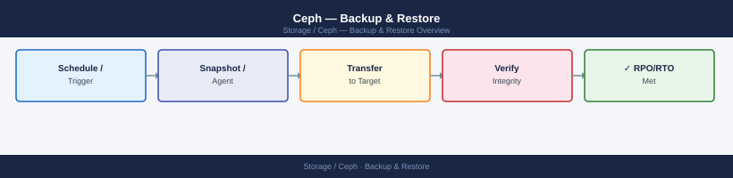
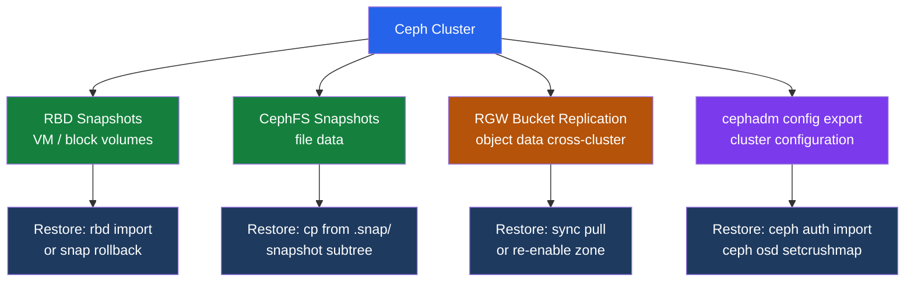

---
tags:
  - ceph
  - operations
---
# Ceph — Backup & Restore


<div class="kb-summary">
Ceph backup: RBD snapshot export for VM disks, CephFS snapshots for file data, RGW bucket replication for objects, cluster configuration backup, and MON data recovery.

*Applies to: Ceph Reef / Squid*
</div>





## Before you begin

- **Access:** Storage admin credentials (cluster admin or equivalent)
- **Timing:** safe to run during business hours unless a step is marked ⚠ (causes interruption)
- **Dependencies:** no active upgrades or migrations on the same infrastructure
- **Logging:** capture command output — paste into the change record on completion

---

## RBD Snapshot and Export

```bash
# Create snapshot before a change or on schedule
rbd snap create <pool>/<image>@backup-$(date +%F)
rbd snap ls <pool>/<image>

# Full export to file (for off-cluster backup)
rbd export <pool>/<image>@backup-$(date +%F) /mnt/backup/image-$(date +%F).img

# Incremental export (differential since last snapshot — much smaller)
rbd export-diff --from-snap <prev-snap> <pool>/<image>@<snap> /mnt/backup/diff.img

# Restore: import as new image
rbd import /mnt/backup/image.img <pool>/<new-image>

# Restore: in-place rollback to snapshot (discards all writes since snap)
rbd snap rollback <pool>/<image>@<snap>

# Apply incremental diff to existing image
rbd import-diff /mnt/backup/diff.img <pool>/<image>
```

## CephFS Snapshots

```bash
# Create snapshot — snapshots live in the .snap/ virtual directory of each CephFS directory
mkdir /mnt/cephfs/.snap/daily-$(date +%F)

# List existing snapshots
ls /mnt/cephfs/.snap/

# Restore: copy files out of the snapshot subtree
cp -a /mnt/cephfs/.snap/daily-2026-06-01/important-dir /mnt/cephfs/restored/

# Delete old snapshot
rmdir /mnt/cephfs/.snap/daily-2026-05-01

# Snapshot scheduling via CephFS snapshot scheduler module
ceph mgr module enable snap_schedule
ceph fs snap-schedule add / 1d               # daily snapshots at root
ceph fs snap-schedule retention add / 7d    # keep 7 days
ceph fs snap-schedule list /
```

## RGW Bucket Replication (Cross-Cluster DR)

```bash
# Check multi-site sync status on source
radosgw-admin sync status

# Commit any pending period updates
radosgw-admin period update --commit

# Bucket-level replication using S3 API (via AWS CLI pointed at RGW)
aws s3api put-bucket-replication \
    --bucket <src-bucket> \
    --replication-configuration file://replicate.json

# Check per-bucket sync status
radosgw-admin bucket sync status --bucket=<name>

# Force sync of a specific bucket
radosgw-admin bucket sync run --bucket=<name>
```

## RBD Mirroring (DR / Async Replication)

```bash
# Enable mirroring on pool (image mode = per-image opt-in)
rbd mirror pool enable rbd image
# Pool mode (all images in pool are mirrored)
rbd mirror pool enable rbd pool

# Enable on specific image (journaling feature required)
rbd mirror image enable rbd/my-volume journaling

# On secondary cluster: import bootstrap token
rbd mirror pool peer bootstrap import rbd bootstrap-token

# Check mirror status
rbd mirror pool status rbd
rbd mirror image status rbd/my-volume

# DR failover: promote secondary image to writable
rbd mirror image promote rbd/my-volume          # on DR site
rbd mirror image demote rbd/my-volume           # on primary (if accessible)
```

## Cluster Configuration Backup

```bash
# Export all monitor key-value store entries (includes config flags and settings)
ceph config-key dump > ceph-config-backup-$(date +%F).json

# List all running daemon state
cephadm ls > cephadm-ls-$(date +%F).json

# Export auth keys for all CephX users
ceph auth list > /backup/ceph-auth-$(date +%F).txt
ceph auth export > /backup/ceph-auth-$(date +%F).keyring

# Export CRUSH map — binary and human-readable text
ceph osd getcrushmap -o crushmap.bin
crushtool -d crushmap.bin -o crushmap.txt

# OSD map
ceph osd dump > /backup/osd-dump-$(date +%F).txt

# Copy ceph.conf from admin node
cp /etc/ceph/ceph.conf /backup/ceph.conf.$(date +%F)
```

## Restore from Configuration Backup

```bash
# Restore CRUSH map
ceph osd setcrushmap -i /backup/crush-2026-06-07.bin

# Restore auth keys for all users
ceph auth import -i /backup/ceph-auth-2026-06-07.keyring

# Restore a single auth key
ceph auth get-or-create client.rbd > /etc/ceph/ceph.client.rbd.keyring

# Restore RBD image from exported file
rbd import /backup/my-volume-2026-06-07.img rbd/my-volume-restored

# Full cluster recovery from scratch:
# 1. Deploy new cluster with cephadm bootstrap (same cluster FSID required)
# 2. Import auth keys
# 3. Re-add OSDs (existing data may be recoverable if disks intact)
# 4. Restore CRUSH map
# 5. Run: ceph pg repair; ceph osd repair
```

## MON Data Recovery (Loss of Quorum)

```bash
# If monitors lose quorum and cannot be recovered normally:

# Rebuild MON store from OSD data (last resort)
ceph-monstore-tool /var/lib/ceph/mon/ceph-<id>/store.db rebuild \
    --keyring /etc/ceph/ceph.client.admin.keyring

# Inject a new MON map if the map is corrupted
ceph-mon --inject-monmap /tmp/monmap --id <mon-id>

# Export MON map for inspection
ceph mon getmap -o /tmp/monmap
monmaptool --print /tmp/monmap

# Check MON store integrity
ceph-kvstore-tool rocksdb /var/lib/ceph/mon/ceph-<id>/store.db check

# Stop all MONs before running store rebuild
systemctl stop ceph-mon@<id>
```

## Backup Schedule Recommendations

| Data type | Method | Frequency | Retention |
|-----------|--------|-----------|-----------|
| RBD images (VM disks) | `rbd snap create` + `rbd export-diff` | Daily | 7 days |
| CephFS directories | `.snap/` snapshot | Daily | 7–14 days |
| Cluster config (auth, CRUSH) | `ceph auth export` + `getcrushmap` | Weekly | 4 weeks |
| config-key store | `ceph config-key dump` | Weekly | 4 weeks |
| RGW object data (DR) | RBD mirroring or zone sync | Continuous | N/A — async replication |

Snapshots are cheap (copy-on-write) and do not require cluster downtime. Full image exports consume storage equal to the image size; use `export-diff` for incremental backups after the first full export.

## See also

- [Ceph — Procedures](../procedures/)
- [Ceph — Common Issues](../../troubleshooting/common-issues/)
- [Ceph — Health Checks](../health-checks/)

## Verify Backup Integrity

```bash
# Verify exported RBD image is readable
qemu-img check /mnt/backup/image-2026-06-07.img

# Check RBD image can be imported cleanly (into a test pool)
rbd import /mnt/backup/image-2026-06-07.img rbd/restore-test && echo "Import OK"

# Verify CRUSH map is decompilable
crushtool -d /backup/crushmap.bin -o /tmp/crush-verify.txt && echo "CRUSH OK"

# Verify auth keyring is parseable
ceph-authtool --print-key /backup/ceph-auth-2026-06-07.keyring && echo "Keyring OK"
```
