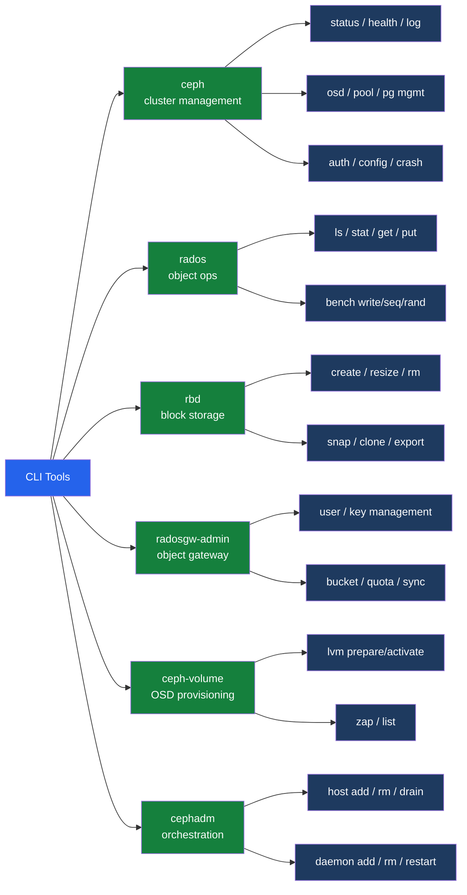

# Ceph — CLI Reference

<div class="kb-summary">
Essential Ceph CLI commands: ceph status and health, OSD management, pool operations, PG management, RADOS object-level ops, RBD image management, radosgw-admin for S3, and cephadm orchestration.
</div>

```text
┌──────────────────────────────────────── Ceph — CLI Reference ─────────────────────────────────────────┐
│                                                                                                       │
│   ┌───────────────────────────────────────────────────────────────────────────────────────────────┐   │
│   │   ceph: admin CLI for cluster status, OSD, pool, PG, and auth management                     │    │
│   │   rados: object-level operations on any pool; benchmarking                                    │   │
│   │   rbd: RBD image create/list/snap/map/resize; required for block storage operations           │   │
│   │   radosgw-admin: S3 user, bucket, quota, and zone management for RGW                          │   │
│   │   ceph-volume: OSD provisioning (lvm/raw); device prepare and activate                        │   │
│   │   cephadm: cluster orchestration; add hosts, deploy daemons, run upgrades                     │   │
│   └───────────────────────────────────────────────────────────────────────────────────────────────┘   │
│                                                                                                       │
│  Key terms:                                                                                           │
│                                                                                                       │
│  ceph -s      = Cluster status: health state, OSD up/in counts, PG summary, I/O rate                  │
│  ceph health detail = Lists all active health codes with per-item explanation and affected OSDs       │
│  ceph osd tree= Hierarchical view of hosts, buckets, OSDs, weights, and up/in state                   │
│  rados        = Object-level CLI; put/get/ls/bench against any pool                                   │
│  rbd          = RADOS Block Device CLI; create/list/snap/map/resize/export images                     │
│  radosgw-admin= RGW admin CLI; manage S3 users, buckets, quotas, and zones                            │
│  ceph auth    = Key management: create/list/delete CephX user keys and capabilities                   │
│  ceph pg stat = Aggregate PG count by state (active+clean, degraded, recovering, etc.)                │
│  ceph osd pool= Pool management: create, set PG count, set replication size, set quotas               │
│  ceph df      = Per-pool capacity: stored objects, data used, available, and quota usage              │
│  cephadm      = Cluster orchestration CLI: add hosts, deploy daemons, run upgrades                    │
│  ceph config  = Runtime configuration: get/set per-daemon options without daemon restart              │
│  ceph crash   = Crash report management: list, inspect, and archive daemon crash reports              │
│                                                                                                       │
└───────────────────────────────────────────────────────────────────────────────────────────────────────┘
```



## Cluster Management

```bash
ceph -s                                              # status summary: health, OSDs, PGs, I/O
ceph -w                                              # live event stream (watch cluster log)
ceph health detail                                   # verbose health messages with error codes
ceph log last 50                                     # 50 most recent cluster log events
ceph config dump                                     # all non-default config values across cluster
ceph config get osd.0 osd_max_backfills              # read single config key for specific daemon
ceph config set global osd_recovery_op_priority 3   # runtime config change (no restart needed)

# Daemon status
ceph orch ps                                         # all daemon instances (cephadm-managed)
ceph mon stat                                        # MON quorum + leader
ceph mgr stat                                        # active MGR
ceph osd stat                                        # OSD up/in counts

# I/O and performance
ceph osd perf                                        # per-OSD commit/apply latency
ceph osd df                                          # per-OSD capacity and utilization
ceph df                                              # pool-level capacity summary
```

## OSD Management

```bash
ceph osd ls                                          # list all OSD IDs
ceph osd tree                                        # topology with weights and up/in state
ceph osd stat                                        # up/in/down counts
ceph osd find <id>                                   # which host an OSD lives on
ceph osd dump | grep osd                             # full OSD map entries

ceph osd set noout                                   # prevent OSDs going out during maintenance
ceph osd unset noout
ceph osd reweight <id> <weight>                      # adjust OSD weight (0.0–1.0); default 1.0
ceph osd crush reweight-all                          # reweight all OSDs to match current capacity
ceph osd out <id>                                    # mark OSD out — starts data migration away
ceph osd in <id>                                     # mark OSD in — triggers rebalance back onto OSD
ceph osd down <id>                                   # mark OSD down (stops it if running)
ceph osd purge <id> --yes-i-really-mean-it           # fully remove OSD: crush entry, auth key, map

# Config at runtime
ceph config show osd.0
ceph tell osd.0 config show
```

## Pool Management

```bash
ceph osd pool ls detail                              # list pools with PG count, size, and flags
ceph osd pool get <pool> all                         # all pool parameters
ceph osd pool set <pool> size 3                      # replica count
ceph osd pool set <pool> min_size 2                  # minimum replicas for I/O
ceph osd pool set <pool> pg_autoscale_mode on        # enable automatic PG scaling
ceph osd pool rename <old> <new>
ceph osd pool delete <pool> <pool> --yes-i-really-really-mean-it

# PG count (manual — only increase; plan ahead)
ceph osd pool set rbd pg_num 256
ceph osd pool set rbd pgp_num 256

# Quotas
ceph osd pool set-quota rbd max_objects 10000
ceph osd pool set-quota rbd max_bytes 10737418240    # 10 GiB
```

## PG Management

```bash
ceph pg stat                                         # PG count and state summary
ceph pg dump_stuck                                   # list stuck/unclean PGs
ceph pg <pgid> query                                 # detailed PG state, acting set, history
ceph pg repair <pgid>                                # trigger repair on inconsistent PG
ceph pg scrub <pgid>                                 # scrub specific PG on demand

ceph osd pool set <pool> noscrub true                # disable scrub for pool (maintenance)
ceph osd pool set <pool> nodeep-scrub true           # disable deep-scrub for pool

# Cluster-wide scrub control
ceph osd set noscrub
ceph osd unset noscrub
ceph osd set nodeep-scrub
ceph osd unset nodeep-scrub

# Autoscale status
ceph osd pool autoscale-status
```

## rados (Object-Level)

```bash
rados ls -p <pool>                                   # list all objects in a pool
rados stat -p <pool> <object>                        # object metadata: size and mtime
rados get -p <pool> <object> /tmp/out                # download object to file
rados put -p <pool> <object> /tmp/in                 # upload file as object

# Benchmarking
rados bench -p <pool> 30 write --no-cleanup          # write benchmark for 30 seconds
rados bench -p <pool> 30 seq                         # sequential read benchmark
rados bench -p <pool> 30 rand                        # random read benchmark
rados cleanup -p <pool>                              # remove bench objects after testing
```

## RBD (Block Storage)

```bash
rbd ls -p <pool>                                     # list RBD images in pool
rbd info <pool>/<image>                              # image metadata: features, size, format
rbd create <pool>/<image> --size 100G
rbd resize <pool>/<image> --size 200G

# Snapshots
rbd snap create <pool>/<image>@<snapname>
rbd snap ls <pool>/<image>
rbd snap rollback <pool>/<image>@<snapname>          # in-place revert
rbd snap rm <pool>/<image>@<snapname>

# Clone (thin provision from snapshot)
rbd snap protect <pool>/<image>@<snapname>
rbd clone <pool>/<image>@<snapname> <pool>/<clone>

# Export / import
rbd export <pool>/<image> /tmp/export.img
rbd export-diff --from-snap <prev> <pool>/<image>@<snap> /tmp/diff.img
rbd import /tmp/export.img <pool>/<image>
rbd import-diff /tmp/diff.img <pool>/<image>

rbd rm <pool>/<image>

# Map on Linux
rbd map <pool>/<image>                               # returns /dev/rbdX
rbd unmap /dev/rbd0
rbd showmapped
```

## radosgw-admin (Object Gateway)

```bash
radosgw-admin user list
radosgw-admin user info --uid=<user>
radosgw-admin user create --uid=<user> --display-name="<name>"
radosgw-admin key create --uid=<user> --key-type=s3   # generate S3 access/secret key pair

radosgw-admin bucket list --uid=<user>
radosgw-admin bucket stats --bucket=<name>
radosgw-admin bucket rm --bucket=<name> --purge-objects

radosgw-admin quota set --uid=<user> --quota-type=user --max-size=50G
radosgw-admin quota enable --uid=<user> --quota-type=user
radosgw-admin usage show --uid=<user> --start-date=2026-01-01
```

## cephadm Orchestration

```bash
# Service management
ceph orch ls                                         # list all services
ceph orch ps                                         # list all daemon instances
ceph orch apply osd --all-available-devices          # deploy OSDs on all available disks
ceph orch daemon restart osd.5
ceph orch daemon stop osd.5
ceph orch daemon add osd <hostname>:/dev/sdX         # add single OSD on specific device

# Host management
ceph orch host ls
ceph orch host add new-node 10.0.1.20
ceph orch host drain <hostname>                      # gracefully remove all daemons from host
ceph orch host rm <hostname>

# Upgrade
ceph orch upgrade status
ceph orch upgrade start --image quay.io/ceph/ceph:v18.2.0

# Crash reports
ceph crash ls                                        # list recorded daemon crashes
ceph crash info <crash-id>                           # full backtrace and context
ceph crash archive <crash-id>                        # mark crash as acknowledged
ceph crash archive-all                               # clear all crash alerts
```

## Auth Management

```bash
ceph auth ls                                         # list all CephX users and capabilities
ceph auth get client.admin                           # show key and caps for a user
ceph auth get-or-create client.rbd mon 'allow r' osd 'allow rwx pool=rbd'
ceph auth caps client.rbd mon 'allow r' osd 'allow rw pool=rbd'   # update caps
ceph auth del client.rbd                             # remove user
ceph auth export client.admin > /backup/admin.keyring
ceph auth import -i /backup/admin.keyring
```
