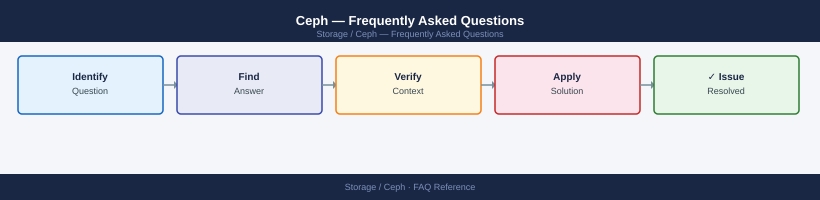

---
tags:
  - ceph
  - faq
  - operations
---
# Ceph — Frequently Asked Questions

*Applies to: Ceph 18.x (Reef)*

Common questions about Ceph operations, configuration, and troubleshooting. For step-by-step procedures, see the <a href="index.md">Operations</a> section.

## General

**Q: What Ceph version is recommended for new deployments?**
A: Ceph Reef (18.x) is the current LTS. Check with `ceph version` on any monitor node. Avoid releases older than Quincy (17.x) for new deployments.

**Q: How do I check the current Ceph version?**
A: `ceph version`

## Configuration

**Q: What is the default replication factor and when should it change?**
A: Default pool size is 3 replicas (`osd_pool_default_size = 3`). Reduce to 2 only for non-critical data with adequate OSD count. Never run `size=1` in production — a single OSD failure causes data loss.

**Q: How do I enable Ceph Dashboard for cluster monitoring?**
A: Enable the dashboard module: `ceph mgr module enable dashboard`. Set credentials: `ceph dashboard create-self-signed-cert; ceph dashboard ac-user-create admin -i <password_file> administrator`. Access at `https://<mgr-host>:8443`.

## Operations

**Q: How do I perform a rolling Ceph upgrade without downtime?**
A: Upgrade monitors first (one at a time), then managers, then OSDs. Use `ceph orch upgrade start --ceph-version <version>` with cephadm. Monitor progress with `ceph orch upgrade status`. Set `noout` flag before OSD upgrades: `ceph osd set noout`.

**Q: What is the correct procedure to add a new OSD node?**
A: Add the node to cephadm: `ceph orch host add <hostname> <ip>`. Deploy OSDs: `ceph orch daemon add osd <hostname>:/dev/sdX`. Verify OSD joins the cluster: `ceph osd tree`. Remove `noout` flag if set.

## Troubleshooting

**Q: Ceph health shows 'HEALTH_WARN: X pgs degraded'. What does it mean?**
A: Some placement groups have fewer than the required replica count. Usually caused by a downed OSD. Check `ceph osd stat` and `ceph osd tree` for down OSDs. Recovery begins automatically when the OSD comes back or is replaced.

**Q: Ceph cluster throughput is below expectations — where do I start?**
A: Check `ceph osd perf` for per-OSD latency. Verify network bandwidth between OSDs (cluster network). Check `ceph df` for near-full OSDs (>85% triggers backpressure). Review `ceph pg stat` for scrubbing activity.

## Backup and Recovery

**Q: How often should I back up Ceph cluster configuration?**
A: Back up monitor config: `ceph config-key dump > ceph-config-backup.json` weekly. With cephadm, back up `/etc/ceph/` and the cephadm spec files. Test restore to a lab cluster annually.

**Q: Can I recover a single lost OSD's data without full cluster restore?**
A: If replication factor >= 2 and the remaining OSDs are healthy, Ceph automatically re-replicates lost data to surviving OSDs. Simply replace the failed OSD and Ceph backfills it. No manual restore needed for single-OSD failures.

## See Also

- [Ceph Operations](index.md)
- [Ceph Troubleshooting](../../troubleshooting/index.md)
