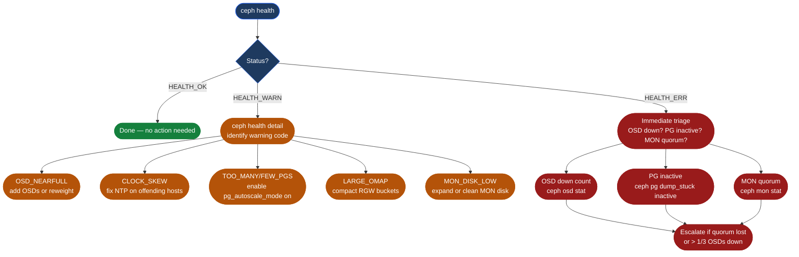

---
tags:
  - ceph
  - operations
---
# Ceph — Health Checks

<div class="kb-summary">
Ceph health check routine: cluster status, OSD up/in counts, PG state verification, MON quorum, capacity thresholds, and recovery progress monitoring.

*Applies to: Ceph Reef / Squid*
</div>



```text
┌──────────────────────────────────────── Ceph — Health Checks ─────────────────────────────────────────┐
│                                                                                                       │
│   ┌───────────────────────────────────────────────────────────────────────────────────────────────┐   │
│   │   Health baseline: HEALTH_OK + all OSDs up+in + all PGs active+clean + MON quorum             │   │
│   │   HEALTH_WARN acceptable if clock skew (fix NTP) or nearfull (add capacity)                   │   │
│   │   HEALTH_ERR: investigate immediately; OSDs down or PGs inactive blocks client I/O            │   │
│   └───────────────────────────────────────────────────────────────────────────────────────────────┘   │
│                                                                                                       │
│  Key terms:                                                                                           │
│                                                                                                       │
│  HEALTH_OK    = All daemons running; all PGs active+clean; no warnings or errors                      │
│  HEALTH_WARN  = Non-critical issue; I/O continues; example: clock skew or nearfull OSD                │
│  HEALTH_ERR   = Critical issue; cluster may stop writes; example: OSD full or PG inactive             │
│  OSD          = Object Storage Daemon; one per disk; stores, replicates, and recovers data            │
│  PG           = Placement Group; data shard mapping to OSD sets via CRUSH algorithm                   │
│  active+clean = Normal PG state: primary OSD active, correct replica count, no repair needed          │
│  MON quorum   = Majority of MON daemons agree on cluster map; quorum loss stops all writes            │
│  nearfull     = OSD disk usage threshold (default 85%); HEALTH_WARN raised when crossed               │
│  BytesToResync= Outstanding bytes not yet replicated; recovery incomplete while non-zero              │
│  noout flag   = Prevents OSDs being marked out during maintenance; set before rebooting hosts         │
│  ceph -s      = Top-level status: health, OSD count, PG summary, I/O rate, capacity                   │
│  ceph osd tree= Visual host/bucket/OSD topology with weights and up/in state per daemon               │
│                                                                                                       │
└───────────────────────────────────────────────────────────────────────────────────────────────────────┘
```

## Before you begin

- **Access:** Storage admin credentials (cluster admin or equivalent)
- **Timing:** safe to run during business hours unless a step is marked ⚠ (causes interruption)
- **Dependencies:** no active upgrades or migrations on the same infrastructure
- **Logging:** capture command output — paste into the change record on completion

---

## Run This Routine

```bash
#!/bin/bash
# Ceph Daily Health Check
# Usage: ./ceph-health-check.sh

PASS=0; FAIL=0; WARN=0

check_ok() { echo "  [OK]  $1"; ((PASS++)); }
check_warn() { echo "  [WARN] $1"; ((WARN++)); }
check_fail() { echo "  [FAIL] $1"; ((FAIL++)); }

echo "=== Ceph Health Check $(date +%F) ==="

echo ""
echo "[Overall Status]"
HEALTH=$(ceph health)
if echo "$HEALTH" | grep -q "^HEALTH_OK"; then
    check_ok "Cluster health: HEALTH_OK"
elif echo "$HEALTH" | grep -q "^HEALTH_WARN"; then
    check_warn "Cluster health: HEALTH_WARN → $(ceph health detail | head -3)"
else
    check_fail "Cluster health: $(echo $HEALTH | head -1)"
fi

echo ""
echo "[OSD Status]"
TOTAL=$(ceph osd stat | awk '{print $1}')
UP=$(ceph osd stat | grep -oP '\d+ up' | awk '{print $1}')
IN=$(ceph osd stat | grep -oP '\d+ in' | awk '{print $1}')
[[ "$UP" == "$TOTAL" ]] && check_ok "OSDs up: $UP/$TOTAL" || check_fail "OSDs not all up: $UP/$TOTAL"
[[ "$IN" == "$TOTAL" ]] && check_ok "OSDs in: $IN/$TOTAL" || check_warn "OSDs not all in: $IN/$TOTAL"

echo ""
echo "[PG Status]"
UNCLEAN=$(ceph pg stat | grep -oP '\d+ unclean')
INACTIVE=$(ceph pg stat | grep -oP '\d+ inactive')
[[ -z "$UNCLEAN" ]] && check_ok "No unclean PGs" || check_warn "PGs unclean: $UNCLEAN"
[[ -z "$INACTIVE" ]] && check_ok "No inactive PGs" || check_fail "PGs inactive: $INACTIVE — I/O may be impacted"

echo ""
echo "[Capacity]"
USAGE=$(ceph df | awk '/TOTAL/{print $NF}' | tr -d '%')
[[ "$USAGE" -lt 75 ]] && check_ok "Total usage: ${USAGE}%" \
  || ([[ "$USAGE" -lt 85 ]] && check_warn "Total usage: ${USAGE}% — approaching nearfull" \
  || check_fail "Total usage: ${USAGE}% — NEARFULL or FULL; writes may stop")

echo ""
echo "[MON Quorum]"
QUORUM=$(ceph mon stat | grep -oP '\d+ mons')
check_ok "MON quorum: $QUORUM"

echo ""
echo "[Recovery Progress]"
RECOVERING=$(ceph -s | grep -c "recovering" || true)
[[ "$RECOVERING" -eq 0 ]] && check_ok "No recovery in progress" \
  || check_warn "Recovery in progress — $(ceph -s | grep recovering)"

echo ""
echo "=== Summary: PASS=$PASS WARN=$WARN FAIL=$FAIL ==="
[[ "$FAIL" -eq 0 ]] && exit 0 || exit 1
```

## Comprehensive Manual Checks

```bash
# 1. Overall cluster health — always start here
ceph -s
ceph health detail

# 2. OSD status — all should be up and in
ceph osd stat
ceph osd tree | grep -E "down|out"
# Any "down" or "out" entry requires immediate investigation

# 3. PG summary — look for non active+clean states
ceph pg stat
ceph pg dump_stuck | head -20    # show stuck PGs (inactive/unclean/undersized)
ceph pg dump_stuck inactive      # detail on PGs that cannot service I/O
ceph pg dump_stuck unclean       # PGs with incorrect replica count

# 4. MON quorum — all MONs must be in quorum
ceph mon stat
ceph quorum_status --format json | python3 -m json.tool | \
  grep -E "quorum_leader_name|quorum\b"

# 5. Capacity — check per-pool and per-OSD utilisation
ceph df
ceph df detail                              # per-pool usage with quota info
ceph osd df tree | sort -k8 -rn | head -10 # top OSDs by usage %

# 6. Recovery progress (if any)
ceph -s | grep -i recover
watch -n5 "ceph -s | grep -E 'health|pgs|recover'"

# 7. Recent errors in cluster log
ceph log last 20 | grep -iE "error|warn|failed"
```

## HEALTH_WARN Triage

| Warning Code | Cause | Remediation |
|---|---|---|
| `OSD_NEARFULL` | OSD disk > 85% used | Add OSDs; or `ceph osd reweight-by-utilization` |
| `OSD_FULL` | OSD disk > 95% used | Stop writes, add OSDs immediately |
| `CLOCK_SKEW_DETECTED` | NTP drift > 0.05 s between hosts | `chronyc makestep` on offending host; verify with `ceph time-sync-status` |
| `TOO_FEW_PGS` / `TOO_MANY_PGS` | Pool PG count not optimised | `ceph osd pool set <pool> pg_autoscale_mode on` |
| `LARGE_OMAP_OBJECTS` | RGW/RBD index objects oversized | Run `radosgw-admin bucket check` and compact with `radosgw-admin gc process` |
| `MON_DISK_LOW` | MON host disk < 30% free | Expand disk or clean old logs under `/var/lib/ceph/mon/` |
| `POOL_NO_REDUNDANCY` | Pool replicated with size=1 | `ceph osd pool set <pool> size 3` |
| `SLOW_OPS` | OSD or MON slow request latency | Check OSD disk health; see OSD-specific checks below |
| `PG_NOT_SCRUBBED` | PG has not been scrubbed in >2 weeks | `ceph osd pool set <pool> noscrub false` then trigger manually |
| `AUTH_INSECURE_GLOBAL_ID_RECLAIM` | Clients using old auth protocol | Upgrade clients; then `ceph config set mon auth_allow_insecure_global_id_reclaim false` |

## OSD-Specific Checks

```bash
# Check slow ops — OSD latency issues
# Sort by commit latency (column 3); highest values = slowest OSDs
ceph osd perf | sort -k3 -rn | head -10

# Dump in-flight ops on a specific OSD (useful when SLOW_OPS warning is active)
ceph daemon osd.<id> dump_ops_in_flight
# Look for ops with age > 30 s; indicates slow disk or network

# Check OSD configuration at runtime
ceph daemon osd.<id> config show | grep -E "osd_op_timeout|osd_disk_threads"

# Check OSD disk device health (if smartmontools installed)
ceph device get-health-metrics <device-id>
ceph device ls    # list device IDs known to the cluster

# Mark an OSD out manually before replacing it
ceph osd out osd.<id>
# Wait for rebalance to complete, then:
ceph osd down osd.<id>
ceph osd purge osd.<id> --yes-i-really-mean-it
```

## Recovery Monitoring

```bash
# Live recovery progress — updates every 5 s
watch -n5 "ceph -s | grep -E 'health|pgs|recover|backfill'"

# Detailed stuck PG information
ceph pg dump_stuck degraded
ceph pg dump_stuck unclean
ceph pg dump_stuck inactive

# Force recovery priority (speeds up recovery at cost of client I/O)
ceph osd set nobackfill        # pause backfill, keep recovery
ceph osd recovery_priority 10  # increase (default 5)

# Throttle recovery if impacting client I/O
ceph tell osd.* injectargs '--osd-max-backfills 1'
ceph tell osd.* injectargs '--osd-recovery-max-active 1'

# Watch bytes remaining
watch -n10 "ceph -s | grep -E 'misplaced|degraded|recovering'"
```

## Capacity Thresholds

| Threshold | Default % | Flag Name | Effect |
|---|---|---|---|
| Nearfull | 85% | `osd_nearfull_ratio` | `HEALTH_WARN OSD_NEARFULL`; writes continue |
| Backfillfull | 90% | `osd_backfillfull_ratio` | New backfill operations blocked to this OSD |
| Full | 95% | `osd_full_ratio` | `HEALTH_ERR OSD_FULL`; writes to this OSD stopped |

```bash
# Check current threshold settings
ceph osd dump | grep -E "nearfull|full_ratio|backfillfull"

# Adjust nearfull threshold (example: lower to 80% for earlier warning)
ceph osd set-nearfull-ratio 0.80
ceph osd set-full-ratio 0.90
ceph osd set-backfillfull-ratio 0.85

# View per-OSD utilisation sorted by % used
ceph osd df | sort -k7 -rn | head -20
# Column 7 = % used; top entries are the fullest OSDs
```

## Manual Spot Checks

```bash
# Cluster I/O rates — real-time read/write throughput
ceph -s | grep "client:"

# Slow OSD requests (> 30 s default threshold)
ceph health detail | grep -i slow

# Clock skew check
ceph time-sync-status

# Scrub progress (background data integrity check)
ceph pg dump | grep -c scrubbing
ceph osd scrub osd.5    # trigger scrub on specific OSD
ceph osd deep-scrub osd.5   # trigger deep scrub (checksums)

# Backfill/recovery progress
ceph -s | grep -E "degraded|recovering|backfilling"
ceph pg dump_stuck degraded   # show degraded PG details
```

---

## See also

- [Ceph — Common Issues](../../troubleshooting/common-issues/)
- [Ceph — Procedures](../procedures/)
- [Ceph — CLI Reference](../cli-reference/)

## Verify

- Confirm the operation completed without errors in the log or management UI
- Verify the expected state change is visible (service running, object created, config applied)
- Document the outcome in the change record
