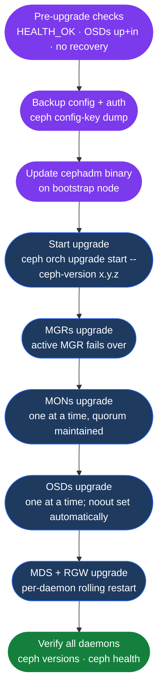

# Ceph — Lifecycle & Upgrades

<div class="kb-summary">
Ceph cluster upgrades with cephadm: version compatibility, upgrade sequence (MON → MGR → OSD → MDS → RGW), monitoring upgrade progress, and rollback considerations.
</div>



```text
┌───────────────────────────────────── Ceph — Lifecycle & Upgrades ─────────────────────────────────────┐
│                                                                                                       │
│   ┌───────────────────────────────────────────────────────────────────────────────────────────────┐   │
│   │   cephadm handles upgrade orchestration; upgrades one daemon at a time with health checks     │   │
│   │   Sequence: MGR → MON → OSD → MDS → RGW → RBD mirror; never skip major versions              │    │
│   │   Pre-upgrade: ensure HEALTH_OK + all OSDs up+in + no active recovery                         │   │
│   └───────────────────────────────────────────────────────────────────────────────────────────────┘   │
│                                                                                                       │
│  Key terms:                                                                                           │
│                                                                                                       │
│  cephadm      = Container-based Ceph orchestrator; manages daemon lifecycle across nodes              │
│  MON          = Monitor daemon; maintains cluster maps and quorum; upgraded first in sequence         │
│  MGR          = Manager daemon; metrics, dashboard, orchestrator APIs; upgraded second                │
│  OSD          = Object Storage Daemon; upgraded third; cephadm upgrades one OSD at a time             │
│  MDS          = Metadata Server; manages CephFS namespace; upgraded after OSD upgrade completes       │
│  RGW          = RADOS Gateway; object storage frontend; upgraded last in standard sequence            │
│  HEALTH_OK    = Required pre-upgrade cluster state; do not start upgrade while cluster degraded       │
│  major version= Named release (Reef, Squid, etc.); never skip a major version during upgrades         │
│  noout flag   = Prevents OSDs being marked out during upgrade; cephadm sets this automatically        │
│  ceph versions= Shows daemon versions currently running; all should match after upgrade completes     │
│  upgrade start= ceph orch upgrade start --ceph-version x.y.z; orchestrates rolling container upgrade  │
│  rollback     = Not automatic; requires re-running old container image; complex for major version     │
│                                                                                                       │
└───────────────────────────────────────────────────────────────────────────────────────────────────────┘
```

## Version Compatibility

| Codename | Major Version | Status | EOL | Kernel RBD Client (min) |
|---|---|---|---|---|
| Squid | 19 | Current development | TBD | kernel 6.x |
| Reef | 18 | Current stable (LTS) | 2026+ | kernel 5.15+ |
| Quincy | 17 | Maintenance (LTS) | 2024 | kernel 5.10+ |
| Pacific | 16 | EOL | 2023 | kernel 5.4+ |
| Octopus | 15 | EOL | 2022 | kernel 4.15+ |

**Rules:**
- Never skip a major version. Pacific → Reef requires an intermediate Quincy upgrade.
- On each OSD node, `ceph osd require-osd-release` must match the current release before starting the next upgrade.
- Client kernels below the minimum may not support RBD features enabled post-upgrade; test before upgrading.

## Pre-Upgrade Checklist

| Check | Command | Required State |
|---|---|---|
| Cluster health | `ceph health` | `HEALTH_OK` |
| OSD in/out ratio | `ceph osd stat` | All OSDs `up` and `in` |
| PG states | `ceph pg stat` | All PGs `active+clean` |
| Recovery | `ceph -s \| grep recover` | 0 bytes recovering |
| Scrub activity | `ceph pg dump \| grep -c scrubbing` | 0 (pause if active) |
| Client compatibility | check kernel/client versions | Above minimum for target release |

```bash
# 1. Verify cluster is healthy — do not upgrade a degraded cluster
ceph health
# Must be HEALTH_OK

# 2. Verify all OSDs are up and in
ceph osd stat
# Expected: X osds: X up, X in

# 3. Check for active recovery (must be zero)
ceph -s | grep recovering
# Should show 0 bytes/objects recovering

# 4. Pause scrubs to reduce I/O contention during upgrade
ceph osd set noscrub
ceph osd set nodeep-scrub

# 5. Back up cluster configuration and auth keys
ceph config-key dump > ceph-config-backup-$(date +%F).json
ceph auth list > ceph-auth-backup-$(date +%F).txt

# 6. Check current version and what require-osd-release is set to
ceph version
ceph osd dump | grep require_osd_release
# These must agree; if not, update require-osd-release first

# 7. Check manager module health
ceph mgr module ls | grep -E "enabled_modules|disabled_modules"
```

## Upgrade with cephadm

### Step 1 — Update cephadm itself

```bash
# Check cephadm version on bootstrap node
cephadm version

# Update cephadm to the latest build for the target release
# Disable and re-enable the mgr module to pick up the new binary
ceph mgr module disable cephadm
cephadm install          # re-downloads and installs latest cephadm binary
ceph mgr module enable cephadm

# Verify the mgr module is running
ceph mgr module ls | grep cephadm
```

### Step 2 — Start the rolling upgrade

```bash
# Specify the exact version or a container image tag
# quay.io/ceph/ceph:vX.Y.Z is the canonical source
ceph orch upgrade start --ceph-version 18.2.4
# Or specify image directly:
# ceph orch upgrade start --image quay.io/ceph/ceph:v18.2.4

# Upgrade daemon order (automatic, orchestrated by cephadm):
#   1. MGR daemons — active MGR fails over; standby becomes active
#   2. MON daemons — one at a time; quorum maintained throughout
#   3. OSD daemons — one at a time; cephadm sets noout automatically
#   4. MDS daemons — active MDS fails over to standby before upgrade
#   5. RGW daemons — rolling restart, gateway remains available
```

### Step 3 — Monitor upgrade progress

```bash
# Watch upgrade status — refreshes every 10 s
watch -n 10 ceph orch upgrade status
# Output shows:
#   target_image, progress (%), current daemon type being upgraded

# Secondary view — watch cluster health during upgrade
watch -n 5 "ceph -s | head -20"

# Inspect which daemons are still on the old version
ceph versions
# Example mid-upgrade output:
# {
#   "mon": {"ceph version 18.2.2": 3},
#   "mgr": {"ceph version 18.2.4": 2},
#   "osd": {"ceph version 18.2.2": 9, "ceph version 18.2.4": 3},
#   ...
# }

# Typical duration: 30–120 min depending on OSD count and rebalancing speed
```

### Step 4 — Pause and resume if needed

```bash
# Pause upgrade (e.g., unexpected HEALTH_WARN during OSD upgrades)
ceph orch upgrade pause

# Check cluster health while paused
ceph health detail
ceph -s

# Resume when cluster is stable
ceph orch upgrade resume

# Stop upgrade entirely (reverts plan but does not downgrade already-upgraded daemons)
ceph orch upgrade stop
```

## Rolling Upgrade Behaviour

- cephadm pulls the new container image on each host before restarting the daemon.
- OSDs: cephadm waits for in-flight I/O to drain before killing the OSD process; the `noout` flag is set cluster-wide automatically and unset after all OSDs are upgraded.
- MONs: Ceph requires a quorum of MONs at all times; cephadm never restarts more than one MON simultaneously.
- If a daemon fails to come back after upgrade, cephadm halts and waits; the operator must investigate before the upgrade continues.

## Major-Version Upgrade Requirements

```bash
# After completing all daemon upgrades (e.g., Pacific → Quincy):
# 1. Confirm all daemons are on the new version
ceph versions
# All entries must show the new major version

# 2. Update the OSD release flag to unlock new features
ceph osd require-osd-release quincy
# Replace "quincy" with the codename for your target version

# 3. Enable new CRUSH features (if applicable)
ceph osd set-require-min-compat-client reef
# Only run this if all clients (RBD, CephFS, RGW) support the new release

# 4. Re-enable scrubs
ceph osd unset noscrub
ceph osd unset nodeep-scrub
```

## Post-Upgrade Validation

| Check | Command | Expected Result |
|---|---|---|
| All daemons on new version | `ceph versions` | Single version entry per daemon type |
| Cluster health | `ceph health` | `HEALTH_OK` |
| PG states | `ceph pg stat` | All PGs `active+clean` |
| OSD feature flags | `ceph osd features` | New release features present |
| Dashboard | `ceph mgr services` | Dashboard URL resolves, shows new version |

```bash
# Verify all daemons report the new version
ceph versions
# All entries must show target version only
# Example: {"mon": {"ceph version 18.2.4": 3}, "osd": {"ceph version 18.2.4": 12}, ...}

# Run full health check
ceph health detail
# Expected: HEALTH_OK

# Confirm PG states recovered
ceph pg stat
# All PGs should be active+clean

# Test I/O — write and read benchmark
rbd create --size 5G rbd/upgrade-test
rbd bench --io-type write --io-size 4K --io-threads 16 --io-total 512M rbd/upgrade-test
rbd bench --io-type read  --io-size 4K --io-threads 16 --io-total 512M rbd/upgrade-test
rbd rm rbd/upgrade-test

# Verify OSD feature flags reflect new release
ceph osd features
# New features should be listed for the target codename

# Check dashboard is accessible and shows correct cluster version
ceph mgr services | grep dashboard
```

## Rollback Considerations

Ceph does **not** support automatic rollback. Key points:

- Daemons that have already been upgraded to the new image cannot be automatically reverted without manual intervention.
- If the upgrade is paused or stopped mid-way, the cluster will run a mixed-version state, which is stable for short periods but should be resolved promptly.
- To manually revert a specific daemon to the old image:

```bash
# Pin a specific daemon to an older image (emergency use only)
ceph orch daemon redeploy <daemon-type>.<id> --image quay.io/ceph/ceph:v18.2.2

# Example: revert a specific MGR
ceph orch daemon redeploy mgr.ceph-node1 --image quay.io/ceph/ceph:v18.2.2
```

- Major version rollback (e.g., Reef → Quincy) is not supported and will corrupt OSD data if attempted after `ceph osd require-osd-release` has been updated.
