---
tags:
  - ceph
  - operations
---
# Ceph — Procedures

```text
┌─────────────────────────────── Ceph — Operational Procedures Overview ────────────────────────────────┐
│                                                                                                       │
│  Procedure Categories                                                                                 │
│  ─────────────────────────────────────────────────────────────────────────────────────────────────    │
│  ┌─────────────────────────┐  ┌─────────────────────────┐  ┌─────────────────────────┐                │
│  │  OSD Lifecycle          │  │  Cluster Maintenance    │  │  Capacity Management    │                │
│  │  add new OSD            │  │  noout / norebalance    │  │  reweight by util       │                │
│  │  replace failed OSD     │  │  scrub scheduling       │  │  add nodes via cephadm  │                │
│  │  decommission host      │  │  PG repair              │  │  crush reweight-all     │                │
│  │  osd out → wait → purge │  │  inconsistent PG fix    │  │  monitor data migration │                │
│  └─────────────────────────┘  └─────────────────────────┘  └─────────────────────────┘                │
│                                                                                                       │
│  OSD Replacement — Safe Sequence                                                                      │
│  ─────────────────────────────────────────────────────────────────────────────────────────────────    │
│  1. Confirm OSD down: ceph osd tree | grep down                                                       │
│  2. Mark out: ceph osd out osd.<id>  — triggers data migration away from failed OSD                   │
│  3. Wait: watch ceph -s  — BytesToResync reaches 0 before physically replacing disk                   │
│  4. Stop daemon: systemctl stop ceph-osd@<id>  ·  replace disk  ·  re-run ceph-volume                 │
│  5. Verify: ceph osd tree — new OSD shows up/in; ceph -s — HEALTH_OK                                  │
│                                                                                                       │
│  Key terms:                                                                                           │
│                                                                                                       │
│  OSD          = Object Storage Daemon; one per disk; stores, replicates, and recovers data            │
│  PG           = Placement Group; logical shard unit; PGs map to OSD sets via CRUSH algorithm          │
│  cephadm      = Ceph's orchestrator; deploys and manages cluster daemons via containers               │
│  CRUSH        = Controlled Replication Under Scalable Hashing; Ceph's data distribution algorithm     │
│  reweight     = Adjusting an OSD's relative capacity share in the CRUSH map                           │
│  scrub        = Data integrity scan; deep-scrub adds checksum verification of stored objects          │
│  ceph osd out = Marks OSD as out of the cluster; triggers data migration to remaining OSDs            │
│  ceph osd in  = Marks OSD back in; triggers data rebalancing back onto the OSD                        │
│  BytesToResync= Remaining bytes to replicate after OSD change; wait for 0 before physical swap        │
│  noout flag   = Prevents OSDs being marked out automatically during planned maintenance               │
│  CRUSH rule   = Policy defining fault domain (host, rack) for data placement in a pool                │
│  ceph orch    = Orchestration commands: apply osds, add hosts, remove daemons via cephadm             │
│                                                                                                       │
└───────────────────────────────────────────────────────────────────────────────────────────────────────┘
```

<div class="kb-summary">
Ceph operational procedures: add/replace/decommission OSDs, reweight for capacity balance, scrub management, PG repair, and controlled cluster maintenance with noout/norebalance flags.

*Applies to: Ceph Reef / Squid*

```mermaid
graph TD
    classDef cat  fill:#2563eb,color:#fff
    classDef step fill:#15803d,color:#fff
    classDef flag fill:#b45309,color:#fff
    classDef cap  fill:#7c3aed,color:#fff

    OSD[OSD Lifecycle]:::cat
    OSD --> ADD[Add new OSD<br/>ceph orch daemon add]:::step
    OSD --> REPL[Replace failed OSD<br/>out → wait → purge → add]:::step
    OSD --> DECOM[Decommission host<br/>drain all OSDs]:::step

    PGM[PG Management]:::cat
    PGM --> REPAIR[Repair inconsistent PG<br/>ceph pg repair pgid]:::step
    PGM --> SCRUB[Scrub scheduling<br/>noscrub / nodeep-scrub flags]:::step

    MAINT[Cluster Maintenance]:::cat
    MAINT --> NOOUT[Set noout flag<br/>prevent auto-out during work]:::flag
    MAINT --> NORB[Set norebalance<br/>pause data migration]:::flag

    CAP[Capacity Management]:::cap
    CAP --> RWU[reweight-by-utilization<br/>move data off full OSDs]:::step
    CAP --> ADDNODE[Add new node<br/>ceph orch host add]:::step
```

</div>



## Before you begin

- **Access:** Storage admin credentials (cluster admin or equivalent)
- **Timing:** safe to run during business hours unless a step is marked ⚠ (causes interruption)
- **Dependencies:** no active upgrades or migrations on the same infrastructure
- **Logging:** capture command output — paste into the change record on completion

---

## Add a New OSD (Single Device)

```bash
# 1. Verify device is clean — no existing filesystem or partition
lsblk -f /dev/sdX

# 2. Wipe device if it has previous data
cephadm ceph-volume lvm zap /dev/sdX --destroy

# 3. Add OSD via cephadm
ceph orch daemon add osd <hostname>:/dev/sdX

# 4. Verify new OSD appears and cluster recovers
ceph osd tree                    # new OSD with correct weight
watch -n 10 ceph -s              # HEALTH_OK after rebalance completes
```

## Replace a Failed OSD

```bash
# 1. Identify failed OSD — note ID and host
ceph osd tree | grep down

# 2. Set noout before starting to avoid false alarms
ceph osd set noout

# 3. Mark OSD out — starts data migration away from failed disk
ceph osd out <id>

# 4. Wait for PGs to recover before touching hardware
watch -n 10 ceph -s              # wait until active+clean

# 5. Stop the OSD daemon
ceph orch daemon stop osd.<id>

# 6. Replace the physical disk on the host

# 7. Purge old OSD entry from cluster
ceph osd purge <id> --yes-i-really-mean-it

# 8. Add new OSD on the same host/device
ceph orch daemon add osd <hostname>:/dev/sdX

# 9. Remove noout
ceph osd unset noout

# 10. Verify
ceph osd tree                    # new OSD has correct weight
ceph -s                          # HEALTH_OK
```

## Decommission a Host (Remove All Its OSDs)

```bash
# 1. Set both noout and norebalance to control data migration
ceph osd set noout
ceph osd set norebalance

# 2. Identify all OSD IDs on the target host
ceph osd tree | grep <hostname>

# 3. Mark all host OSDs out
for i in <id1> <id2> <id3>; do ceph osd out $i; done

# 4. Unset norebalance to allow data to migrate away
ceph osd unset norebalance

# 5. Wait for all PGs to return to active+clean
watch -n 10 ceph -s

# 6. Drain and stop all daemons on the host
ceph orch host drain <hostname>

# 7. Purge each OSD from the cluster map
for i in <id1> <id2> <id3>; do
    ceph osd purge $i --yes-i-really-mean-it
done

# 8. Remove host from orchestrator
ceph orch host rm <hostname>

# 9. Unset noout
ceph osd unset noout
```

## Reweight OSDs to Balance Capacity

```bash
# Check current utilization per OSD
ceph osd df tree

# Sort to find most-full OSDs
ceph osd df tree | sort -k8 -rn

# Automatic reweight: move data off OSDs more than 115% of average utilization
ceph osd reweight-by-utilization 115

# Manual reweight for a single OSD (lower value = less data placed on it)
ceph osd reweight <id> <0.0–1.0>

# Reweight all OSDs to match their actual device capacity (after adding larger disks)
ceph osd crush reweight-all

# Verify effect after rebalance
ceph osd df tree | sort -k8 -rn
```

## Manage Scrub Operations

```bash
# Check scrub status across PGs
ceph pg dump | grep scrub

# Force immediate scrub on a specific PG
ceph pg scrub <pgid>

# Force scrub on all PGs in a pool
ceph osd pool scrub <pool>
ceph osd pool deep-scrub <pool>

# Disable scrub during maintenance window
ceph osd set noscrub
ceph osd set nodeep-scrub

# Re-enable after maintenance
ceph osd unset noscrub
ceph osd unset nodeep-scrub

# Restrict automatic scrub to off-hours
ceph config set osd osd_scrub_begin_hour 1
ceph config set osd osd_scrub_end_hour 5

# Per-pool scrub disable (does not affect other pools)
ceph osd pool set <pool> noscrub true
ceph osd pool set <pool> nodeep-scrub true
```

## Repair an Inconsistent PG

```bash
# 1. Identify inconsistent PGs
ceph health detail | grep inconsistent

# 2. Trigger repair on the affected PG
ceph pg repair <pgid>

# 3. Monitor repair progress
watch -n 10 "ceph pg <pgid> query | python3 -m json.tool | grep state"

# 4. Confirm PG returns to active+clean
ceph pg stat

# If repair fails — identify which OSD has the bad object copy
ceph pg <pgid> query | python3 -m json.tool | grep acting

# Pull the object from the good OSD manually
rados get -p <pool> <object> /tmp/recovered-object
rados put -p <pool> <object> /tmp/recovered-object
```

## OSD Replacement (Original Procedure — ceph orch)

```bash
# When a disk fails and needs replacement:

# 1. Confirm OSD is down
ceph osd tree | grep down

# 2. Mark OSD out (triggers data migration to remaining OSDs)
ceph osd out osd.5

# 3. Wait for PGs to recover (BytesToResync reaches 0)
watch -n 10 ceph -s

# 4. Remove OSD daemon
ceph orch daemon rm osd.5 --force

# 5. Remove OSD from CRUSH and cluster
ceph osd crush rm osd.5
ceph auth del osd.5
ceph osd rm 5

# 6. Physically replace the disk

# 7. Add new OSD (cephadm discovers new disk automatically)
ceph orch apply osd --all-available-devices
# Or specifically:
ceph orch daemon add osd ceph-node2:/dev/sdb
```

## Add New Node

```bash
# 1. Prepare the new node: install dependencies, configure networking
# 2. Copy SSH key
ssh-copy-id -f -i /etc/ceph/ceph.pub root@new-node

# 3. Add host to cluster
ceph orch host add new-node 10.0.1.30

# 4. Add OSDs from new node
ceph orch daemon add osd new-node:/dev/sdb
ceph orch daemon add osd new-node:/dev/sdc

# 5. Monitor rebalancing (data redistributes to new OSDs)
watch -n 10 ceph -s   # wait for HEALTH_OK

# 6. Adjust CRUSH weight if needed (should happen automatically)
ceph osd tree
```

## Maintenance Mode

```bash
# Before maintenance on an OSD node:
ceph osd set noout        # prevent OSDs from being marked out during maintenance

# Perform maintenance (patch, reboot, hardware work)

# Verify OSDs come back up after reboot
ceph osd stat             # all OSDs should be up+in

# Remove noout flag
ceph osd unset noout

# Flags reference:
# noout      = don't mark OSDs out when they disconnect (maintenance safety)
# noin       = don't mark OSDs in when they reconnect
# norecover  = suspend recovery
# nobackfill = suspend backfill
# norebalance= suspend rebalancing
```

---

## Verify

- Confirm the operation completed without errors in the log or management UI
- Verify the expected state change is visible (service running, object created, config applied)
- Document the outcome in the change record
