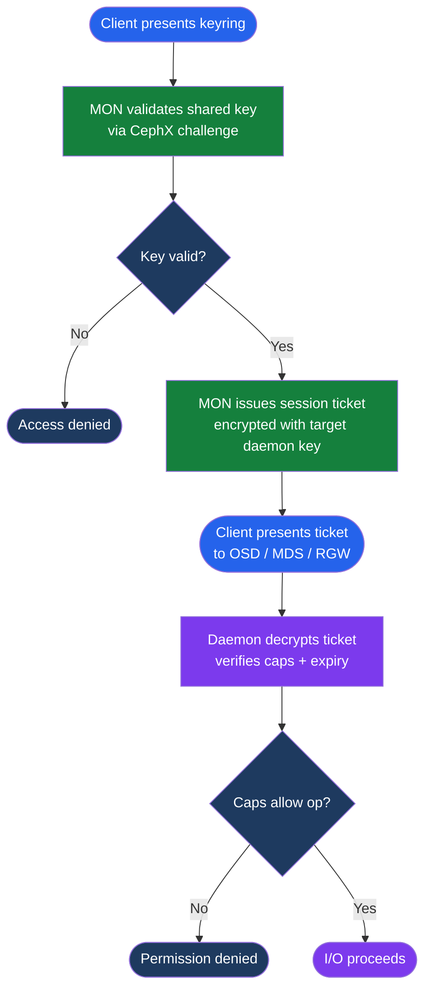

# Ceph — Access Control

<div class="kb-summary">
CephX user accounts, capability syntax for granular permissions, per-pool access control, admin key management, and least-privilege design for application service accounts.
</div>

```text
┌──────────────────────────────────────── Ceph — Access Control ────────────────────────────────────────┐
│                                                                                                       │
│   ┌───────────────────────────────────────────────────────────────────────────────────────────────┐   │
│   │   CephX: every client authenticates with a shared secret key; no anonymous access            │    │
│   │   Capabilities: per-service (mon, osd, mds); per-pool; least-privilege by default            │    │
│   │   Admin key: client.admin has full access; protect it; use service-specific keys in prod     │    │
│   └───────────────────────────────────────────────────────────────────────────────────────────────┘   │
│                                                                                                       │
│  Key terms:                                                                                           │
│                                                                                                       │
│  CephX         = Ceph's native shared-secret mutual authentication protocol for all daemon access     │
│  capability    = Permission string granting access: mon, osd, mds per pool or service                 │
│  allow rw      = Read-write capability on a pool; use allow r for read-only service accounts          │
│  allow *       = Full access capability; reserved for client.admin and cephadm keys only              │
│  client.admin  = Superuser key; full cluster access; store securely; rotate on team changes           │
│  profile rbd   = Pre-defined capability set for RBD clients; grants pool-level rbd access             │
│  keyring       = File holding CephX key and capability: /etc/ceph/ceph.client.<name>.keyring          │
│  ceph auth add = Creates a new CephX user with specified capabilities                                 │
│  ceph auth get-or-create = Idempotent user creation; used by cephadm and automation scripts           │
│  caps osd      = OSD capability string; example: allow rw pool=rbd profile rbd                        │
│  least privilege = Grant only required capabilities; separate key per application/workload            │
│  bootstrap-osd = Bootstrap keyring used only during OSD initialization; limited lifespan              │
│                                                                                                       │
└───────────────────────────────────────────────────────────────────────────────────────────────────────┘
```



## CephX User Management

```bash
ceph auth ls                          # list all keyring entities
ceph auth get client.<name>           # show caps and key for one entity
ceph auth get-key client.<name>       # just the key (for scripting)

# Create a scoped service account
ceph auth add client.<name> \
  mon 'allow r' \
  osd 'allow rw pool=<pool>'

# Update capabilities on existing entity
ceph auth caps client.<name> \
  osd 'allow rw pool=rbd' \
  mon 'allow r'

# Delete entity
ceph auth del client.<name>

# Export for distribution to application nodes
ceph auth export client.<name> > keyring.conf

# Create service account (Cinder/Nova example)
ceph auth get-or-create client.cinder \
  mon 'profile rbd' \
  osd 'profile rbd pool=volumes, profile rbd pool=vms, profile rbd-read-only pool=images' \
  -o /etc/ceph/ceph.client.cinder.keyring

# Create read-only monitoring user
ceph auth get-or-create client.readonly \
  mon 'allow r' \
  osd 'allow r' \
  -o /etc/ceph/ceph.client.readonly.keyring

# Create user with access to specific pool only
ceph auth get-or-create client.myapp \
  mon 'allow r' \
  osd 'allow rw pool=myapp-pool' \
  -o /etc/ceph/ceph.client.myapp.keyring
```

## Capability Syntax Reference

| Capability String | Scope | Effect |
|---|---|---|
| `allow r` | any service | Read-only access |
| `allow rw` | any service | Read-write access |
| `allow rwx` | osd | Read-write plus class method execution |
| `allow *` | any service | Full unrestricted access |
| `allow rw pool=<name>` | osd | Read-write scoped to named pool |
| `allow rw namespace=<ns>` | osd | Read-write scoped to RBD namespace |
| `profile rbd` | mon / osd | Pre-defined RBD client capability set |
| `profile rbd-read-only` | osd | Pre-defined read-only RBD access |
| `allow rw path=/exports/t1` | mds | CephFS directory-level restriction |

```bash
# MON capabilities
mon 'allow r'         # read-only (status, maps)
mon 'profile rbd'     # preset for RBD clients
mon 'allow *'         # full admin (use only for client.admin)

# OSD capabilities — combined multi-pool
osd 'allow rw pool=volumes, allow r pool=images, allow rw pool=vms'

# Namespace-scoped (RBD namespaces within a pool)
osd 'allow rw pool=rbd namespace=tenant1'

# MDS capabilities (CephFS)
mds 'allow rw path=/exports/tenant1'  # directory-level restriction
```

## Service Account Patterns

Never use `client.admin` in application configuration files. Create a dedicated keyring per application with the minimum required pool access.

```bash
# Recommended pattern: one keyring per application workload
# App A: read-write on app-a-pool only
ceph auth get-or-create client.app-a \
  mon 'allow r' \
  osd 'allow rw pool=app-a-pool'

# App B: read-only on shared dataset
ceph auth get-or-create client.app-b \
  mon 'allow r' \
  osd 'allow r pool=shared-data'

# Backup agent: needs read from all data pools, write to backup pool
ceph auth get-or-create client.backup \
  mon 'allow r' \
  osd 'allow r pool=volumes, allow r pool=vms, allow rw pool=backups'
```

Quarterly rotation procedure: create new entity with `-new` suffix, distribute, verify, then delete old.

## Keyring File Management

```bash
# Keyring files must be owned by root, mode 600
ls -la /etc/ceph/*.keyring
chmod 600 /etc/ceph/ceph.client.*.keyring
chown root:root /etc/ceph/ceph.client.*.keyring

# Export keyring for distribution to application nodes
ceph auth export client.cinder > /tmp/ceph.client.cinder.keyring
scp /tmp/ceph.client.cinder.keyring app-node:/etc/ceph/

# Verify key on application node
ceph --keyring /etc/ceph/ceph.client.cinder.keyring --id cinder status
```

## RGW User Layers

RGW authentication operates at two independent layers. Confusion between them is a common misconfiguration.

| Layer | Entity type | Managed by | Purpose |
|---|---|---|---|
| CephX (daemon auth) | `client.rgw.<id>` | `ceph auth` | RGW daemon authenticates to MON/OSD |
| RGW user (S3/Swift) | S3 access key / Swift user | `radosgw-admin` | End-user or application S3/Swift access |

```bash
# CephX entity for the RGW daemon itself (created by cephadm automatically)
ceph auth get client.rgw.myorg

# RGW S3/Swift user management — completely separate from cephx
radosgw-admin user create --uid=app-user --display-name="App Service Account" \
  --access-key=AKID1234 --secret=secretkey

radosgw-admin user info --uid=app-user
radosgw-admin caps add --uid=app-user --caps="buckets=read"
```

## Rook / Kubernetes Keyring Access

Rook stores all cephx keyrings as Kubernetes Secrets in the `rook-ceph` namespace. Never copy them manually; retrieve via `oc get secret`.

```bash
# List cephx-related secrets
oc get secret -n rook-ceph | grep keyring

# Retrieve admin keyring (base64-encoded)
oc get secret -n rook-ceph rook-ceph-admin-keyring -o jsonpath='{.data.keyring}' | base64 -d

# Retrieve OSD keyring for a specific OSD
oc get secret -n rook-ceph rook-ceph-osd-<id>-keyring -o jsonpath='{.data.keyring}' | base64 -d

# Create a custom keyring secret for an application
oc create secret generic ceph-app-keyring \
  --from-file=keyring=/etc/ceph/ceph.client.myapp.keyring \
  -n rook-ceph
```
