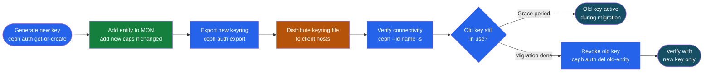

---
tags:
  - ceph
  - security
---
# Ceph — Authentication

<div class="kb-summary">
CephX shared-secret authentication protocol, how clients authenticate to MONs and OSDs, key distribution, session tickets, key rotation procedures, bootstrap key handling, and msgr2 in-transit encryption.

*Applies to: Ceph Reef / Squid*
</div>

## Before you begin

- **Access:** Storage admin credentials (cluster admin or equivalent)
- **Change management:** security changes require CAB approval in most environments
- **Rollback plan:** document current state before any security control change
- **Testing:** validate in a non-production environment first where possible

---

## CephX Protocol Overview

```text
CephX uses a shared-secret (pre-shared key) mutual authentication scheme:

  1. Client requests a session ticket from MON
     Client presents: username + timestamp + encrypted nonce
     MON verifies: username in auth DB + decrypts nonce with stored key

  2. MON returns a session ticket
     Ticket is encrypted with the OSD's key
     Client cannot read the ticket content

  3. Client presents ticket to OSD
     OSD decrypts ticket using its own key
     OSD verifies: client name + capabilities + expiry timestamp

  4. Established session: normal I/O proceeds
     Sessions are time-limited (default: 12 hours)

Key properties:
  - No passwords over the wire; all challenges use HMAC
  - Compromise of one key doesn't expose others
  - Keys stored at: /etc/ceph/ceph.client.<name>.keyring (clients)
                     /var/lib/ceph/osd/ceph-N/keyring (OSDs)
                     /var/lib/ceph/mon/ceph-<host>/keyring (MONs)

Key terms:

  CephX          = Ceph's shared-secret mutual authentication protocol; required for all access
  shared secret  = Pre-shared 128-bit key; stored in keyring files; never transmitted in clear
  session ticket = Time-limited auth token issued by MON; client presents to OSD to prove identity
  HMAC           = Hash-based Message Authentication Code; used to sign all CephX challenges
  nonce          = One-time random value preventing replay attacks in CephX challenge flow
  client.admin   = Default superuser identity; full cluster access; created during cephadm bootstrap
  keyring        = File holding CephX identity and shared secret; chmod 600 required on all nodes
  capability     = Permission string granted per identity: allow r/rw/* per service and pool
  bootstrap key  = Temporary key used during OSD/MDS initialization; replaced by permanent key
  ceph auth get  = Retrieves key and capabilities for a given CephX identity
  key rotation   = Replacing an existing CephX key; requires update on all clients using that key
  auth DB        = MON-maintained key-value store mapping identity names to keys and capabilities
```



## Key Distribution

```bash
# On a new client node that needs to access Ceph:
# 1. Install ceph-common package (provides ceph-fuse, rbd, rados commands)
dnf install -y ceph-common   # RHEL/Rocky
apt-get install -y ceph-common  # Ubuntu

# 2. Copy ceph.conf and keyring from admin node
scp admin-node:/etc/ceph/ceph.conf /etc/ceph/
scp admin-node:/etc/ceph/ceph.client.myapp.keyring /etc/ceph/

# 3. Set correct permissions
chmod 644 /etc/ceph/ceph.conf
chmod 600 /etc/ceph/ceph.client.myapp.keyring

# 4. Test connectivity
ceph --id myapp health
rbd --id myapp ls rbd
```

## Key Rotation Procedure

Ceph has no automatic key rotation; all rotation is manual. Execute in sequence — never delete the old key before the new key is confirmed working on all clients.

1. Generate new key for entity (get-or-create is idempotent; if entity exists it returns the existing key — for rotation, use a new entity name with `-v2` suffix or delete first):

```bash
ceph auth get-or-create client.<name> \
  mon 'allow r' \
  osd 'allow rw pool=<pool>'
```

2. Export new keyring:

```bash
ceph auth export client.<name> > /etc/ceph/ceph.client.<name>.keyring
```

3. Distribute keyring to all client hosts:

```bash
for host in app1 app2 app3; do
  scp /etc/ceph/ceph.client.<name>.keyring ${host}:/etc/ceph/
done
```

4. Verify client connectivity with new key on each host:

```bash
ceph --id <name> --keyring /etc/ceph/ceph.client.<name>.keyring -s
```

5. Restart application services to load new keyring; confirm I/O is operating.

6. Revoke old key after all clients confirmed on new key:

```bash
ceph auth del client.<name>-old
```

7. Confirm no remaining references to old entity:

```bash
ceph auth get client.<name>-old  # should return error: entity not found
```

## Bootstrap Key Handling

Bootstrap keys are used by cephadm during initial daemon provisioning. They hold elevated permissions for provisioning only and must be rotated after cluster setup is complete.

| Bootstrap key | Default location | Purpose |
|---|---|---|
| `client.bootstrap-osd` | `/var/lib/ceph/bootstrap-osd/ceph.keyring` | Provisions new OSD keyrings |
| `client.bootstrap-mds` | `/var/lib/ceph/bootstrap-mds/ceph.keyring` | Provisions new MDS keyrings |
| `client.bootstrap-rgw` | `/var/lib/ceph/bootstrap-rgw/ceph.keyring` | Provisions new RGW keyrings |

```bash
# Check bootstrap keys still present (should be restricted post-setup)
ceph auth get client.bootstrap-osd
ceph auth get client.bootstrap-mds

# Restrict bootstrap-osd after all OSDs deployed
ceph auth caps client.bootstrap-osd \
  mon 'profile bootstrap-osd'    # already minimal; confirm it hasn't been widened
```

## MON and Admin Keyring Security

```bash
# MON keyring — never copy to client hosts
ls /etc/ceph/ceph.mon.keyring
# Controls cluster map access; only MON daemons need this file

# Admin keyring — full cluster access
ceph auth get client.admin
# Recommended: store in HashiCorp Vault or Red Hat Secrets Manager
# Restrict /etc/ceph/ceph.client.admin.keyring to admin workstations only

# Check who has the admin keyring on cluster nodes
for host in $(ceph orch host ls --format json | python3 -c \
  "import sys,json; [print(h['hostname']) for h in json.load(sys.stdin)]"); do
  echo -n "$host: "; ssh "$host" "ls -la /etc/ceph/ceph.client.admin.keyring 2>/dev/null || echo absent"
done
```

## Cluster Bootstrap Auth (New Node)

```bash
# When cephadm adds a new node, it:
# 1. Creates bootstrap keyrings for each daemon type
# 2. Generates unique OSD/MON keyrings per daemon
# 3. Distributes them via SSH (key already copied in advance)

# Verify keyrings exist on a new OSD node
ls /var/lib/ceph/osd/ceph-*/keyring

# Check MON keyring
cat /var/lib/ceph/mon/ceph-$(hostname -s)/keyring

# Verify daemon is authenticating correctly
ceph auth get osd.5   # should show capabilities
```

## Session Timeouts

```bash
# Check current auth timeout settings
ceph config show-with-defaults global | grep -i auth_mon

# Adjust session ticket TTL (default 12 h for clients)
ceph config set global auth_service_ticket_ttl 3600  # 1 hour sessions

# Adjust MON session timeout
ceph config set global auth_mon_ticket_ttl 86400
```

## msgr2 In-Transit Encryption

Ceph msgr2 protocol (default since Octopus) supports `secure` mode for AES-GCM encrypted transport. `crc` mode (default) provides integrity only — no confidentiality.

```bash
# Enable secure mode cluster-wide
ceph config set global ms_cluster_mode secure    # OSD-to-OSD (cluster network)
ceph config set global ms_service_mode secure    # client-to-OSD / client-to-MON
ceph config set global ms_client_mode secure     # client connections

# Verify setting applied
ceph config get mon ms_cluster_mode
ceph config get osd ms_service_mode

# Check active connections use secure mode (look for "secure" in connection list)
ceph daemon mon.<id> sessions | grep -i secure

# Disable insecure msgr1 (prevents protocol downgrade attacks)
ceph config set global ms_bind_msgr1 false
```

> **Performance note**: `secure` mode adds ~5–10% throughput overhead on the cluster network. On hardware with AES-NI, overhead is typically 3–5%. Enable on cluster network at minimum; the public (client) network is lower priority if clients are on a trusted VLAN.

## Authentication Troubleshooting

```bash
# Client fails with "EACCES Permission denied"
# Cause: capabilities too restrictive for the operation
ceph auth get client.<name>   # check caps
# Fix: widen caps with ceph auth caps

# Client fails with "ENOENT" or "auth: unable to find a keyring"
# Cause: keyring file missing or wrong path
ls /etc/ceph/ceph.client.<name>.keyring
# Fix: copy keyring from admin node

# "clock skew detected" errors on client
chronyc tracking
# Fix: synchronise client clock with NTP before retrying

# Authentication debugging (produces verbose auth log)
ceph --debug-auth 10 --id <name> -s 2>&1 | head -40
# Shows: key lookup, challenge/response, ticket grant or denial
```

## Authentication Reference Table

| Item | Default value | Notes |
|---|---|---|
| Session ticket TTL | 12 hours (43200 s) | Set via `auth_service_ticket_ttl` |
| MON auth DB backend | LevelDB (MON KV) | Keys persist through MON restarts |
| Keyring default path | `/etc/ceph/ceph.client.<name>.keyring` | Override with `--keyring` flag |
| Admin keyring path | `/etc/ceph/ceph.client.admin.keyring` | Created by cephadm bootstrap |
| OSD keyring path | `/var/lib/ceph/osd/ceph-<id>/keyring` | Per-OSD unique key |
| MON keyring path | `/var/lib/ceph/mon/ceph-<host>/keyring` | Never copy to client hosts |
| msgr2 default mode | `crc` (integrity only) | Change to `secure` for encryption |
| Key algorithm | AES-128 / HMAC-SHA1 | Shared-secret symmetric key |

## Keyring File Format

Understanding the keyring file format helps when scripting key distribution.

```ini
# /etc/ceph/ceph.client.myapp.keyring
[client.myapp]
        key = AQBxxxxxxxxxxxxxxxxxxxxxxxxxxxxxxxxxxxxxxA==
        caps mon = "allow r"
        caps osd = "allow rw pool=myapp-pool"
```

```bash
# Extract just the key value (for environment variables or scripts)
ceph auth get-key client.myapp
# Returns: AQBxxxxxxxxxxxxxxxxxxxxxxxxxxxxxxxxxxxxxxA==

# Use in environment variable for containerised workloads
export CEPH_KEY=$(ceph auth get-key client.myapp)
```
