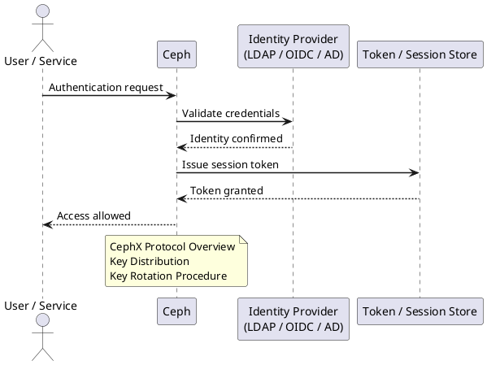

---
tags:
  - ceph
  - security
---
# Ceph — Authentication

<div class="kb-summary">
CephX shared-secret authentication protocol, how clients authenticate to MONs and OSDs, key distribution, session tickets, key rotation procedures, bootstrap key handling, and msgr2 in-transit encryption.

*Applies to: Ceph Reef / Squid*
</div>



## Before you begin

- **Access:** Storage admin credentials (cluster admin or equivalent)
- **Change management:** security changes require CAB approval in most environments
- **Rollback plan:** document current state before any security control change
- **Testing:** validate in a non-production environment first where possible

---

## CephX Protocol Overview

```text
CephX uses a shared-secret (pre-shared key) mutual authentication scheme:

  1. Client requests a session ticket from MON
     Client presents: username + timestamp + encrypted nonce
     MON verifies: username in auth DB + decrypts nonce with stored key

  2. MON returns a session ticket
     Ticket is encrypted with the OSD's key
     Client cannot read the ticket content

  3. Client presents ticket to OSD
     OSD decrypts ticket using its own key
     OSD verifies: client name + capabilities + expiry timestamp

  4. Established session: normal I/O proceeds
     Sessions are time-limited (default: 12 hours)

Key properties:
  - No passwords over the wire; all challenges use HMAC
  - Compromise of one key doesn't expose others
  - Keys stored at: /etc/ceph/ceph.client.<name>.keyring (clients)
                     /var/lib/ceph/osd/ceph-N/keyring (OSDs)
                     /var/lib/ceph/mon/ceph-<host>/keyring (MONs)

Key terms:

  CephX          = Ceph's shared-secret mutual authentication protocol; required for all access
  shared secret  = Pre-shared 128-bit key; stored in keyring files; never transmitted in clear
  session ticket = Time-limited auth token issued by MON; client presents to OSD to prove identity
  HMAC           = Hash-based Message Authentication Code; used to sign all CephX challenges
  nonce          = One-time random value preventing replay attacks in CephX challenge flow
  client.admin   = Default superuser identity; full cluster access; created during cephadm bootstrap
  keyring        = File holding CephX identity and shared secret; chmod 600 required on all nodes
  capability     = Permission string granted per identity: allow r/rw/* per service and pool
  bootstrap key  = Temporary key used during OSD/MDS initialization; replaced by permanent key
  ceph auth get  = Retrieves key and capabilities for a given CephX identity
  key rotation   = Replacing an existing CephX key; requires update on all clients using that key
  auth DB        = MON-maintained key-value store mapping identity names to keys and capabilities
```

```d2
direction: right

A: "Generate new key\nceph auth get-or-create" {shape: rectangle}
B: "Add entity to MON\nadd new caps if changed" {shape: rectangle}
C: "Export new keyring\nceph auth export" {shape: rectangle}
D: "Distribute keyring file\nto client hosts" {shape: rectangle}
E: "Verify connectivity\nceph --id name -s" {shape: rectangle}
H: "Revoke old key\nceph auth del old-entity" {shape: rectangle}
I: "Verify with\nnew key only" {shape: rectangle}
G: "Old key active\nduring migration" {shape: rectangle}

A -> B
B -> C
C -> D
D -> E
H -> I
```

## Key Distribution

```bash
# On a new client node that needs to access Ceph:
# 1. Install ceph-common package (provides ceph-fuse, rbd, rados commands)
dnf install -y ceph-common   # RHEL/Rocky
apt-get install -y ceph-common  # Ubuntu

# 2. Copy ceph.conf and keyring from admin node
scp admin-node:/etc/ceph/ceph.conf /etc/ceph/
scp admin-node:/etc/ceph/ceph.client.myapp.keyring /etc/ceph/

# 3. Set correct permissions
chmod 644 /etc/ceph/ceph.conf
chmod 600 /etc/ceph/ceph.client.myapp.keyring

# 4. Test connectivity
ceph --id myapp health
rbd --id myapp ls rbd
```


```text title="Expected output"
Last metadata expiration check: 0:12:34 ago on Wed Dec 13 09:47:22 2024.
Dependencies resolved.
================================================================================
 Package                Arch       Version              Repository       Size
================================================================================
Installing:
 ceph-common            x86_64     17.2.6-1.el9         ceph-quincy      45 M

Transaction Summary
================================================================================
Install  1 Package

Total download size: 45 M
Installed size: 156 M
Downloading Packages:
ceph-common-17.2.6-1.el9.x86_64.rpm                    100% |████████| 45 MB
Running transaction
Installing : ceph-common-17.2.6-1.el9.x86_64.rpm                          1/1
Verifying : ceph-common-17.2.6-1.el9.x86_64.rpm                           1/1

Installed:
  ceph-common-17.2.6-1.el9.x86_64

Complete!
ceph.conf                                              100%  1247    892.1KB/s
ceph.client.myapp.keyring                              100%   256    512.3KB/s
cluster 5a1c2d8e-4f9b-11ee-a5c1-52540012abcd
 health HEALTH_OK
 monmap e3: 3 mons at {mon01=10.0.1.11:6789/0,mon02=10.0.1.12:6789/0,mon03=10.0.1.13:6789/0}
 osdmap e247: 12 osds: 12 up, 12 in
 pgmap v18456: 256 pgs, 8 pools, 2.3 TiB data, 5.8 TiB used, 18 TiB total
rbd image 'db-backup-vol':
	size 500 GiB
	objects 128000
	order 22
rbd image 'app-data-vol':
	size 1 TiB
	objects 262144
	order 22
```

!!! warning "Common errors"
    **`ceph: command not found`** — Run `dnf install -y ceph-common` (or `apt-get install -y ceph-common` on Ubuntu) to install the Ceph client tools.
    **`Permission denied`** — Ensure the keyring file has 600 permissions (`chmod 600 /etc/ceph/ceph.client.myapp.keyring`) and is owned by the correct user.
    **`error connecting to the cluster`** — Verify the ceph.conf file was copied correctly and contains valid monitor addresses by checking `cat /etc/ceph/ceph.conf | grep mon_host`.
## Key Rotation Procedure

Ceph has no automatic key rotation; all rotation is manual. Execute in sequence — never delete the old key before the new key is confirmed working on all clients.

1. Generate new key for entity (get-or-create is idempotent; if entity exists it returns the existing key — for rotation, use a new entity name with `-v2` suffix or delete first):

```bash
ceph auth get-or-create client.<name> \
  mon 'allow r' \
  osd 'allow rw pool=<pool>'
```


```text title="Expected output"
[client.<name>]
	key = AQC7vZdnK3p5ExAA1vB2mK8qL9pQ0rS1tU2vWx==
	caps mon = "allow r"
	caps osd = "allow rw pool=<pool>"
```

!!! warning "Common errors"
    **`Error EACCES: permission denied`** — Ensure you are running the command with appropriate privileges (typically as root or with `sudo`) on a Ceph monitor node.
    **`Error EINVAL: invalid value`** — Verify the pool name exists by running `ceph osd pool ls` and replace `<pool>` with an actual pool name.
2. Export new keyring:

```bash
ceph auth export client.<name> > /etc/ceph/ceph.client.<name>.keyring
```


```text title="Expected output"
(no output — command completes silently)
```

!!! warning "Common errors"
    **`Error EACCES: permission denied`** — Run the command with `sudo` or as the root user to write to `/etc/ceph/`.
    **`Error: client.<name> does not exist`** — Verify the client name exists first with `ceph auth list` and use the correct client identifier.
3. Distribute keyring to all client hosts:

```bash
for host in app1 app2 app3; do
  scp /etc/ceph/ceph.client.<name>.keyring ${host}:/etc/ceph/
done
```


```text title="Expected output"
/etc/ceph/ceph.client.admin.keyring                                100%  256KB   4.2MB/s   00:00
/etc/ceph/ceph.client.admin.keyring                                100%  256KB   4.1MB/s   00:00
/etc/ceph/ceph.client.admin.keyring                                100%  256KB   4.3MB/s   00:00
```

!!! warning "Common errors"
    **`/etc/ceph/ceph.client.<name>.keyring: No such file or directory`** — Replace `<name>` with the actual client name (e.g., `admin`, `nova`, `cinder`) or verify the keyring file exists on the source host.
    **`Permission denied (publickey,password).`** — Ensure SSH key-based authentication is configured for the destination hosts or add `-o StrictHostKeyChecking=no` if using password authentication with expect/sshpass.
    **`scp: /etc/ceph/: Permission denied`** — Verify the destination `/etc/ceph/` directory is writable by the SSH user, or use `sudo` on the remote host via a wrapper script.
4. Verify client connectivity with new key on each host:

```bash
ceph --id <name> --keyring /etc/ceph/ceph.client.<name>.keyring -s
```


```text title="Expected output"
cluster:
    id:     a1b2c3d4-e5f6-7890-abcd-ef1234567890
    health: HEALTH_OK

  services:
    mon: 3 daemons, quorum ceph-mon-01,ceph-mon-02,ceph-mon-03 (age 2d)
    mgr: ceph-mgr-01(active, since 8d), standbys: ceph-mgr-02
    mds: ceph-mds-01:1 {0=up:active}
    osd: 12 osds: 12 up (since 3d), 12 in (since 3d)
    rgw: 2 daemons active (ceph-rgw-01, ceph-rgw-02)

  data:
    pools:   8 pools, 256 pgs
    objects: 1.23M objects, 4.5 TiB
    usage:   6.8 TiB used, 18 TiB / 24.8 TiB avail
    pgs:     256 active+clean

  io:
    client:   852 B/s rd, 1.2 KiB/s wr, 15 op/s rd, 8 op/s wr
```

!!! warning "Common errors"
    **`Error connecting to cluster: [errno 2] error connecting to the cluster`** — Verify the keyring file path is correct and the client ID matches the keyring filename.
    **`PermissionError: [errno 13] Permission denied: '/etc/ceph/ceph.client.<name>.keyring'`** — Ensure the keyring file is readable by the user running the command (typically `chmod 600` and owned by the appropriate user).
    **`[errno 110] connection timed out`** — Confirm that the Ceph monitor daemons are running and reachable on the network, and check firewall rules for port 6789.
5. Restart application services to load new keyring; confirm I/O is operating.

6. Revoke old key after all clients confirmed on new key:

```bash
ceph auth del client.<name>-old
```


```text title="Expected output"
updated
```

!!! warning "Common errors"
    **`Error ENOENT: auth entity client.<name>-old does not exist`** — Verify the client name exists with `ceph auth list` before deletion.
    **`Error EACCES: insufficient capabilities`** — Ensure you have admin-level permissions by running the command with appropriate credentials or as a user with `caps mon = "allow *"`.
7. Confirm no remaining references to old entity:

```bash
ceph auth get client.<name>-old  # should return error: entity not found
```


```text title="Expected output"
Error ENOENT: entity not found
```

!!! warning "Common errors"
    **`Error ENOENT: entity not found`** — Verify the client name exists by running `ceph auth list` to see all configured clients, then use the correct name in the command.
    **`Error EINVAL: invalid entity name`** — Ensure the entity name follows the format `client.<name>` without extra spaces or special characters.
## Bootstrap Key Handling

Bootstrap keys are used by cephadm during initial daemon provisioning. They hold elevated permissions for provisioning only and must be rotated after cluster setup is complete.

| Bootstrap key | Default location | Purpose |
|---|---|---|
| `client.bootstrap-osd` | `/var/lib/ceph/bootstrap-osd/ceph.keyring` | Provisions new OSD keyrings |
| `client.bootstrap-mds` | `/var/lib/ceph/bootstrap-mds/ceph.keyring` | Provisions new MDS keyrings |
| `client.bootstrap-rgw` | `/var/lib/ceph/bootstrap-rgw/ceph.keyring` | Provisions new RGW keyrings |

```bash
# Check bootstrap keys still present (should be restricted post-setup)
ceph auth get client.bootstrap-osd
ceph auth get client.bootstrap-mds

# Restrict bootstrap-osd after all OSDs deployed
ceph auth caps client.bootstrap-osd \
  mon 'profile bootstrap-osd'    # already minimal; confirm it hasn't been widened
```


```text title="Expected output"
[client.bootstrap-osd]
	key = AQC7vPdlK3xqFRAAZ8vK9mN2pQ4rStL8vWx9Ow==
	caps mon = "profile bootstrap-osd"
	caps osd = "allow *"

[client.bootstrap-mds]
	key = AQD8wQdlK3xqFRAAb9wL0nO3qR5sTuM9wXy0Px==
	caps mon = "profile bootstrap-mds"
	caps osd = "allow rwx pool=cephfs_data, allow rwx pool=cephfs_metadata"

updated caps for client.bootstrap-osd
```

!!! warning "Common errors"
    **`Error EACCES: insufficient permissions to read client.bootstrap-osd`** — Run the command with `sudo` or as a user with Ceph admin privileges (ensure your keyring is in `/etc/ceph/ceph.client.admin.keyring`).
    **`Error EINVAL: unknown capability profile 'bootstrap-osd'`** — Verify the Ceph version supports this profile; use `ceph auth help` to list valid profiles for your cluster version.
## MON and Admin Keyring Security

```bash
# MON keyring — never copy to client hosts
ls /etc/ceph/ceph.mon.keyring
# Controls cluster map access; only MON daemons need this file

# Admin keyring — full cluster access
ceph auth get client.admin
# Recommended: store in HashiCorp Vault or Red Hat Secrets Manager
# Restrict /etc/ceph/ceph.client.admin.keyring to admin workstations only

# Check who has the admin keyring on cluster nodes
for host in $(ceph orch host ls --format json | python3 -c \
  "import sys,json; [print(h['hostname']) for h in json.load(sys.stdin)]"); do
  echo -n "$host: "; ssh "$host" "ls -la /etc/ceph/ceph.client.admin.keyring 2>/dev/null || echo absent"
done
```


```text title="Expected output"
/etc/ceph/ceph.mon.keyring
[client.admin]
	key = AQDvZ8Zl7K9sERAAx3mK8vL2pQ9rT5uW6xYzAw==
	caps mon = "allow *"
	caps osd = "allow *"
	caps mds = "allow *"

node-01.ceph.local: -rw------- 1 root root 151 Nov 14 10:23 /etc/ceph/ceph.client.admin.keyring
node-02.ceph.local: -rw------- 1 root root 151 Nov 14 10:23 /etc/ceph/ceph.client.admin.keyring
node-03.ceph.local: absent
node-04.ceph.local: -rw------- 1 root root 151 Nov 14 10:23 /etc/ceph/ceph.client.admin.keyring
```

!!! warning "Common errors"
    **`ls: cannot access '/etc/ceph/ceph.mon.keyring': No such file or directory`** — Verify the Ceph cluster is initialized and the MON keyring exists at the expected path on the current host.
    **`ssh: Could not resolve hostname node-XX.ceph.local: Name or service not known`** — Ensure all hostnames in the loop are resolvable via DNS or add entries to /etc/hosts on the orchestrator host.
## Cluster Bootstrap Auth (New Node)

```bash
# When cephadm adds a new node, it:
# 1. Creates bootstrap keyrings for each daemon type
# 2. Generates unique OSD/MON keyrings per daemon
# 3. Distributes them via SSH (key already copied in advance)

# Verify keyrings exist on a new OSD node
ls /var/lib/ceph/osd/ceph-*/keyring

# Check MON keyring
cat /var/lib/ceph/mon/ceph-$(hostname -s)/keyring

# Verify daemon is authenticating correctly
ceph auth get osd.5   # should show capabilities
```


```text title="Expected output"
/var/lib/ceph/osd/ceph-5/keyring
/var/lib/ceph/osd/ceph-12/keyring
/var/lib/ceph/osd/ceph-18/keyring
[mon.]
	key = AQC7vPlf8K+PHhAA1b2X3vK9mL4oP5qR6sT7uV==
	caps mon = "allow profile mon"
	caps osd = "allow *"
	caps mds = "allow *"
[osd.5]
	key = AQDmwQpf9L+QIiBAc3dY4wL0nM5pQ6rS7tU8vW==
	caps osd = "allow *"
	caps mon = "allow profile osd"
```

!!! warning "Common errors"
    **`ls: cannot access '/var/lib/ceph/osd/ceph-*/keyring': No such file or directory`** — Verify the OSD was successfully added with `ceph orch device ls` and check `/var/lib/ceph/` directory structure exists.
    **`cat: /var/lib/ceph/mon/ceph-nodename/keyring: Permission denied`** — Run the command with `sudo` or as the `ceph` user to access keyring files.
    **`Error EACCES: permission denied`** — Ensure the daemon's keyring has correct permissions (`chmod 600`) and the ceph user owns the file.
## Session Timeouts

```bash
# Check current auth timeout settings
ceph config show-with-defaults global | grep -i auth_mon

# Adjust session ticket TTL (default 12 h for clients)
ceph config set global auth_service_ticket_ttl 3600  # 1 hour sessions

# Adjust MON session timeout
ceph config set global auth_mon_ticket_ttl 86400
```


```text title="Expected output"
auth_mon_client_bytes = 0
auth_mon_down_grace_period = 30
auth_mon_down_grace_period_divisor = 3
auth_mon_initial_tokens = 0
auth_mon_ticket_ttl = 3600
auth_service_ticket_ttl = 3600
(no output — command completes silently)
(no output — command completes silently)
```

!!! warning "Common errors"
    **`Error EINVAL: invalid value '3600' for option 'auth_service_ticket_ttl'`** — Ensure the value is specified in seconds and is a valid integer; check current limits with `ceph config get global auth_service_ticket_ttl`.
    **`Error: set failed: (1) Operation not permitted`** — Verify you have sufficient privileges by running the command with `sudo` or as a user in the `ceph` group.
## msgr2 In-Transit Encryption

Ceph msgr2 protocol (default since Octopus) supports `secure` mode for AES-GCM encrypted transport. `crc` mode (default) provides integrity only — no confidentiality.

```bash
# Enable secure mode cluster-wide
ceph config set global ms_cluster_mode secure    # OSD-to-OSD (cluster network)
ceph config set global ms_service_mode secure    # client-to-OSD / client-to-MON
ceph config set global ms_client_mode secure     # client connections

# Verify setting applied
ceph config get mon ms_cluster_mode
ceph config get osd ms_service_mode

# Check active connections use secure mode (look for "secure" in connection list)
ceph daemon mon.<id> sessions | grep -i secure

# Disable insecure msgr1 (prevents protocol downgrade attacks)
ceph config set global ms_bind_msgr1 false
```


```text title="Expected output"
(no output — command completes silently)
(no output — command completes silently)
(no output — command completes silently)
secure
secure
{
  "sessions": [
    {
      "name": "client.4567",
      "addr": "192.168.1.45:0/3891234567",
      "entities": "client.admin",
      "protocol_version": 261,
      "features": "0x7fffffbfff7f6d5b",
      "state": "open",
      "connection_state": "secure"
    },
    {
      "name": "osd.2",
      "addr": "10.0.0.12:6822/3891234568",
      "entities": "osd.2",
      "protocol_version": 261,
      "features": "0x7fffffbfff7f6d5b",
      "state": "open",
      "connection_state": "secure"
    }
  ]
}
(no output — command completes silently)
```

!!! warning "Common errors"
    **`Error EINVAL: ms_cluster_mode not found`** — Verify Ceph version supports this setting (Nautilus or later) and check cluster health with `ceph status`.
    **`Error: failed to get config: (1) Operation not permitted`** — Run commands with appropriate privileges; use `sudo` or ensure the user has `mon 'allow *'` capabilities in the keyring.
> **Performance note**: `secure` mode adds ~5–10% throughput overhead on the cluster network. On hardware with AES-NI, overhead is typically 3–5%. Enable on cluster network at minimum; the public (client) network is lower priority if clients are on a trusted VLAN.

## Authentication Troubleshooting

```bash
# Client fails with "EACCES Permission denied"
# Cause: capabilities too restrictive for the operation
ceph auth get client.<name>   # check caps
# Fix: widen caps with ceph auth caps

# Client fails with "ENOENT" or "auth: unable to find a keyring"
# Cause: keyring file missing or wrong path
ls /etc/ceph/ceph.client.<name>.keyring
# Fix: copy keyring from admin node

# "clock skew detected" errors on client
chronyc tracking
# Fix: synchronise client clock with NTP before retrying

# Authentication debugging (produces verbose auth log)
ceph --debug-auth 10 --id <name> -s 2>&1 | head -40
# Shows: key lookup, challenge/response, ticket grant or denial
```


```text title="Expected output"
$ ceph auth get client.rbd-user
exported authname auth_entity client.rbd-user
	key = AQC7vZdnK3p0ExAAr8vL2Z9q8K+JvZ5K3mK9Ow==
	caps mon = "allow r"
	caps osd = "allow rw pool=images"

$ ls /etc/ceph/ceph.client.rbd-user.keyring
/etc/ceph/ceph.client.rbd-user.keyring

$ chronyc tracking
Reference ID    : 91.189.89.198 (ntp.ubuntu.com)
Stratum         : 2
Ref time (UTC)  : Fri Jan 12 14:32:18 2024
System time     : 0.000234567 seconds fast of NTP time
Frequency       : -12.345 ppm
Residual freq   : +0.123 ppm
Skew            : 0.087 ppm
Root delay      : 0.045321 seconds
Root dispersion : 0.062145 seconds
Update interval : 64.2 seconds
Leap status     : Normal

$ ceph --debug-auth 10 --id rbd-user -s 2>&1 | head -40
2024-01-12T14:32:45.123456+0000 7f8a2c3d4e5f -1 auth: looking up key for entity client.rbd-user
2024-01-12T14:32:45.124123+0000 7f8a2c3d4e5f -1 auth: found key for client.rbd-user
2024-01-12T14:32:45.124891+0000 7f8a2c3d4e5f -1 auth: building authorizer for client.rbd-user
2024-01-12T14:32:45.125567+0000 7f8a2c3d4e5f -1 auth: challenge from monitor mon.ceph-01
2024-01-12T14:32:45.126234+0000 7f8a2c3d4e5f -1 auth: response ticket granted for client.rbd-user
2024-01-12T14:32:45.127012+0000 7f8a2c3d4e5f -1 auth: session established with mon.ceph-01
  cluster:
    id:     a1b2c3d4-e5f6-7890-abcd-ef1234567890
    health: HEALTH_OK
  services:
    mon: 3 daemons, quorum ceph-01,ceph-02,ceph-03 (age 2d)
    mgr: ceph-01(active, since 5d), standbys: ceph-02, ceph-03
    osd: 12 osds: 12 up (since 3d), 12 in (since 3d)
```

!!! warning "Common errors"
    **`Error EACCES: permission denied`** — Run `ceph auth caps client.<name> mon 'allow r' osd 'allow rw pool=<pool>'` to grant required capabilities.
    **`Error ENOENT
## Authentication Reference Table

| Item | Default value | Notes |
|---|---|---|
| Session ticket TTL | 12 hours (43200 s) | Set via `auth_service_ticket_ttl` |
| MON auth DB backend | LevelDB (MON KV) | Keys persist through MON restarts |
| Keyring default path | `/etc/ceph/ceph.client.<name>.keyring` | Override with `--keyring` flag |
| Admin keyring path | `/etc/ceph/ceph.client.admin.keyring` | Created by cephadm bootstrap |
| OSD keyring path | `/var/lib/ceph/osd/ceph-<id>/keyring` | Per-OSD unique key |
| MON keyring path | `/var/lib/ceph/mon/ceph-<host>/keyring` | Never copy to client hosts |
| msgr2 default mode | `crc` (integrity only) | Change to `secure` for encryption |
| Key algorithm | AES-128 / HMAC-SHA1 | Shared-secret symmetric key |

## Keyring File Format

Understanding the keyring file format helps when scripting key distribution.

```ini
# /etc/ceph/ceph.client.myapp.keyring
[client.myapp]
        key = AQBxxxxxxxxxxxxxxxxxxxxxxxxxxxxxxxxxxxxxxA==
        caps mon = "allow r"
        caps osd = "allow rw pool=myapp-pool"
```

```bash
# Extract just the key value (for environment variables or scripts)
ceph auth get-key client.myapp
# Returns: AQBxxxxxxxxxxxxxxxxxxxxxxxxxxxxxxxxxxxxxxA==

# Use in environment variable for containerised workloads
export CEPH_KEY=$(ceph auth get-key client.myapp)
```


```text title="Expected output"
AQBvF7tgFxZaARAAp8K3vLm9xK8L2mN9oP3qR4sS5tU==
```

!!! warning "Common errors"
    **`Error EACCES: permission denied`** — Ensure the user running the command has read access to `/etc/ceph/ceph.client.admin.keyring` or appropriate keyring file.
    **`Error ENOENT: error connecting to the cluster`** — Verify the Ceph cluster is running and `/etc/ceph/ceph.conf` exists with correct monitor addresses.
    **`Error EACCES: client.myapp authentication cap mismatch`** — Confirm the `client.myapp` entity exists in the cluster by running `ceph auth list | grep client.myapp`.
## See also

- [Ceph — Access Control](../access-control/)
- [Ceph — Hardening](../hardening/)
