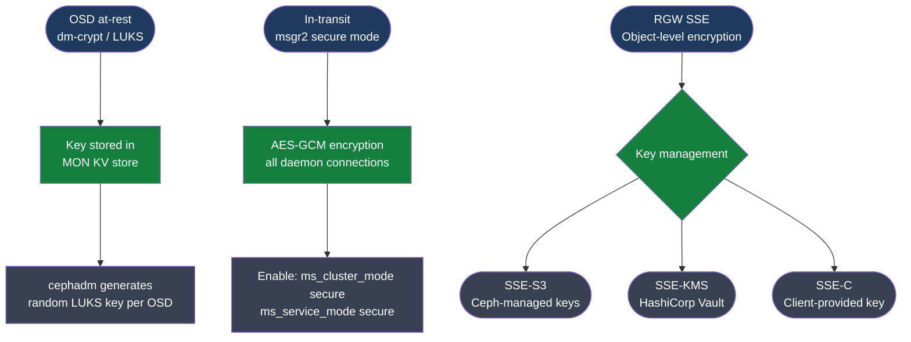

# Ceph — Encryption

<div class="kb-summary">
Ceph encryption: OSD-level dmcrypt for data at rest, RBD image encryption per-image, RGW server-side encryption with KMS, and in-transit encryption via messenger v2.
</div>

```text
┌───────────────────────────────────── Ceph — Encryption Overview ──────────────────────────────────────┐
│                                                                                                       │
│  Encryption Layers                                                                                    │
│  ─────────────────────────────────────────────────────────────────────────────────────────────────    │
│  ┌─────────────────────────┐  ┌─────────────────────────┐  ┌─────────────────────────┐                │
│  │  OSD at-rest (dmcrypt)  │  │  RBD per-image encrypt  │  │  RGW SSE (S3-compat)    │                │
│  │  block device level     │  │  client-side key mgmt   │  │  SSE-KMS or SSE-S3      │                │
│  │  configured at OSD      │  │  LUKS key in keyring    │  │  Vault or local KMS     │                │
│  │  creation time only     │  │  transparent to client  │  │  per-object or per-bkt  │                │
│  └─────────────────────────┘  └─────────────────────────┘  └─────────────────────────┘                │
│                                                                                                       │
│  In-Transit Encryption                                                                                │
│  ─────────────────────────────────────────────────────────────────────────────────────────────────    │
│  Messenger v2 (msgr2): default in Octopus+; encrypts all OSD-to-OSD and client-to-OSD traffic         │
│  Enable: ceph config set global ms_cluster_mode secure                                                │
│  Verify: ceph config get osd ms_client_mode — should show secure (not legacy)                         │
│                                                                                                       │
│  OSD dmcrypt — Key Points                                                                             │
│  ─────────────────────────────────────────────────────────────────────────────────────────────────    │
│  Encryption must be set at OSD creation time — cannot encrypt an existing OSD without rebuild         │
│  cephadm: ceph orch apply osd --all-available-devices --data-encrypt                                  │
│  Keys stored in Ceph monitor key-value store; no external KMS required for OSD encryption             │
│  Performance impact: modern CPUs with AES-NI hardware acceleration ~1–3% overhead typical             │
│                                                                                                       │
│  Key terms:                                                                                           │
│                                                                                                       │
│  dmcrypt    = Linux kernel dm-crypt; transparent block device encryption layer for OSD disks          │
│  LUKS       = Linux Unified Key Setup; key management standard used by dm-crypt                       │
│  RBD encrypt= Per-image client-side encryption; LUKS key managed via LUKS passphrase in keyring       │
│  SSE-KMS    = Server-Side Encryption with external KMS (Vault); per-object or per-bucket in RGW       │
│  SSE-S3     = Server-Side Encryption with Ceph-managed keys (S3-compatible object encryption)         │
│  SSE-C      = Server-Side Encryption with Client-provided keys; Ceph never stores the key             │
│  msgr2      = Ceph messenger protocol v2; supports secure (encrypted) and crc (checksummed) modes     │
│  AES-NI     = Intel/AMD hardware AES instruction set; ~1–3% overhead with modern CPUs                 │
│  KMS        = Key Management Service; external secret store (e.g. HashiCorp Vault) for SSE-KMS        │
│  DEK        = Data Encryption Key; per-object key used by RGW SSE; wrapped by KEK from KMS            │
│  KEK        = Key Encryption Key; master key stored in KMS; wraps DEKs; rotate to re-protect data     │
│                                                                                                       │
└───────────────────────────────────────────────────────────────────────────────────────────────────────┘
```



## OSD Encryption at Rest (dmcrypt / cephadm)

OSD encryption uses dm-crypt (Linux kernel) to encrypt the block device. Must be configured at OSD creation time — cannot encrypt existing OSDs without destroying and re-creating them.

```bash
# Enable encryption for all available devices at provision time
ceph orch apply osd --all-available-devices --data-encrypt

# Or per OSD specification file (preferred for production):
cat > osd-spec.yaml <<EOF
service_type: osd
service_id: encrypted
placement:
  hosts: [node1, node2, node3]
spec:
  data_devices:
    all: true
  encrypted: true
EOF
ceph orch apply -i osd-spec.yaml

# For a specific device on a single host:
ceph orch daemon add osd ceph-node1:/dev/sdb --encrypted
```

## dm-crypt Key Management

cephadm generates a unique random LUKS key per OSD. Keys are stored in the MON KV store — no external KMS is required, but the MON quorum must remain intact or encrypted OSDs cannot be unlocked.

```bash
# Retrieve LUKS key for a specific OSD (requires admin caps)
ceph config-key get dm-crypt/osd/<id>/luks

# List all stored dm-crypt keys
ceph config-key dump | grep dm-crypt

# Back up all dm-crypt keys for escrow (store in vault or secure offline storage)
ceph config-key dump | grep dm-crypt > /secure-backup/ceph-luks-keys-$(date +%F).json

# Verify encryption is active on a running OSD
cryptsetup status /dev/mapper/ceph-<uuid>
# Output shows: cipher aes-xts-plain64, keysize 512 bits, mode rw
```

> **Critical**: if all MONs are lost, encrypted OSD data is unrecoverable. Always maintain MON quorum and back up MON keyrings separately from the cluster.

## Verify OSD Encryption Status

```bash
# Check OSD spec shows encrypted flag
ceph orch ls --service-type osd --format yaml | grep -A5 encrypted

# On OSD host: verify LUKS header present on device
cryptsetup isLuks /dev/sdb && echo "LUKS encrypted" || echo "Not encrypted"

# List all LUKS-encrypted mapper devices on a node
dmsetup ls --target crypt
```

## RBD Image Encryption

```bash
# Per-image encryption (Quincy+) — encrypt specific RBD images
# Useful when you need client-managed keys (not cluster-managed)

# Create a passphrase-based encrypted image
rbd create rbd/encrypted-vol --size 100G
rbd encryption format rbd/encrypted-vol luks2 --passphrase-file /root/secret.key

# Open encrypted image for use
rbd encryption open rbd/encrypted-vol --passphrase-file /root/secret.key

# Map the opened image as a block device
rbd map rbd/encrypted-vol
# Note: encryption metadata is stored in the image itself; the Ceph cluster is unaware of the key.
```

## RGW Server-Side Encryption (SSE)

### SSE-S3: Ceph-Managed Keys

```bash
# Enable SSE-S3 (Ceph manages the keys)
ceph config set client.rgw.myorg rgw_crypt_require_ssl true
ceph config set client.rgw.myorg rgw_crypt_s3_kms_backend secrettable

# Upload object with SSE-S3 (client sends encryption request header)
aws s3 cp myfile.dat s3://mybucket/myfile.dat \
  --endpoint-url https://rgw.ceph.local:443 \
  --sse AES256
```

### SSE-KMS: HashiCorp Vault-Backed Keys

```bash
# Configure Vault integration in ceph.conf / config DB
ceph config set client.rgw.myorg rgw_crypt_s3_kms_backend vault
ceph config set client.rgw.myorg rgw_crypt_vault_addr https://vault.example.com:8200
ceph config set client.rgw.myorg rgw_crypt_vault_auth token
ceph config set client.rgw.myorg rgw_crypt_vault_token_file /etc/ceph/vault-token

# Client sends KMS header with key reference
aws s3 cp myfile.dat s3://mybucket/myfile.dat \
  --endpoint-url https://rgw.ceph.local:443 \
  --sse aws:kms \
  --sse-kms-key-id vault-key-id
```

### SSE-C: Client-Provided Keys

```bash
# Client supplies the encryption key with every request
# Ceph applies the key for encryption/decryption but never stores it
aws s3 cp myfile.dat s3://mybucket/myfile.dat \
  --endpoint-url https://rgw.ceph.local:443 \
  --sse-c AES256 \
  --sse-c-key fileb:///path/to/32-byte-key.bin

# Client MUST supply the same key for every subsequent GET; Ceph cannot recover data without it
```

## Encryption Options Summary

| Option | Scope | Key management | Perf impact | Use case |
|---|---|---|---|---|
| OSD dmcrypt | All cluster data at rest | MON KV store (LUKS key per OSD) | ~1–3% (AES-NI) | Disk theft / decommission protection |
| RBD image encrypt | Single RBD image | Client-held passphrase | ~3–5% | Tenant isolation, client-side key control |
| RGW SSE-S3 | Object data in RGW | Ceph-managed per-object DEK | ~2–4% | S3-compatible object encryption, simple config |
| RGW SSE-KMS | Object data in RGW | External KMS (Vault) wraps DEK | ~2–4% + KMS latency | Compliance, centralized key governance |
| RGW SSE-C | Object data in RGW | Client provides key per request | ~2–4% | Client retains full key custody |
| msgr2 secure | All in-transit data | Session keys negotiated per connection | ~5–10% | MITM protection on cluster/public networks |

## Messenger v2 (In-Transit Encryption)

```bash
# Enable encryption for all connections
ceph config set global ms_cluster_mode secure    # OSD-to-OSD (cluster network)
ceph config set global ms_service_mode secure    # client-to-OSD
ceph config set global ms_client_mode secure     # client connections
ceph config set global ms_mon_cluster_mode secure  # MON-to-MON

# Disable legacy msgr1 to prevent downgrade attacks
ceph config set global ms_bind_msgr1 false

# Verify connections use secure mode
ceph config get mon ms_cluster_mode
# Expected: secure
```
