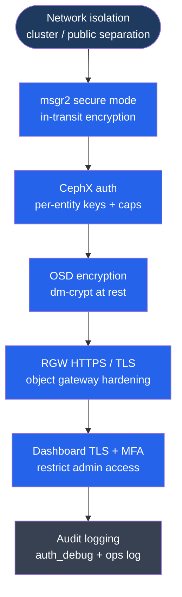

---
tags:
  - ceph
  - security
---
# Ceph — Hardening

<div class="kb-summary">
Ceph security hardening: network isolation, msgr2 encryption, cephx least-privilege, OSD encryption, RGW HTTPS, dashboard TLS, audit logging, and CIS-aligned controls.

*Applies to: Ceph Reef / Squid*
</div>

```text
┌────────────────────────────────────────── Ceph — Hardening ───────────────────────────────────────────┐
│                                                                                                       │
│   ┌───────────────────────────────────────────────────────────────────────────────────────────────┐   │
│   │   Network: firewall the cluster network; only Ceph nodes should reach OSD ports              │    │
│   │   Dashboard: change default admin password; enable TLS; restrict source IPs                  │    │
│   │   Modules: disable pg_autoscaler, telemetry, crash if not needed to reduce attack surface    │    │
│   └───────────────────────────────────────────────────────────────────────────────────────────────┘   │
│                                                                                                       │
│  Key terms:                                                                                           │
│                                                                                                       │
│  Cluster network = Separate network for OSD-to-OSD replication; block from client-facing hosts        │
│  Public network  = Client-facing network; OSDs listen here for client I/O requests                    │
│  firewalld      = Linux firewall service; restrict cluster network ports to Ceph OSD nodes only       │
│  Dashboard TLS  = Ceph Dashboard HTTPS cert; ceph dashboard create-self-signed-cert for internal use  │
│  telemetry module = MGR module sending anonymous usage data to Ceph project; disable if not desired   │
│  pg_autoscaler  = MGR module auto-adjusting PG counts; disable for production cluster stability       │
│  crash module   = Captures daemon crash dumps; keep enabled for diagnostic visibility                 │
│  admin socket   = Unix socket for per-daemon runtime info; restrict file permissions on all hosts     │
│  msgr2 secure   = Ceph messenger v2 encryption mode; encrypts all OSD-to-OSD and client traffic       │
│  nomonmap       = Prevents unauthenticated MON map enumeration; enforced by CephX by default          │
│  CIS benchmark  = Center for Internet Security hardening guide; reference for Ceph compliance audits  │
│                                                                                                       │
└───────────────────────────────────────────────────────────────────────────────────────────────────────┘
```



## Before you begin

- **Access:** Storage admin credentials (cluster admin or equivalent)
- **Change management:** security changes require CAB approval in most environments
- **Rollback plan:** document current state before any security control change
- **Testing:** validate in a non-production environment first where possible

---

## Network Isolation

```bash
# Verify cluster network is configured (OSD replication stays on dedicated network)
ceph config get osd cluster_network
ceph config get osd public_network

# Set if not configured
ceph config set global cluster_network 10.0.1.0/24
ceph config set global public_network 10.0.0.0/24

# Verify separation took effect on a running OSD
ceph daemon osd.0 config show | grep -E "cluster_network|public_network"
```

## Firewall Rules

| Port | Protocol | From | To | Purpose |
|---|---|---|---|---|
| 6789 | TCP | Client hosts | MON nodes | MON msgr1 (legacy) |
| 3300 | TCP | All Ceph nodes + clients | MON nodes | MON msgr2 |
| 6800–7300 | TCP | Ceph nodes only | OSD nodes | OSD replication + client I/O |
| 8080 | TCP | Admin hosts | MGR node | Dashboard HTTP (disable; use 8443) |
| 8443 | TCP | Admin hosts | MGR node | Dashboard HTTPS |
| 9283 | TCP | Prometheus host | MGR node | Prometheus metrics exporter |
| 7480 | TCP | Client hosts | RGW nodes | RGW HTTP default (prefer 443) |
| 443 | TCP | Client hosts | RGW nodes | RGW HTTPS |

```bash
# firewalld example for OSD nodes (cluster network must be internal-only)
firewall-cmd --permanent --zone=internal --add-source=10.0.1.0/24  # cluster network CIDR
firewall-cmd --permanent --zone=internal --add-port=6800-7300/tcp

# Public network (client access to MON and OSD)
firewall-cmd --permanent --zone=public --add-source=10.0.0.0/24
firewall-cmd --permanent --zone=public --add-port=3300/tcp          # MON msgr2
firewall-cmd --permanent --zone=public --add-port=6800-7300/tcp     # OSD client I/O
firewall-cmd --reload
# Block all other inbound on cluster network from outside Ceph nodes
```

## Disable Insecure msgr1

```bash
# Force all connections to use msgr2 (prevents protocol downgrade attacks)
ceph config set global ms_bind_msgr1 false

# Enable encrypted mode on all connection types
ceph config set global ms_cluster_mode secure    # OSD-to-OSD
ceph config set global ms_service_mode secure    # client-to-OSD / MON
ceph config set global ms_client_mode secure     # outgoing client connections

# Verify
ceph config get mon ms_cluster_mode   # expected: secure
```

## Dashboard Security

```bash
# Change default admin password
ceph dashboard ac-user-set-password admin --password-policy-check-enabled NewSecurePassword123!

# Enable HTTPS with a signed certificate
ceph dashboard set-ssl-certificate -i /etc/ceph/dashboard.crt
ceph dashboard set-ssl-certificate-key -i /etc/ceph/dashboard.key
ceph config set mgr mgr/dashboard/ssl true

# Create self-signed cert for internal use (testing only)
ceph dashboard create-self-signed-cert

# Verify HTTPS is active
ceph mgr services | grep dashboard   # URL should show https://

# Create read-only monitoring user (never use admin account for monitoring)
ceph dashboard ac-user-create monitoring --roles=read-only

# List available roles
# administrator, read-only, block-manager, rgw-manager, cluster-manager, pool-manager, cephfs-manager

# Disable dashboard entirely if not needed
ceph mgr module disable dashboard
```

## Disable Unnecessary MGR Modules

```bash
# List enabled modules
ceph mgr module ls | grep enabled

# Disable modules not in use
ceph mgr module disable telemetry      # anonymous usage data sent to Ceph project
ceph mgr module disable insights       # workload analytics
ceph mgr module disable rbd_support    # RBD monitoring hooks (if not using)

# Review pg_autoscaler (disable for manual PG control in production)
ceph mgr module disable pg_autoscaler

# List currently exposed services
ceph mgr services
```

## Audit Logging

```bash
# Enable auth debug logging for incident investigation
# WARNING: verbose — disable after investigation; not for permanent production use
ceph config set global auth_debug true

# Log slow ops (threshold in seconds — log ops slower than this)
ceph config set osd osd_op_log_threshold 5

# Enable cluster-level audit log (records all config changes and auth events)
ceph config set global log_to_file true
ceph config set global log_file /var/log/ceph/ceph.log

# Verify audit log is capturing events
tail -f /var/log/ceph/ceph.log | grep -E "auth|audit"

# Reset debug logging after investigation
ceph config rm global auth_debug
```

## Least Privilege: Key Hygiene

```bash
# Never use client.admin in application configuration
# Create a pool-scoped service account per application
ceph auth get-or-create client.myapp \
  mon 'allow r' \
  osd 'allow rw pool=myapp-pool'

# Check which hosts have the admin keyring (should be admin workstations only)
for host in $(ceph orch host ls -f json | python3 -c \
  "import sys,json; [print(h['hostname']) for h in json.load(sys.stdin)]"); do
  echo -n "$host: "
  ssh "$host" "ls /etc/ceph/ceph.client.admin.keyring 2>/dev/null && echo PRESENT || echo absent"
done

# Rotate keyrings quarterly: create new entity, distribute, verify, delete old
ceph auth del client.myapp        # delete old
ceph auth get-or-create client.myapp mon 'allow r' osd 'allow rw pool=myapp-pool'
```

## CIS Hardening Controls

| Control | Implementation | Command |
|---|---|---|
| Network separation | Dedicated cluster network, firewall OSD ports | `ceph config set global cluster_network 10.0.1.0/24` |
| In-transit encryption | msgr2 secure mode, disable msgr1 | `ceph config set global ms_cluster_mode secure` |
| Authentication | CephX enabled (default); pool-scoped keys | `ceph auth get-or-create client.app ...` |
| At-rest encryption | OSD dm-crypt enabled at creation | `ceph orch apply osd ... --data-encrypt` |
| Dashboard access | HTTPS only, non-admin roles for monitoring | `ceph config set mgr mgr/dashboard/ssl true` |
| Audit logging | Ceph audit log + OS audit (auditd) | `ceph config set global log_to_file true` |
| SSH hardening | Disable password auth; cephadm SSH key only | `/etc/ssh/sshd_config: PasswordAuthentication no` |
| NTP enforced | Clock skew > 50 ms causes MON warnings | `systemctl enable --now chronyd` |
| Prometheus auth | mTLS or basic auth on scrape endpoint | `ceph dashboard set-prometheus-credentials` |
| Unused modules | Disable telemetry, insights, rbd_support | `ceph mgr module disable telemetry` |

## Prometheus Exporter Hardening

The MGR Prometheus exporter (port 9283) exposes detailed cluster metrics. Restrict access and enable authentication to prevent information disclosure.

```bash
# Restrict Prometheus scrape to specific IP (use firewall zone or Prometheus credentials)
firewall-cmd --permanent --zone=internal --add-source=<prometheus-host-ip>
firewall-cmd --permanent --zone=internal --add-port=9283/tcp
firewall-cmd --reload

# Enable basic auth for Prometheus endpoint
ceph dashboard set-prometheus-credentials <username> <password>

# Verify exporter is only listening on expected interface
ss -tlnp | grep 9283
```

## Admin Socket Permissions

Each Ceph daemon creates a Unix domain socket for runtime queries. Restrict these to prevent local privilege escalation.

```bash
# Admin sockets are located at /var/run/ceph/
ls -la /var/run/ceph/

# Verify sockets are owned by ceph user only (no world-readable sockets)
find /var/run/ceph -name "*.asok" -exec ls -la {} \;
# Expected: srwxr-x--- (owner: ceph, group: ceph or cephadm)

# Set socket permissions explicitly if incorrect
ceph config set global admin_socket_mode 0660
```

## Hardening Verification Commands

Run these after applying hardening controls to confirm the state matches intent.

```bash
# Verify msgr2 secure mode
ceph config get mon ms_cluster_mode    # expect: secure
ceph config get osd ms_service_mode    # expect: secure
ceph config get global ms_bind_msgr1   # expect: false

# Verify network config
ceph config get osd public_network
ceph config get osd cluster_network

# Verify dashboard TLS
ceph mgr services | grep dashboard     # URL must be https://

# Verify OSD encryption in spec
ceph orch ls --service-type osd -f yaml | grep -i encrypt

# Verify no over-privileged entities
ceph auth ls | grep "allow \*"         # should show only client.admin and bootstrap keys

# Verify NTP on all nodes
for host in $(ceph orch host ls -f json | python3 -c \
  "import sys,json; [print(h['hostname']) for h in json.load(sys.stdin)]"); do
  echo -n "$host: "; ssh "$host" chronyc tracking | grep "System time"
done
```

## See also

- [Ceph — Access Control](../access-control/)
- [Ceph — Authentication](../authentication/)
- [Ceph — Health Checks](../../operations/health-checks/)
