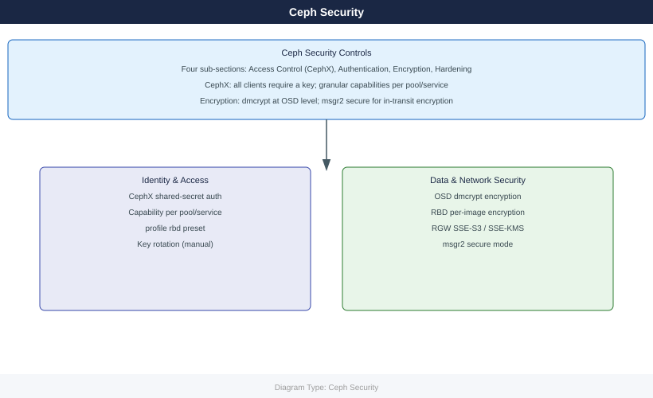

---
tags:
  - ceph
  - security
---
# Ceph — Security

<!-- diagram:ceph-security -->

Ceph security: CephX authentication for all daemon and client communication, RBAC capabilities per user, encryption at rest with dmcrypt, and TLS for RGW S3 endpoints.

*Applies to: Ceph Reef / Squid*

  <a class="kb-card" href="access-control/">
    Access Control
    CephX auth users, capabilities, per-pool permissions, admin key management
  </a>
  <a class="kb-card" href="authentication/">
    Authentication
    CephX shared secret auth, key distribution, client trust model
  </a>
  <a class="kb-card" href="encryption/">
    Encryption
    OSD-level dmcrypt at rest, RBD image encryption, RGW server-side encryption
  </a>
  <a class="kb-card" href="hardening/">
    Hardening
    Network firewall rules, disable unused modules, monitoring alerts, CIS controls
  </a>

