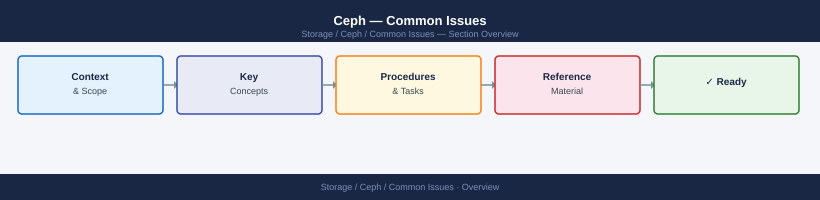
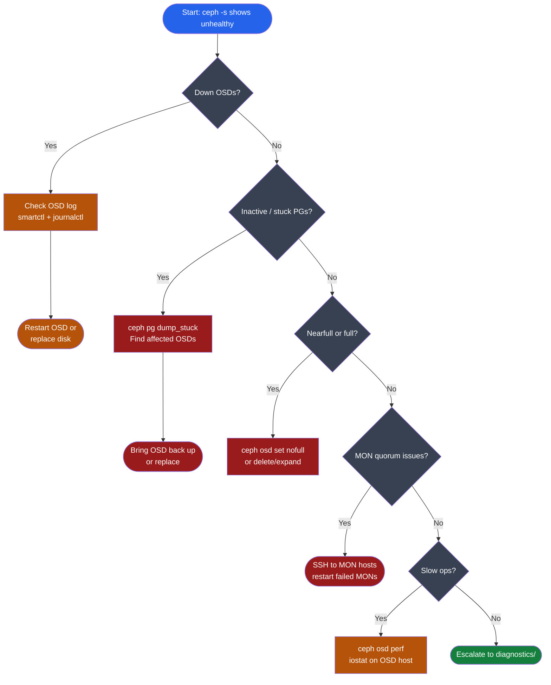
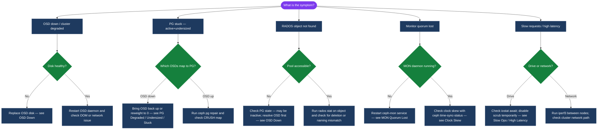

---
tags:
  - ceph
  - troubleshooting
search:
  boost: 1.5
---
# Ceph — Common Issues

<div class="kb-summary">
Troubleshooting guide for frequent Ceph problems: OSD down/out, PG degraded and stuck, slow requests, nearfull/full cluster, clock skew, MON quorum loss, and recovery that won't complete.

*Applies to: Ceph Reef / Squid*
</div>





## Diagnostic Flow



---

## Before you begin

- **Access:** Storage admin credentials (cluster admin or equivalent)
- **Gather first:** recent error message text, event timestamps, and affected object names
- **Scope:** confirm whether the issue affects a single object, host, cluster, or site
- **Escalation:** open a vendor support ticket before running any destructive step
- **Logging:** document each command and output — required if escalation is needed

---

## OSD Down

```bash
# Identify down OSDs
ceph health detail | grep OSD_DOWN
ceph osd tree | grep down

# Check OSD log (most common cause: disk error, kernel issue, or OOM kill)
journalctl -u ceph-osd@5 -n 100 --no-pager
# Or via cephadm:
ceph orch daemon logs osd.5 | tail -100

# Check disk health
smartctl -a /dev/sdb | grep -E "Reallocated|Pending|Offline|Error"

# If disk is healthy but OSD crashed: restart OSD
ceph orch daemon restart osd.5

# If disk has errors: replace the OSD (see Procedures page)

# Check if OSD is timing out due to network
ceph osd perf | grep osd.5   # check commit/apply latency

# Check for OOM kill
dmesg | grep -i oom | tail -20
# If OOM: increase osd_memory_target
ceph config set osd osd_memory_target 6G  # adjust per available RAM
```

## HEALTH_ERR: OSD Full

When the cluster hits the `full ratio` (default 95%), all writes are blocked including replication and recovery.

```bash
# Confirm full state
ceph health detail | grep -E "OSD_FULL|FULL"
ceph osd df | sort -k8 -rn | head -20  # find highest-utilisation OSDs

# Immediate override — allows writes past 100% temporarily (DANGEROUS)
# Only use to free space, then unset immediately
ceph osd set nofull

# Buy time by raising the full threshold
ceph osd set-full-ratio 0.97          # temporary; reset after fix
ceph osd set-nearfull-ratio 0.92

# Find large objects contributing to usage
rados df | sort -k2 -rn | head -20

# Find large RBD images
rbd ls rbd | while read img; do
  SIZE=$(rbd info rbd/$img | grep disk_usage | awk '{print $2}')
  echo "$SIZE $img"
done | sort -h -r | head -20

# Permanent fix options:
# 1. Delete data or expired snapshots
# 2. Add more OSDs (see Procedures)
# 3. Increase pool min_size temporarily only in genuine emergency

# After freeing space: unset override flags
ceph osd unset nofull
ceph osd set-full-ratio 0.95   # reset to default
```

## Slow Ops / High Latency

```bash
# Symptoms: HEALTH_WARN "X requests are blocked"
ceph health detail | grep SLOW_OPS
ceph osd perf | sort -k3 -rn | head -10  # sort by commit_latency; high value = disk issue

# Check disk I/O on OSD host (await > 50 ms = disk saturated)
iostat -dx 5 3 | grep -E "^sd|Device"

# Test cluster network bandwidth (expect ≥ 10 Gbps on 10 GbE)
iperf3 -c ceph-node2 -t 10 -P 4

# Check BlueStore WAL/DB usage
ceph daemon osd.5 perf dump | grep -E "wal|db|commit"

# Temporarily disable scrubbing if it is contributing to latency
ceph osd set noscrub
ceph osd set nodeep-scrub
# Re-enable after resolving: ceph osd unset noscrub

# Limit recovery I/O to reduce impact on client ops
ceph config set osd osd_max_backfills 1
ceph config set osd osd_recovery_max_active_hdd 2

# Check slow op details (shows which object and which client)
ceph daemon osd.5 dump_ops_in_flight
ceph daemon osd.5 dump_historic_ops
```

## PG Degraded / Undersized / Stuck

```bash
# Check PG status
ceph pg stat
ceph pg dump_stuck                    # all stuck PGs
ceph pg dump_stuck unclean | head -20  # identify PGs and their OSDs

# PG states requiring action:
# active+degraded   = Some replicas missing; cluster recovering; usually self-resolves
# inactive          = No primary OSD; I/O blocked; urgent — check which OSD is down
# stale             = Primary OSD hasn't reported in; check MON-OSD connectivity
# incomplete        = Not enough OSDs to form a quorum for the PG; data at risk
# active+undersized = Replica count below min_size (one or more OSDs down)

# Find which OSDs are mapped to a specific PG
ceph pg map 1.5a    # shows: osd.[primary] [osd.secondary, ...]

# Force repair on a specific PG
ceph pg repair 1.5a

# Identify which OSDs are down causing undersized PGs
ceph osd tree | grep -E "down|out"

# If one OSD is permanently lost: reweight to 0 and let cluster rebalance
ceph osd reweight osd.5 0

# Emergency only: temporarily reduce min_size (DANGEROUS — data loss risk)
# ceph osd pool set rbd min_size 1   # use only if you have no other option, unset immediately
```

## Clock Skew

```bash
# MONs require clock sync within 0.05 s (50 ms); > 1 s can cause MON election failures
ceph health detail | grep CLOCK_SKEW

# Show per-MON skew values
ceph time-sync-status

# Check NTP on affected nodes
chronyc tracking
chronyc sources -v

# Fix: restart chrony if drifted
systemctl status chronyd
systemctl restart chronyd

# Check clock difference between MON nodes
for host in $(ceph mon dump | awk '/^[0-9]/{print $3}' | cut -d: -f1); do
  echo -n "$host: "; ssh $host date -u +%T
done

# Verify MON clock skew after fix
ceph health detail | grep -E "CLOCK|TIME"
```

## MON Quorum Lost

A MON quorum loss blocks all writes and most reads. Minimum 2 of 3 MONs (or 3 of 5) must be up.

```bash
# Symptoms: ceph -s hangs or returns Error ENOENT
# All writes blocked

# 1. SSH to each MON host and check daemon status
systemctl status ceph-mon@<id>

# 2. Restart failed MONs
systemctl restart ceph-mon@<id>
# Or via cephadm:
ceph orch daemon restart mon.<hostname>

# 3. Verify quorum restored
ceph quorum_status
# Output shows: "quorum_names" containing all expected MON hostnames

# 4. If one MON host permanently failed:
ceph mon rm <id>    # run from a healthy MON host
# Then deploy a replacement MON:
ceph orch apply mon --placement="host1,host2,host3-new"

# 5. Check MON log for split-brain or election issues
journalctl -u ceph-mon@<id> -n 200 | grep -E "election|quorum|paxos"
```

---

## See also

- [Ceph — Diagnostics](../diagnostics/)
- [Ceph — Escalation](../escalation/)
- [Ceph — Health Checks](../../operations/health-checks/)

## Verify resolution

- Confirm the original symptom no longer occurs
- Check logs for any residual errors related to the issue
- Monitor for 10–15 minutes to confirm the fix is stable
