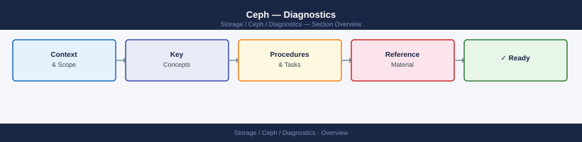
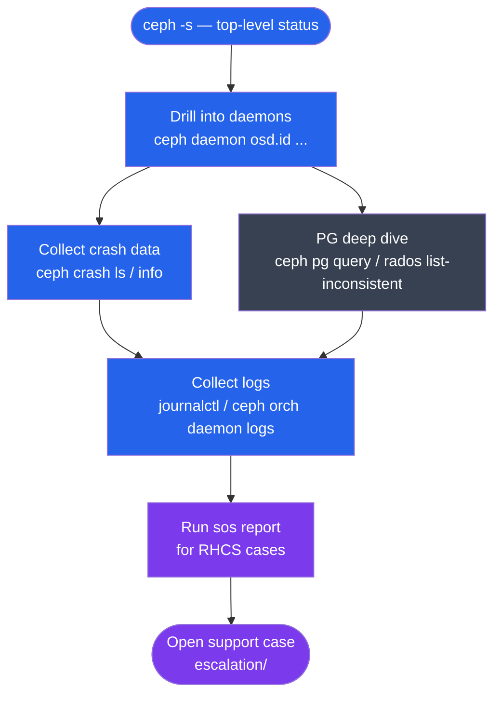

---
tags:
  - ceph
  - troubleshooting
search:
  boost: 1.5
---
# Ceph — Diagnostics


<div class="kb-summary">
Diagnostic tools for Ceph: health code reference, OSD log analysis, crash dump review, network and latency diagnostics, PG deep dives, and gathering data for support cases.

*Applies to: Ceph Reef / Squid*
</div>





## Before you begin

- **Access:** Storage admin credentials (cluster admin or equivalent)
- **Gather first:** recent error message text, event timestamps, and affected object names
- **Scope:** confirm whether the issue affects a single object, host, cluster, or site
- **Escalation:** open a vendor support ticket before running any destructive step
- **Logging:** document each command and output — required if escalation is needed

---

## Health Code Reference

```bash
# Get full health detail with error codes
ceph health detail

# Common health codes and meanings:
# OSD_DOWN           = OSD not responding; check disk and daemon log
# OSD_OUT            = OSD marked out manually; data migrating
# OSD_NEARFULL       = OSD disk > nearfull ratio (per-OSD)
# OSD_FULL           = All writes blocked; free space immediately
# PG_DEGRADED        = PG has fewer than desired replicas
# PG_INACTIVE        = PG can't serve I/O; check which OSD primary is down
# PG_BACKFILL_TOOFULL= OSD too full to receive backfill; add capacity
# SLOW_OPS           = Ops queued > 30s; check disk I/O or network
# CLOCK_SKEW         = MON node NTP drift > 50ms; fix NTP
# MON_DOWN           = MON daemon down; quorum may be at risk
# POOL_NEAR_FULL     = Pool quota nearly exceeded
# AUTH_INSECURE_GLOBAL_ID_RECLAIM = msgr2 security issue; patch required
```

## Crash Collection

```bash
ceph crash ls                          # list crashes with timestamp and ID
ceph crash info <crash-id>             # full crash detail: backtrace, daemon version, message
ceph crash archive <crash-id>          # acknowledge crash after review
ceph crash archive-all                 # acknowledge all pending crashes

# Crash minidumps stored on disk at:
ls /var/lib/ceph/crash/
# Each crash directory contains: metadata JSON, backtrace, and OSD log at time of crash

# Count crashes by daemon type
ceph crash stat
```

## OSD Daemon Diagnostics

```bash
# Performance counters (all metrics the OSD tracks internally)
ceph daemon osd.<id> perf dump

# Show active configuration for messaging and OSD parameters
ceph daemon osd.<id> config show | grep -E "ms_|osd_max"

# Recent slow ops — shows ops that exceeded slow_op threshold
ceph daemon osd.<id> dump_historic_ops

# Current in-flight ops — shows what is actively being processed
ceph daemon osd.<id> dump_ops_in_flight

# BlueStore internal stats (fragmentation, read/write latency breakdown)
ceph daemon osd.<id> perf dump | python3 -m json.tool | grep -A5 "bluestore"

# Cache stats for BlueStore buffer cache
ceph daemon osd.<id> perf dump | python3 -m json.tool | grep -E "cache_|throttle"
```

## OSD Log Analysis

```bash
# Ceph OSD logs (cephadm-managed clusters use container logs)
ceph orch daemon logs osd.5            # recent container logs
ceph orch daemon logs osd.5 --follow   # live tail

# On OSD node directly
journalctl -u ceph-osd@5 -n 200 --no-pager

# Common OSD log messages and their meaning:
# "slow request"                       → latency issue (disk or network)
# "wrongly marked me down"             → network partition between OSD and MON
# "bluestore osd ... fsck failed"      → disk corruption; run: ceph-osd --osd-id 5 --repair
# "FAILED assert" followed by crash    → OSD bug or disk error
# "heartbeat_check: no reply from osd.X" → OSD-to-OSD network issue

# Get OSD perf dump (runtime metrics)
ceph daemon osd.5 perf dump | python3 -m json.tool | grep -A3 "commit_latency\|apply_latency"
```

## Log Levels (Debugging)

```bash
# Increase OSD log verbosity for debugging (reset after use — very verbose)
ceph config set osd debug_osd 10       # verbose OSD log
ceph config set osd debug_ms 1         # message layer debug
ceph config set osd debug_bluestore 10 # BlueStore internals

# Reset after debugging (do not leave elevated in production)
ceph config rm osd debug_osd
ceph config rm osd debug_ms
ceph config rm osd debug_bluestore

# Via cephadm orchestrator log tailing
ceph orch daemon logs osd.<id>         # tail daemon log via orchestrator

# Journald query on OSD host
journalctl -u ceph-osd@<id> --since "1 hour ago"
```

## Crash Dump Analysis

```bash
# View specific crash detail
ceph crash info <crash-id>   # shows backtrace, OSD version, message

# Archive crash (acknowledge it after review)
ceph crash archive <crash-id>
ceph crash archive-all       # archive all

# Crash logs on disk: one directory per crash
ls /var/lib/ceph/crash/
# Each crash has: metadata, backtrace, and log at time of crash
```

## Network Diagnostics

```bash
# Test cluster network bandwidth between OSD nodes
# Node 1 (receiver):
iperf3 -s

# Node 2 (sender):
iperf3 -c 10.0.1.11 -t 30 -P 4 -i 5
# Expected: near line rate (9+ Gbps for 10 GbE, 23+ Gbps for 25 GbE)

# Check OSD heartbeat timeouts (indicates network issues)
ceph config show-with-defaults osd.0 | grep -E "heartbeat|timeout"

# Measure round-trip latency between OSD nodes
ping -c 20 10.0.1.11   # cluster network; expected < 0.5 ms
# Check for packet loss (can cause OSD down events)
mtr --report --report-cycles 100 10.0.1.11
```

## PG Inconsistency Deep Dive

```bash
# Full PG state JSON (useful for support cases)
ceph pg <pgid> query | python3 -m json.tool

# Find which pools have inconsistent PGs
rados list-inconsistent-pg <pool>

# Find which objects are inconsistent within a specific PG
rados list-inconsistent-obj <pgid> <pool>

# Force a PG repair (Ceph will attempt to fix the inconsistency)
ceph pg repair <pgid>

# Check PG states across all pools
ceph pg dump_stuck inconsistent
ceph pg dump | awk '$1 ~ /^[0-9]+\.[0-9a-f]+/ && $9 != "active+clean" {print $1, $9}'
```

## sosreport for Red Hat Ceph Storage

```bash
# Collect sos report on any RHCS node (includes all Ceph-specific diagnostics)
sos report -e ceph -k ceph.all=true

# Output tarball written to:
ls /var/tmp/sosreport-*.tar.xz

# Collect on all MON hosts and affected OSD hosts before opening a case
# Transfer to admin workstation for upload to access.redhat.com
```

## Gather Support Data

```bash
# 1. Full cluster status
ceph status > /tmp/ceph-status.txt
ceph health detail >> /tmp/ceph-status.txt
ceph -s >> /tmp/ceph-status.txt

# 2. OSD map and tree
ceph osd dump > /tmp/osd-dump.txt
ceph osd tree > /tmp/osd-tree.txt
ceph osd df > /tmp/osd-df.txt

# 3. PG dump
ceph pg dump > /tmp/pg-dump.txt
ceph pg dump_stuck > /tmp/pg-stuck.txt

# 4. Config
ceph config dump > /tmp/ceph-config.txt

# 5. MON logs (last 1000 lines per MON)
for mon in $(ceph mon dump | awk '/^[0-9]/{print $3}' | cut -d: -f1); do
  ssh $mon "journalctl -u ceph-mon@$(hostname) -n 1000 --no-pager" > /tmp/mon-${mon}.log
done

# 6. OSD logs from affected OSDs
ceph orch daemon logs osd.5 > /tmp/osd5.log

# Compress all for upload
tar czf ceph-support-$(date +%F).tar.gz /tmp/ceph-*.txt /tmp/osd*.log /tmp/mon-*.log
```

---

## See also

- [Ceph — Common Issues](../common-issues/)
- [Ceph — Escalation](../escalation/)

## Verify resolution

- Confirm the original symptom no longer occurs
- Check logs for any residual errors related to the issue
- Monitor for 10–15 minutes to confirm the fix is stable
