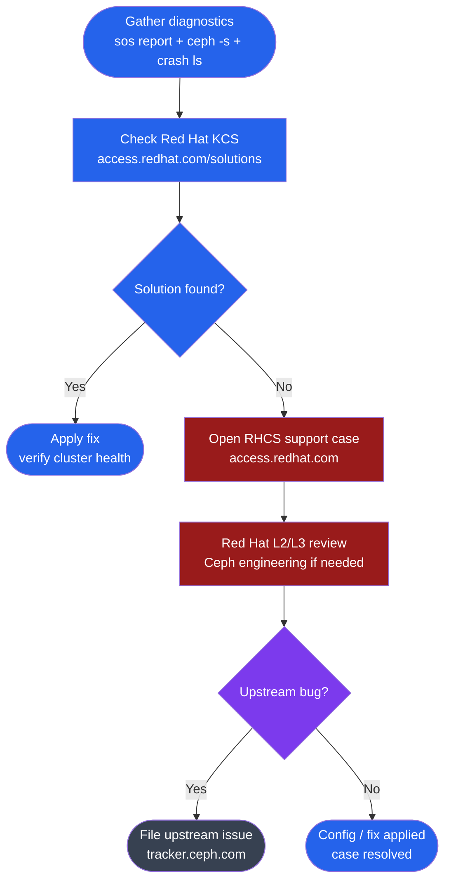

---
tags:
  - ceph
  - troubleshooting
---
# Ceph — Escalation

<div class="kb-summary">
Ceph support escalation: Red Hat Ceph Storage support case process, community resources, severity levels, required diagnostic data, must-gather for ODF/OpenShift, and sanitisation before sharing logs.

*Applies to: Ceph Reef / Squid*
</div>

```text
┌────────────────────────────────────── Ceph — Support Escalation ──────────────────────────────────────┐
│                                                                                                       │
│   ┌───────────────────────────────────────────────────────────────────────────────────────────────┐   │
│   │   Red Hat Ceph Storage: full commercial support for RHCS; similar to RHEL support model       │   │
│   │   Community Ceph: upstream issues go to ceph-users ML or GitHub issues                        │   │
│   │   Data loss risk: any HEALTH_ERR with inactive PGs → open Sev 1 immediately                   │   │
│   └───────────────────────────────────────────────────────────────────────────────────────────────┘   │
│                                                                                                       │
│  Key terms:                                                                                           │
│                                                                                                       │
│  Red Hat RHCS  = Red Hat Ceph Storage; commercial distribution with SLA-backed enterprise support     │
│  Sev 1         = Production down; data at risk or I/O halted; 24×7 immediate response required        │
│  Sev 2         = Degraded production; reduced redundancy; 2–4 hour initial response SLA               │
│  sosreport     = Linux system diagnostics collector; required attachment for all Red Hat cases        │
│  ceph report   = Full cluster state JSON snapshot; ceph report > ceph-report.json for support         │
│  ceph crash    = Daemon crash report store; ceph crash info <id> provides traceback and context       │
│  ceph-users ML = Upstream mailing list; community support for non-RHCS Ceph deployments               │
│  GitHub issues = ceph/ceph repository; upstream bug tracking and community Ceph case management       │
│  IRC/Slack     = #ceph on OFTC IRC and ceph.io Slack; real-time community support channel             │
│  vendor TAM    = Technical Account Manager; Red Hat named escalation contact for Premier subscribers  │
│  support bundle= sosreport + ceph report + OSD journal; standard data set for vendor cases            │
│  HEALTH_ERR    = Threshold for Sev 1 escalation; any HEALTH_ERR with inactive PGs → immediate case    │
│                                                                                                       │
└───────────────────────────────────────────────────────────────────────────────────────────────────────┘
```



## Before you begin

- **Access:** Storage admin credentials (cluster admin or equivalent)
- **Gather first:** recent error message text, event timestamps, and affected object names
- **Scope:** confirm whether the issue affects a single object, host, cluster, or site
- **Escalation:** open a vendor support ticket before running any destructive step
- **Logging:** document each command and output — required if escalation is needed

---

## Escalation Severity Table

| Severity | Definition | SLA | Action |
|---|---|---|---|
| Sev 1 | Cluster not writable or data loss imminent | 1 hour (24×7) | Phone + case immediately |
| Sev 2 | Degraded performance, OSD failures, no data loss | 4 business hours | Open case + attach bundle |
| Sev 3 | HEALTH_WARN, minor issues, workaround available | 1 business day | Online case |
| Sev 4 | General question or planning guidance | 2 business days | Online case |

## Red Hat Ceph Storage (RHCS) Support

**Support portal**: access.redhat.com → Create Case

Set severity based on the impact table above. For Sev 1, call the Red Hat support phone number displayed on access.redhat.com immediately after opening the case.

### Required information

```bash
# Gather all of the following before opening the case:

# 1. RHCS version
ceph version
ceph versions       # all daemon versions (useful if mixed during upgrade)

# 2. Cluster health snapshot
ceph -s > /tmp/ceph-status.txt
ceph health detail >> /tmp/ceph-status.txt
ceph osd tree >> /tmp/ceph-status.txt
ceph pg dump_stuck >> /tmp/ceph-status.txt
ceph config dump >> /tmp/ceph-status.txt
ceph crash ls >> /tmp/ceph-status.txt

# 3. Crash dumps
ceph crash info $(ceph crash ls | awk '{print $1}') > /tmp/crash-dumps.txt

# 4. Affected daemon logs (last 2000 lines per daemon)
ceph orch daemon logs osd.5 > /tmp/osd5.log
journalctl -u ceph-mon@$(hostname) -n 2000 --no-pager > /tmp/mon.log

# 5. sos reports from ALL MON hosts and affected OSD hosts
sos report -e ceph -k ceph.all=true --batch --label ceph

# Compress everything for upload
tar czf ceph-case-data-$(date +%F).tar.gz /tmp/ceph-*.txt /tmp/osd*.log /tmp/mon.log
```

## Must-Gather for ODF / OpenShift

If running Ceph via OpenShift Data Foundation (ODF), use must-gather instead of (or in addition to) sos report:

```bash
oc adm must-gather \
  --image=registry.redhat.io/odf4/odf-must-gather-rhel9
# Output: must-gather.local.<timestamp>/ directory
# Includes: ODF operator logs, Rook-Ceph logs, Ceph health, PVC/PV state, storage class info
```

## Escalation Path (Step-by-Step)

```text
1. Open case at access.redhat.com (RHCS subscription required)
   - Set severity based on impact table above
   - Attach ceph-case-data bundle + sos reports
   - Provide: Ceph version, cluster size (#nodes, #OSDs), symptoms, timeline

2. For Sev 1: call Red Hat support immediately after opening case
   - Phone number displayed on access.redhat.com

3. If no progress in 2–4 hours on Sev 1: request case escalation
   - Ask CEE (Customer Engagement Engineer) to escalate to the Ceph engineering team

4. If TAM assigned: contact TAM directly for critical situations

Community Ceph (upstream, no support contract):
  - ceph-users mailing list:  ceph-users@ceph.io
  - IRC:                      #ceph on OFTC
  - Slack:                    ceph.io/slack
  - GitHub (bugs):            https://github.com/ceph/ceph/issues
  - Forum:                    https://forum.ceph.io
  - Upstream tracker:         tracker.ceph.com
```

## Upstream Bug Filing

When filing a bug at tracker.ceph.com:

- Include `ceph versions` output
- State cluster size: number of nodes, total OSDs, total capacity
- Include exact reproduction steps
- Attach sanitised logs (see below)
- Reference the Red Hat case number if one exists

## Sanitise Before Sharing

Remove auth keys and secrets from all log output before uploading to support portals or public trackers.

```bash
# Check sos report for secrets before sharing
grep -ri "password\|secret\|key\|token" /var/tmp/sosreport*/

# Remove or redact keyring content from log files
sed -i 's/key = .*/key = [REDACTED]/g' /tmp/ceph-status.txt

# Use --mask option in newer sos versions to auto-redact
sos report -e ceph -k ceph.all=true --mask

# Check exported ceph config for sensitive values
ceph config dump | grep -E "pass|secret|key|token"

# Never share client.admin keyring content in support cases
# Strip key lines from any keyring file before attaching
grep -v "^[[:space:]]*key" /etc/ceph/ceph.client.admin.keyring
```

## Emergency Recovery Commands

```bash
# Cluster completely unresponsive — emergency recovery steps:

# 1. Check MON quorum (minimum 2 of 3 must be up)
ceph mon stat
ceph quorum_status

# 2. If no quorum: check MON services on each host
for host in ceph-node1 ceph-node2 ceph-node3; do
  ssh $host "systemctl status ceph-mon@$host"
done

# 3. Restart failed MONs
systemctl restart ceph-mon@<id>
ceph orch daemon restart mon.<hostname>

# 4. Cluster full stop (halt all writes for investigation)
ceph osd set pause   # pause all OSD I/O
# Resume:
ceph osd unset pause

# 5. Recover MON from monmap (advanced — contact support first)
# ceph-mon --extract-monmap /tmp/monmap --mon-data /var/lib/ceph/mon/ceph-$host
```

## Pre-Case Self-Service Checklist

Before opening a support case, check the Red Hat Knowledge Base for known solutions:

```text
1. Go to access.redhat.com/search
2. Search for the exact HEALTH code: e.g. "OSD_FULL" or "PG_INACTIVE"
3. Filter by product: Red Hat Ceph Storage
4. Check top solutions — most common issues have a KCS article

Common KCS articles:
  - "How to recover from a full Ceph cluster"
  - "Ceph MON quorum lost recovery steps"
  - "AUTH_INSECURE_GLOBAL_ID_RECLAIM explained and remediation"
  - "Clock skew between Ceph Monitor nodes"
```

## Ceph Version and Support Lifecycle

Check the RHCS support lifecycle before opening a case — running an end-of-life version may limit support options.

```bash
# Check running version
ceph version

# List all daemon versions (important during rolling upgrades)
ceph versions

# RHCS support lifecycle:
# RHCS 5 (Octopus-based): check access.redhat.com for EOL date
# RHCS 6 (Quincy-based):  current; full support
# RHCS 7 (Reef-based):    current; full support
```

## Information to Include in Every Case

When filing any Ceph support case, always include the following regardless of severity. Missing information adds round-trip delay.

| Required item | How to collect |
|---|---|
| RHCS version | `ceph version` |
| All daemon versions | `ceph versions` |
| Cluster health output | `ceph -s && ceph health detail` |
| OSD tree | `ceph osd tree` |
| PG dump (stuck PGs) | `ceph pg dump_stuck` |
| Cluster config | `ceph config dump` |
| Timeline of events | Manual: when did the issue start, what changed |
| sos reports | `sos report -e ceph -k ceph.all=true` from all MON hosts |
| Crash dumps | `ceph crash ls && ceph crash info <id>` |
| Affected daemon logs | `ceph orch daemon logs osd.<id>` |

---

## Verify resolution

- Confirm the original symptom no longer occurs
- Check logs for any residual errors related to the issue
- Monitor for 10–15 minutes to confirm the fix is stable
