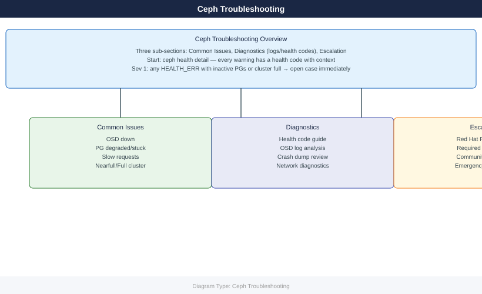

---
tags:
  - ceph
  - troubleshooting
search:
  boost: 1.5
---
# Ceph — Troubleshooting

<!-- diagram:ceph-troubleshooting -->

<div class="kb-summary">
Ceph troubleshooting: OSD down/out recovery, PG degraded and stuck states, slow requests, nearfull cluster, and escalation to Red Hat/Ceph community support.

*Applies to: Ceph Reef / Squid*
</div>



```d2
direction: right

D: "Check specific warning\nceph health detail" {shape: rectangle}
E: "Clock skew? OSD nearfull?\nSlow ops? → common-issues/" {shape: rectangle}
A: "ceph -s" {shape: rectangle}
C: "Done — no action needed" {shape: rectangle}
G: "OSD recovery\ncommon-issues/" {shape: rectangle}
H: "PG diagnostics\ndiagnostics/" {shape: rectangle}
I: "MON recovery\ncommon-issues/" {shape: rectangle}
J: "Escalation\nescalation/" {shape: rectangle}

D -> E
```
| Symptom | Start here |
|---|---|
| OSD_DOWN, OSDs not starting | [Common Issues](common-issues/) |
| PG degraded, undersized, inactive | [Common Issues](common-issues/) |
| HEALTH_ERR OSD_FULL, writes blocked | [Common Issues](common-issues/) |
| Slow ops, client latency > 100 ms | [Common Issues](common-issues/) |
| Clock skew HEALTH_WARN | [Common Issues](common-issues/) |
| MON quorum lost | [Common Issues](common-issues/) |
| Need crash info, log collection, PG deep dive | [Diagnostics](diagnostics/) |
| Opening Red Hat support case | [Escalation](escalation/) |

<div class="kb-grid">
  <a class="kb-card" href="common-issues/">
    <span class="kb-card-title">Common Issues</span>
    <span class="kb-card-desc">OSD down, PG stuck, slow requests, nearfull, clock skew, recovery stuck</span>
  </a>
  <a class="kb-card" href="diagnostics/">
    <span class="kb-card-title">Diagnostics</span>
    <span class="kb-card-desc">ceph health codes, OSD logs, crash dump analysis, network diagnostics</span>
  </a>
  <a class="kb-card" href="escalation/">
    <span class="kb-card-title">Escalation</span>
    <span class="kb-card-desc">Red Hat Ceph support cases, community resources, required diagnostic data</span>
  </a>
</div>

