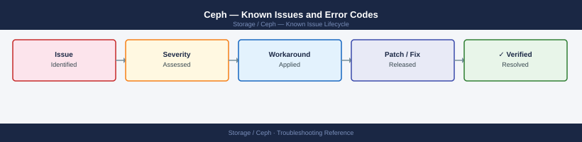

---
tags:
  - troubleshooting
  - ceph
  - known-issues
---
# Ceph — Known Issues and Error Codes

<div class="kb-summary">
Catalog of known Ceph bugs, error codes, and workarounds covering OSD failures, MON quorum, RGW, and performance issues.

*Applies to: Ceph Reef (18.x) / Quincy (17.x)*
</div>



```d2
direction: down

symptom: Identify Symptom {shape: diamond}
osd_issues: "OSD Issues" {shape: rectangle}
mon_quorum: "MON Quorum" {shape: rectangle}
rgw_object_storage: "RGW (Object Storage)" {shape: rectangle}
dashboard: "Dashboard" {shape: rectangle}
resolution: Resolve or Escalate {shape: oval}

symptom -> osd_issues: investigate
symptom -> mon_quorum: investigate
symptom -> rgw_object_storage: investigate
symptom -> dashboard: investigate
osd_issues -> resolution
mon_quorum -> resolution
rgw_object_storage -> resolution
dashboard -> resolution
```

## Before you begin

- Run `ceph -s` for overall cluster health; `ceph health detail` for detailed warnings.
- OSD logs: `journalctl -u ceph-osd@<id>` or `/var/log/ceph/ceph-osd.<id>.log`.
- `HEALTH_WARN` is advisory; `HEALTH_ERR` means data integrity is at risk — act immediately.

## OSD Issues

| Error / Symptom | Affected Versions | Cause | Workaround / Fix | Fixed In |
|---|---|---|---|---|
| `HEALTH_ERR: X osds down` | Any | OSD process crashed or disk failed | Check: `ceph osd tree`; `journalctl -u ceph-osd@<id>`; replace disk if SMART errors found | N/A |
| OSD slow ops warnings (`slow request`) | Any | Disk latency spike, network congestion, or full journal | Check disk SMART; check network MTU on OSD public/cluster networks; check `osd_max_backfills` | N/A |
| OSD fill alarm: `nearfull OSDs` | Any | OSDs approaching `osd_nearfull_ratio` (default 0.85) | Add capacity; or rebalance: `ceph osd reweight-by-utilization` | N/A |
| `ceph osd out` unexpected — OSD ejected | Any | OSD missed heartbeat for `osd_heartbeat_grace` seconds | Investigate OSD host: network latency or disk stall; restart OSD: `systemctl restart ceph-osd@<id>` | N/A |

## MON Quorum

| Error / Symptom | Affected Versions | Cause | Workaround / Fix | Fixed In |
|---|---|---|---|---|
| `HEALTH_ERR: mon down` — 1 of 3 MONs unreachable | Any | MON host crashed or network partition | Restore MON host; cluster continues with 2/3 quorum — do not lose another MON | N/A |
| `Clock skew detected on mon` | Any | NTP offset >0.05s between MON hosts | Sync all MON hosts to same NTP source; verify `chronyc tracking` | N/A |
| MON database full: `leveldb too large` | Any | Long-term cluster running without MON compaction | Compact MON DB: `ceph tell mon.* compact` | N/A |

## RGW (Object Storage)

| Error / Symptom | Affected Versions | Cause | Workaround / Fix | Fixed In |
|---|---|---|---|---|
| S3 `503 Service Unavailable` from RGW | Any | RGW process down or OSD pool degraded | Check: `systemctl status ceph-radosgw@*`; check cluster health for degraded pools | N/A |
| Multipart upload orphans growing | Ceph 17.x | Failed multipart uploads not expired | Set lifecycle policy to expire incomplete multiparts; or run `radosgw-admin orphans find --pool .rgw.root` | 18.x |

## Dashboard

| Error / Symptom | Affected Versions | Cause | Workaround / Fix | Fixed In |
|---|---|---|---|---|
| Ceph Dashboard shows `MGR unavailable` | Any | Active MGR crashed; standby promoting | Wait for standby to promote (30–60s); check `ceph mgr stat` | N/A |
| Dashboard login returns `SSO failure` | Ceph 18.x | Ceph Dashboard SSO misconfigured after upgrade | Disable SSO: `ceph dashboard sso disable`; reconfigure | N/A |

## See also

- [Ceph — Common Issues](../common-issues/)
