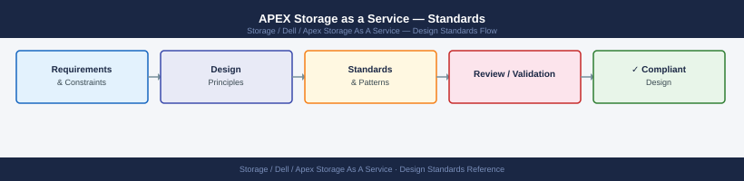

---
tags:
  - architecture
  - dell
---
# APEX Storage as a Service — Standards

Standards reference covering Upgrade Notes, Design Standards.

*Applies to: APEX Storage-as-a-Service*

> Part of the [APEX Storage as a Service](../index.md) reference.

---

## Upgrade Notes

| Step | Action |
|---|---|
| 1 | Hardware firmware and lifecycle upgrades for APEX STaaS are Dell's responsibility — do not initiate firmware changes on APEX-managed infrastructure without coordination |
| 2 | Monitor the APEX Console for Dell-initiated maintenance notifications; Dell will schedule maintenance windows for upgrades and communicate via the Console |
| 3 | Confirm Secure Connect Gateway is at the current recommended version — SCG upgrades can be triggered from the APEX Console or SCG management interface |
| 4 | After any Dell-initiated maintenance, verify all subscriptions show healthy status in APEX Console and confirm on-premises platform availability from the host side |

## Design Standards

- Deploy two SCG appliances for redundancy; register each APEX system to both
- Monitor APEX Console alerts daily — infrastructure issues are Dell's responsibility but customer must confirm SLA compliance
- Request capacity tier increases at least 30 days before projected threshold breach
- Document subscription ID, contract end date, committed tier, and burst thresholds in a runbook

---

## See also

- [Apex Storage As A Service — How It Works](how-it-works/)
- [Apex Storage As A Service — Integrations](integrations/)
