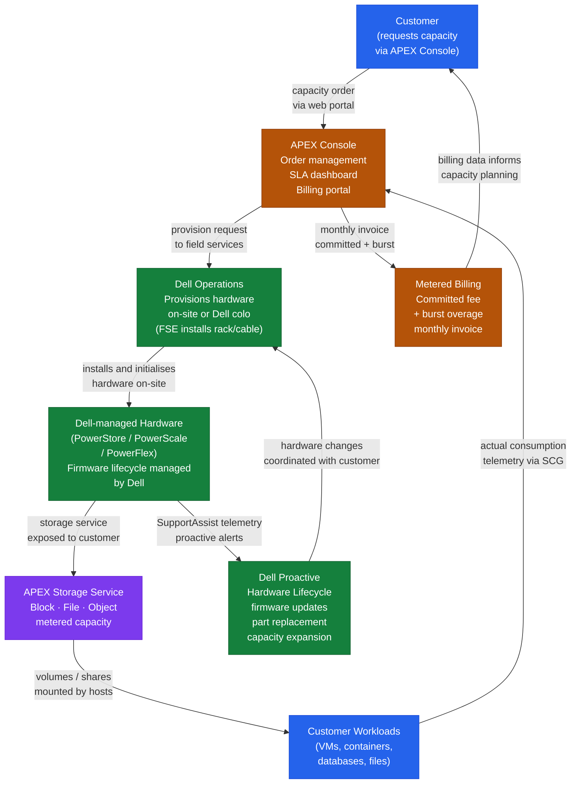

---
tags:
  - architecture
  - dell
---
# APEX Storage as a Service — How It Works

How It Works reference covering Overview, Use Cases, How It Works, Underlying Platforms, Best Practices.

*Applies to: APEX Storage-as-a-Service*

## Overview

Dell APEX Storage as a Service (STaaS) is a consumption-based storage model where Dell provisions, owns, and manages the physical infrastructure on-premises at the customer site. Capacity is metered monthly based on committed and burst usage, billed through the APEX Console. The underlying platforms are PowerStore, PowerScale, or PowerFlex, managed by Dell — the customer interacts primarily with the APEX Console or REST API for visibility, capacity requests, and billing reporting.

## Use Cases

| Use Case |
|---|
| Organisations that want on-premises storage economics without capital expenditure or operational management overhead |
| Environments requiring predictable $/TiB subscription pricing with burst capacity headroom |
| Multi-platform environments (block, file, object) under a single consumption agreement |
| IT teams that want to outsource hardware lifecycle management (firmware, hardware replace, capacity adds) to Dell |
| Capacity planning scenarios where future growth is uncertain and over-provisioning risk needs to be avoided |

## How It Works

Dell installs and owns the physical hardware. A Secure Connect Gateway (SCG) appliance at the customer site relays telemetry to Dell's cloud backend for metering and health monitoring. The APEX Console tracks consumed vs. committed capacity. Burst capacity above the committed tier is billed at an incremental per-TiB rate at the end of each billing period.

## Underlying Platforms

| Platform | Storage Type | Use Case |
|---|---|---|
| PowerStore | Block (NVMe) and file | General-purpose primary storage |
| PowerScale | NAS (scale-out NFS/SMB) | Unstructured data and file workloads |
| PowerFlex | Block (software-defined) | High-performance and Kubernetes workloads |

## Best Practices

| Recommendation | Detail |
|---|---|
| Keep Secure Connect Gateway appliances highly available | Deploy two SCG appliances for redundancy — loss of SCG connectivity causes telemetry gaps and may trigger alerts |
| Monitor committed vs. consumed capacity monthly | Request tier increases at least 30 days before hitting the committed threshold to avoid burst pricing |
| Use the APEX REST API to build automated capacity reports | Feed into internal capacity planning tools |
| Review APEX Console alerts daily | Infrastructure issues are Dell's responsibility to remediate but you need to confirm SLA compliance |
| Document subscription details in a runbook | Subscription ID, contract end date, committed tier, and burst thresholds for on-call staff |

---

## See also

- [Apex Storage As A Service — Design Standards](design-standards/)
- [Apex Storage As A Service — Integrations](integrations/)
