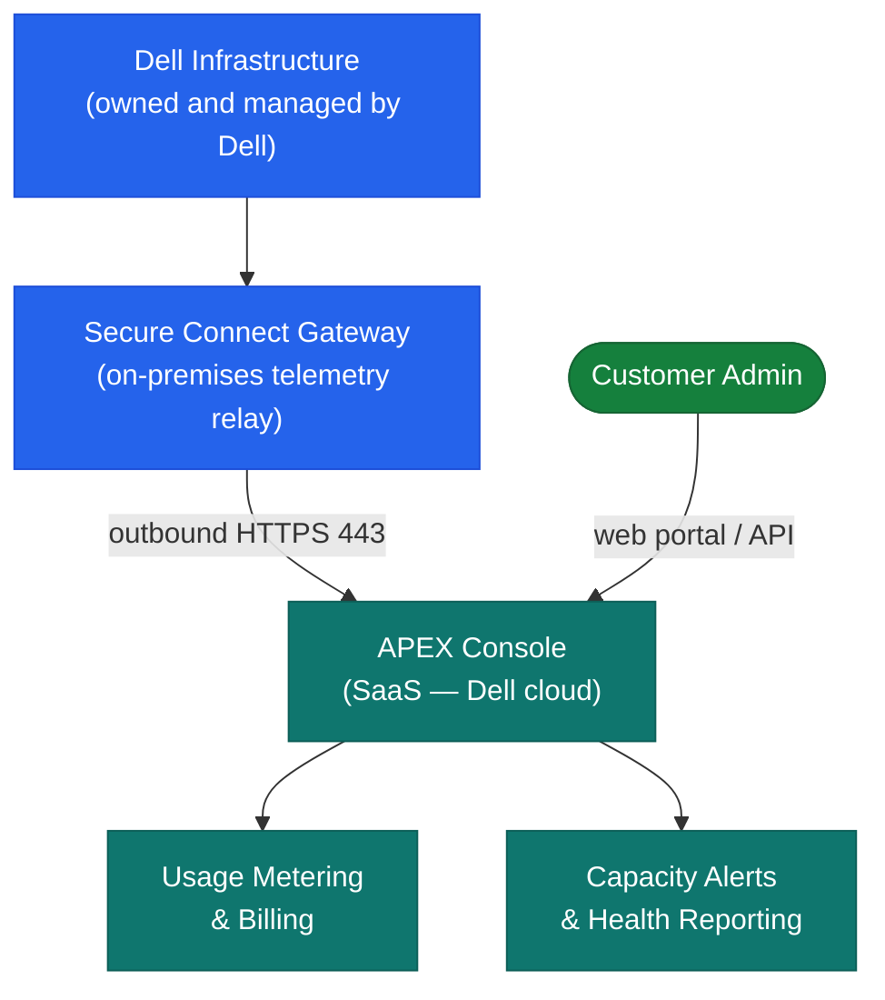

# APEX Storage as a Service — Architecture

<div class="kb-summary">
Consumption-based STaaS model — Dell owns and manages on-premises PowerStore, PowerScale, or PowerFlex hardware; capacity is metered monthly via the APEX Console with committed and burst tiers.
</div>
```
┌─────────────────────────────────── Dell Apex STaaS — Architecture ────────────────────────────────────┐
│                                                                                                       │
│   ┌───────────────────────────────────────────────────────────────────────────────────────────────┐   │
│   │          Apex STaaS architecture overview: cloud-managed on-prem storage subscription         │   │
│   │                               Protocols: iSCSI · FC · NFS · SMB                               │   │
│   │                 Key components: Apex Console, CloudIQ, SCG relay, NVMe arrays                 │   │
│   │          Design principles: HA, scalability, non-disruptive operations, and security          │   │
│   └───────────────────────────────────────────────────────────────────────────────────────────────┘   │
│                                                                                                       │
│    Design → deploy → configure → validate → monitor → optimise                                        │
│                                                                                                       │
│                  ▼                                ▼                                ▼                  │
│                                                                                                       │
│   ┌─────────────────────────────┐  ┌─────────────────────────────┐  ┌─────────────────────────────┐   │
│   │            Layer            │  │          Component          │  │            Owner            │   │
│   │           Hardware          │  │       NVMe/SAS arrays       │  │             Dell            │   │
│   │          Management         │  │         Apex Console        │  │           Customer          │   │
│   │          Monitoring         │  │         CloudIQ/SCG         │  │            Shared           │   │
│   │           Billing           │  │       Committed+burst       │  │         Dell billing        │   │
│   │           Network           │  │        iSCSI VLAN/FC        │  │           Customer          │   │
│   └─────────────────────────────┘  └─────────────────────────────┘  └─────────────────────────────┘   │
│                                                                                                       │
│                          ▼                                                 ▼                          │
│                                                                                                       │
│   ┌───────────────────────────────────────────────────────────────────────────────────────────────┐   │
│   │    Component     │     Function     │      Protocol     │       Auth       │      Notes       │   │
│   │      Arrays      │  Block/File/NFS  │    iSCSI/FC/NFS   │  CHAP/Kerberos   │     On-prem      │   │
│   │   Apex Console   │  Provision/bill  │     HTTPS REST    │     SAML SSO     │   SaaS portal    │   │
│   │       SCG        │ Telemetry relay  │       HTTPS       │   Certificate    │     Local VM     │   │
│   │     CloudIQ      │ AIOps analytics  │       HTTPS       │      OAuth2      │       SaaS       │   │
│   └───────────────────────────────────────────────────────────────────────────────────────────────┘   │
│                                                                                                       │
│    Physical: Dell array hardware on-premises · customer iSCSI VLAN / FC fabric · Apex Console SaaS    │
│                                                                                                       │
│    Key terms:                                                                                         │
│                                                                                                       │
│    Apex STaaS         = on-prem Dell storage consumed as a cloud service with subscription billing    │
│    Apex Console       = cloud portal; provision volumes, view usage, and raise support requests       │
│    Committed base     = minimum contracted capacity tier; billed monthly regardless of actual use     │
│    Burst capacity     = pre-installed unlocked storage above committed; billed when consumed          │
│    SCG                = Secure Connect Gateway; relays array telemetry to CloudIQ for analysis        │
│    CloudIQ            = Dell AIOps SaaS; health scores, capacity forecasts, firmware advisories       │
│    NVMe tier          = all-flash performance tier; sub-millisecond latency for database workloads    │
│    Capacity tier      = SAS/NL-SAS lower cost tier; suited to bulk storage and backup targets         │
│    iSCSI CHAP         = Challenge Handshake Auth Protocol; authenticates iSCSI initiators to array    │
│    FC port sec.       = FC fabric binding and port security; restricts which HBAs can log in          │
│    vVols              = Virtual Volumes; per-VM storage objects exposed via VASA provider to vCenter  │
│    OOB mgmt           = out-of-band management network for direct array controller access             │
│                                                                                                       │
└───────────────────────────────────────────────────────────────────────────────────────────────────────┘
```


<div class="kb-grid kb-grid-3">
<a class="kb-card" href="how-it-works/"><strong>How It Works</strong><span>How it works, integrations, and design standards.</span></a>
<a class="kb-card" href="integrations/"><strong>Integrations</strong><span>Integration with APEX Console, Secure Connect Gateway, and REST API.</span></a>
<a class="kb-card" href="design-standards/"><strong>Design Standards</strong><span>SCG redundancy, capacity planning, and subscription management practices.</span></a>
</div>

## Underlying Platforms

| Platform | Storage Type | Use Case |
|---|---|---|
| PowerStore | Block (NVMe) and file | General-purpose primary storage |
| PowerScale | NAS (scale-out NFS/SMB) | Unstructured data and file workloads |
| PowerFlex | Block (software-defined) | High-performance and Kubernetes workloads |

## How APEX STaaS Works


