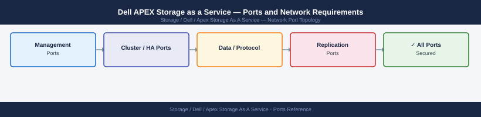

---
tags:
  - apex
  - dell
  - storage-as-a-service
  - networking
  - firewall
  - ports
---
# Dell APEX Storage as a Service — Ports and Network Requirements

Firewall port reference for Dell APEX Storage as a Service (STaaS). APEX Storage deploys Dell hardware on-premises managed through Dell's cloud portal. The underlying storage protocols are identical to the array type deployed (PowerStore, PowerFlex, etc.).

*Applies to: Dell APEX Block Storage / File Storage / Object Storage*

## APEX Cloud Management (Outbound — Required)

| Port | Protocol | Source | Destination | Purpose |
|---|---|---|---|---|
| 443 | TCP | APEX array management IP | apex.dell.com, cloudiq.dell.com, esrs.dell.com | APEX portal connectivity, CloudIQ telemetry, ESRS support, automated updates |

## Data Access Protocols (Same as Underlying Array)

APEX Storage uses the same data access ports as the underlying array type:

| Array Type | Relevant Ports Page |
|---|---|
| APEX Block Storage (PowerStore-based) | [Dell PowerStore — Ports](../../powerstore/architecture/ports/) |
| APEX Block Storage (PowerFlex-based) | iSCSI 3260, NVMe-oF 4420 |
| APEX File Storage (PowerScale-based) | [Dell PowerScale — Ports](../../powerscale/architecture/ports/) |
| APEX Object Storage (ECS-based) | [Dell ECS — Ports](../../ecs/architecture/ports/) |

## Admin Access to APEX Portal (SaaS)

| Port | Protocol | Destination | Purpose |
|---|---|---|---|
| 443 | TCP | apex.dell.com | Admin browser access to APEX order management and monitoring |

## Firewall Summary

| From | To | Ports | Notes |
|---|---|---|---|
| APEX array mgmt IP | apex.dell.com, cloudiq.dell.com | 443 | Required for APEX management — must be open |
| Data protocol hosts | APEX array data IPs | Varies by type | Same as underlying array ports |

## See also

- [Dell APEX — Architecture](how-it-works/)
- [Dell CloudIQ — Ports](../../cloudiq/architecture/ports.md)
- [Dell PowerStore — Ports](../../powerstore/architecture/ports.md)
