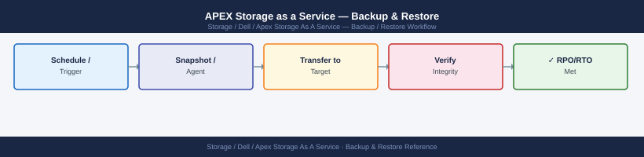

---
tags:
  - dell
  - operations
---
# APEX Storage as a Service — Backup & Restore

APEX STaaS backup and restore: snapshot schedule configuration via CloudIQ portal, cross-region copy policies, and restore-from-snapshot procedure.

*Applies to: APEX Storage-as-a-Service*

> Part of the [APEX Storage as a Service](../index.md) reference.

---

Data backup on APEX STaaS is the customer's responsibility using the same backup solutions as for any other storage platform (e.g., PowerProtect Data Manager, Avamar, Networker). Dell manages the hardware and infrastructure layer only.

Key items to document and protect:

- **APEX API credentials**: store client ID and client secret in a secrets vault; cannot be retrieved after creation
- **Subscription records**: retain documentation of subscription ID, committed tier, burst ceiling, contract dates, and SLA tier
- **Monthly usage exports**: export APEX Console billing data monthly and retain for billing reconciliation

## Before you begin

- **Access:** Storage admin credentials (cluster admin or equivalent)
- **Timing:** safe to run during business hours unless a step is marked ⚠ (causes interruption)
- **Dependencies:** no active upgrades or migrations on the same infrastructure
- **Logging:** capture command output — paste into the change record on completion

---

---

## Verify

- Confirm the operation completed without errors in the log or management UI
- Verify the expected state change is visible (service running, object created, config applied)
- Document the outcome in the change record

---

## See also

- [Apex Storage As A Service — Procedures](procedures/)
- [Apex Storage As A Service — Health Checks](health-checks/)
- [Apex Storage As A Service — Common Issues](../troubleshooting/common-issues/)
