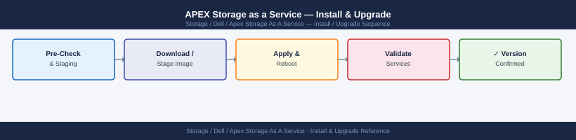

---
tags:
  - dell
  - operations
---
# APEX Storage as a Service — Install & Upgrade

APEX STaaS install and upgrade: SCG registration for telemetry, software stack upgrade workflow via CloudIQ portal, and post-upgrade health validation.

*Applies to: APEX Storage-as-a-Service*

> Part of the [APEX Storage as a Service](../index.md) reference.

---

Hardware firmware and lifecycle upgrades for APEX STaaS are Dell's responsibility. The customer's role in upgrade events:

| Step | Action |
|---|---|
| 1 | Do not initiate firmware changes on APEX-managed infrastructure without coordination with Dell |
| 2 | Monitor the APEX Console for Dell-initiated maintenance notifications; Dell will schedule maintenance windows and communicate via the Console |
| 3 | Confirm Secure Connect Gateway is at the current recommended version — SCG upgrades can be triggered from the APEX Console or SCG management interface |
| 4 | After any Dell-initiated maintenance, verify all subscriptions show healthy status in APEX Console and confirm on-premises platform availability from the host side |

## Before you begin

- **Access:** Storage admin credentials (cluster admin or equivalent)
- **Timing:** safe to run during business hours unless a step is marked ⚠ (causes interruption)
- **Dependencies:** no active upgrades or migrations on the same infrastructure
- **Logging:** capture command output — paste into the change record on completion

---

---

## Verify

- Confirm the operation completed without errors in the log or management UI
- Verify the expected state change is visible (service running, object created, config applied)
- Document the outcome in the change record

---

## See also

- [Apex Storage As A Service — Procedures](../procedures/)
- [Apex Storage As A Service — Health Checks](../health-checks/)
