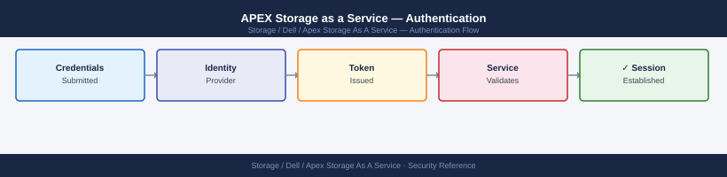

---
tags:
  - dell
  - security
---
# APEX Storage as a Service — Authentication

APEX STaaS authentication: CloudIQ portal SSO with SAML 2.0, API OAuth2 token generation, MFA enforcement policy, and service account credential rotation.

*Applies to: APEX Storage-as-a-Service*

> Part of the [APEX Storage as a Service](../index.md) reference.

---

- **APEX Console**: Dell account-based authentication with optional SSO/federation via Azure AD or Okta configured under Console Settings
- **APEX REST API**: OAuth2 client credentials (client ID + client secret) generated in APEX Console → Settings → API Keys; access tokens valid for 3600 seconds
- **Underlying platforms**: PowerStore/PowerScale/PowerFlex management authentication is separate and follows each platform's local or LDAP configuration
---

## Before you begin

- **Access:** Storage admin credentials (cluster admin or equivalent)
- **Change management:** security changes require CAB approval in most environments
- **Rollback plan:** document current state before any security control change
- **Testing:** validate in a non-production environment first where possible

---

## Related Reference

- [Standard LDAP Integration](../../../../security/ldap-integration/index.md) — field reference, service account standards, TLS requirements, and connectivity testing
- [Standard SAML Configuration](../../../../security/saml-configuration/index.md) — SP/IdP setup, Azure AD and Okta steps, attribute mapping, and security requirements

---

## See also

- [Apex Storage As A Service — Access Control](../access-control/)
- [Apex Storage As A Service — Hardening](../hardening/)
- [Apex Storage As A Service — Encryption](../encryption/)
