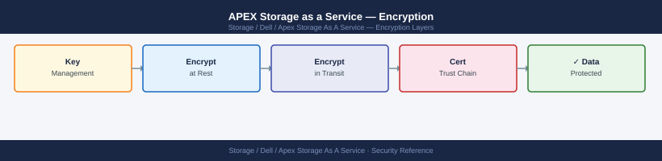

---
tags:
  - dell
  - security
---
# APEX Storage as a Service — Encryption

Encryption reference covering Encryption Controls, Key Points.

*Applies to: APEX Storage-as-a-Service*

> Part of the [APEX Storage as a Service](../index.md) reference.

---

## Before you begin

- **Access:** Storage admin credentials (cluster admin or equivalent)
- **Change management:** security changes require CAB approval in most environments
- **Rollback plan:** document current state before any security control change
- **Testing:** validate in a non-production environment first where possible

---

## Encryption Controls

| Control | Detail |
|---|---|
| **APEX Console TLS** | The APEX Console web UI and REST API are served exclusively over HTTPS (TLS 1.2+). Certificate management is handled by Dell's cloud infrastructure. Customers do not manage these certificates. |
| **SCG telemetry transmission** | The Secure Connect Gateway (SCG) forwards telemetry from on-premises hardware to CloudIQ over TLS 1.2 or higher. The SCG initiates all outbound connections; no inbound connectivity from Dell's cloud to the SCG is required. |
| **API authentication encryption** | All APEX API requests use OAuth 2.0 client credentials. The token exchange and all subsequent API calls are protected by the same TLS layer as the console — credentials are never transmitted in plaintext. |
| **Data-in-transit (replication / host I/O)** | Host I/O between servers and APEX-managed storage uses standard block or file protocols (FC, iSCSI, NFS, SMB). Encryption of these I/O paths is a network and host configuration concern — enable IPsec or in-flight encryption at the fabric or host level if required by policy. |
| **PowerStore data-at-rest** | PowerStore supports Drive Encryption (D@RE) using self-encrypting drives managed through Unisphere. APEX does not alter this configuration — it is set during array deployment and follows the PowerStore security hardening guide. |
| **PowerScale data-at-rest** | PowerScale supports DARE using the Self-Encrypting Drive (SED) feature. Key management can be delegated to an external KMIP server. APEX does not manage this — configure it per the PowerScale Security Configuration Guide. |
| **PowerFlex data-at-rest** | PowerFlex supports volume-level encryption through the PowerFlex Data Security feature. Volumes can be individually encrypted with AES-256. APEX subscription does not change the encryption configuration — apply it via the PowerFlex Manager or REST API as part of storage provisioning. |
| **Management network path** | Communication between on-premises hardware and the SCG appliance travels over the management VLAN. Isolate this path from untrusted networks. If a proxy is used for SCG outbound access, ensure TLS inspection is not applied to Dell cloud endpoints — certificate pinning will reject inspected connections. |

## Key Points

- APEX is a subscription and management overlay; it does not own or encrypt stored data.
- Data-at-rest encryption is a platform-level control on the underlying hardware (PowerStore, PowerScale, PowerFlex).
- Telemetry transmitted via SCG contains capacity metrics only — no user data or file content leaves the array through this path.
- TLS 1.0 and 1.1 are not accepted by Dell's cloud endpoints.

---

## See also

- [Apex Storage As A Service — Hardening](hardening/)
- [Apex Storage As A Service — Authentication](authentication/)
- [Apex Storage As A Service — Access Control](access-control/)
