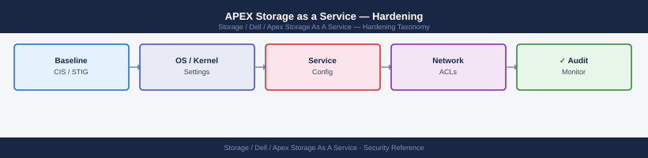

---
tags:
  - dell
  - security
---
# APEX Storage as a Service — Hardening

Hardening reference covering Hardening Checklist, Network Requirements Summary.

*Applies to: APEX Storage-as-a-Service*

> Part of the [APEX Storage as a Service](../index.md) reference.

---

## Before you begin

- **Access:** Storage admin credentials (cluster admin or equivalent)
- **Change management:** security changes require CAB approval in most environments
- **Rollback plan:** document current state before any security control change
- **Testing:** validate in a non-production environment first where possible

---

## Hardening Checklist

| Control | Standard | Action |
|---|---|---|
| **SCG software version** | Current GA release | Update the SCG appliance whenever Dell releases a new version. Outdated SCG versions may break telemetry delivery and SupportAssist connectivity, causing metering gaps that require manual correction. Check the SCG admin console for available updates at least monthly. |
| **SCG redundancy** | Two SCG appliances per site | Deploy two SCG appliances and register each monitored array to both. A single SCG is a metering and support single point of failure. Both appliances should be on separate physical hosts to survive a host-level failure. |
| **SCG network isolation** | Management VLAN only | Place SCG appliances on the storage management VLAN. Block access from general server VLANs. The SCG requires outbound HTTPS (443) to Dell cloud endpoints only — no inbound connections are required from external networks. |
| **SCG outbound allowlist** | Dell cloud endpoints only | Permit SCG outbound TCP 443 to `esrs.dell.com`, `cloudiq.dell.com`, and `api.dell.com` (or the regional equivalents listed in the SCG deployment guide). Deny all other outbound destinations at the perimeter firewall. |
| **API credential rotation** | Every 90 days | Rotate all APEX API client secrets on a 90-day cycle. Automate rotation where possible. Store credentials in a secrets vault — never in config files or version control. |
| **MFA enforcement** | Enforced for all human users | Enable MFA on all Dell account users with APEX Console access. This is configured under account identity settings and applies to all users in the tenancy. Emergency break-glass accounts are exempt but must be logged and reviewed monthly. |
| **IP allowlisting** | Corporate egress IPs only | Restrict APEX Console access to known corporate egress IP ranges or VPN exit nodes under account security settings. Review and prune stale CIDRs quarterly. |
| **Audit log review** | Monthly | Review the APEX Console audit log monthly for unexpected access, failed authentication attempts, unscheduled configuration changes, and unexpected SCG registration or deregistration events. |
| **SCG TLS validation** | Certificate pinning enabled | Do not deploy a TLS-inspecting proxy between the SCG and Dell cloud endpoints. Certificate pinning on the SCG will reject inspected connections, silently breaking telemetry delivery. Use a split-tunnel or allowlist exemption for SCG traffic. |
| **Named service accounts per integration** | One account per consuming system | Create a dedicated APEX API service account for each consuming system (monitoring tool, CMDB, automation pipeline). Assign the Viewer role unless write access is explicitly required. Never share credentials between integrations. |
| **Access review cadence** | Quarterly | Review all APEX Console user roles and service accounts on a quarterly basis. Revoke access for departed staff and contractors immediately; recertify remaining accounts annually at minimum. Document the review outcome in the CMDB. |
| **Platform-level encryption** | Enabled at deployment | Verify that Dell-managed encryption is enabled on all APEX storage pools. Confirm encryption status is visible in the APEX Console under the storage pool details view. Do not disable encryption for performance testing without a formal change record. |

## Network Requirements Summary

| Destination | Port | Direction | Purpose |
|---|---|---|---|
| `esrs.dell.com` | TCP 443 | Outbound from SCG | Secure Connect Gateway telemetry upload |
| `cloudiq.dell.com` | TCP 443 | Outbound from SCG | CloudIQ metric ingestion |
| `api.dell.com` | TCP 443 | Outbound from management hosts | APEX API access |
| Array management interface | TCP 443 / 8443 | SCG to array | Array registration and metric collection |
| SCG admin console | TCP 443 | Management hosts to SCG | SCG configuration and update management |

All other inbound connections to the SCG should be denied by default. SCG appliances do not require inbound access from the internet.

---

## See also

- [Apex Storage As A Service — Authentication](authentication/)
- [Apex Storage As A Service — Access Control](access-control/)
- [Apex Storage As A Service — Encryption](encryption/)
