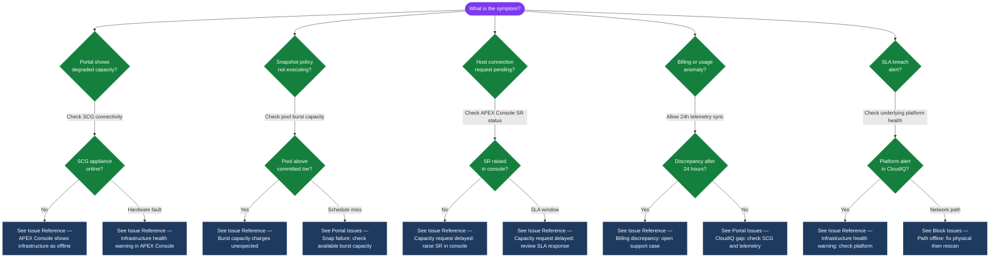

---
tags:
  - dell
  - troubleshooting
search:
  boost: 1.5
---
# APEX Storage as a Service — Common Issues


<div class="kb-summary">
Common APEX Storage as a Service issues — provisioning failures, connectivity errors, and service-level degradation.
</div>

```text
┌─────────────────────────────────── Dell Apex STaaS — Common Issues ───────────────────────────────────┐
│                                                                                                       │
│   ┌───────────────────────────────────────────────────────────────────────────────────────────────┐   │
│   │           Common Apex issues: path offline, CHAP mismatch, NFS mount error, SCG gap           │   │
│   │         Path offline: cable/SFP fault → check multipath -ll; fix physical then rescan         │   │
│   │         CHAP mismatch: secret differs between host and array; re-enter in both places         │   │
│   │           NFS stale mount: server restarted; umount -l and remount; check /etc/fstab          │   │
│   └───────────────────────────────────────────────────────────────────────────────────────────────┘   │
│                                                                                                       │
│    Issue identified → collect logs → isolate layer (physical/network/config) → resolve                │
│                                                                                                       │
│                  ▼                                ▼                                ▼                  │
│                                                                                                       │
│   ┌─────────────────────────────┐  ┌─────────────────────────────┐  ┌─────────────────────────────┐   │
│   │         Block Issues        │  │         File Issues         │  │        Portal Issues        │   │
│   │         Path offline        │  │        NFS mount fail       │  │         SCG offline         │   │
│   │         CHAP reject         │  │         Stale handle        │  │         CloudIQ gap         │   │
│   │         LUN not seen        │  │       Permission deny       │  │         Console slow        │   │
│   │         MPIO asymm.         │  │         NFS timeout         │  │        SR not created       │   │
│   │         Snap failure        │  │         Quota exceed        │  │        Billing error        │   │
│   └─────────────────────────────┘  └─────────────────────────────┘  └─────────────────────────────┘   │
│                                                                                                       │
│    For any unresolved issue after 30 mins: open Apex SR with logs before escalating                   │
│                                                                                                       │
│                  ▼                                ▼                                ▼                  │
│                                                                                                       │
│   ┌───────────────────────────────────────────────────────────────────────────────────────────────┐   │
│   │      Issue       │   First check    │      Command      │       Fix        │     Escalate     │   │
│   │   Path offline   │    Cable/SFP     │   multipath -ll   │   Fix physical   │    Dell SR P2    │   │
│   │   CHAP reject    │   Secret match   │    iscsiadm log   │  Re-enter CHAP   │   Apex Console   │   │
│   │     NFS fail     │   showmount -e   │    mount output   │     Re-mount     │   Check export   │   │
│   │   SCG offline    │   SCG VM state   │       SCG UI      │    Restart VM    │    Dell SR P3    │   │
│   └───────────────────────────────────────────────────────────────────────────────────────────────┘   │
│                                                                                                       │
│    Physical: SFP Tx/Rx power · Ethernet cable · FC cable · switch port state                          │
│                                                                                                       │
│    Key terms:                                                                                         │
│                                                                                                       │
│    multipath -ll   = Shows all device paths with status (active/failed/ready)                         │
│    CHAP reject     = Array refuses iSCSI login because CHAP secrets do not match                      │
│    LUN not seen    = Host does not see volume after mapping; run iscsiadm rescan                      │
│    MPIO asymm.     = All I/O on one path; other paths not load-balanced; check policy                 │
│    NFS stale handle = Cached file handle invalid after server restart; unmount and remount            │
│    NFS permission  = Host IP not in export access list; add CIDR to share config                      │
│    Quota exceed    = NFS share quota reached; expand in Apex Console or clean data                    │
│    SCG offline     = VM stopped or network issue; restart VM; verify outbound HTTPS works             │
│    CloudIQ gap     = Historical data missing due to SCG outage; non-impacting but fix SCG             │
│    Snap failure    = Snapshot policy fails; check available pool space (burst capacity)               │
│    showmount -e    = Show NFS exports available from server; verify export exists and ACL             │
│    iscsiadm log    = iSCSI daemon log showing login attempts and auth failures                        │
│                                                                                                       │
└───────────────────────────────────────────────────────────────────────────────────────────────────────┘
```

> Part of the [APEX Storage as a Service](../index.md) reference.

---

| Symptom | Likely Cause | Action |
|---|---|---|
| Infrastructure health warning in APEX Console | On-premises hardware fault or connectivity loss from Secure Connect Gateway | Check SCG connectivity; review hardware alerts on the underlying platform (PowerStore/PowerScale/PowerFlex) |
| Burst capacity charges unexpected | Workload growth or snapshot/backup accumulation pushing usage above committed tier | Review consumed capacity trend in APEX Console; identify growth sources; raise committed tier if sustained |
| APEX Console shows infrastructure as offline | Secure Connect Gateway appliance down or network path to Dell blocked | Check SCG appliance health and outbound HTTPS connectivity on port 443 to Dell APEX endpoints |
| Capacity request delayed | Service request not raised in APEX Console, or SLA window not yet elapsed | Raise a capacity increase request via APEX Console; review the contracted SLA response time |
| Billing discrepancy | Consumed capacity reported differently between on-premises platform and APEX Console | Allow 24 hours for telemetry sync; open a support case via APEX Console if discrepancy persists |

## Diagnostic Flow



---

## Before you begin

- **Access:** Storage admin credentials (cluster admin or equivalent)
- **Gather first:** recent error message text, event timestamps, and affected object names
- **Scope:** confirm whether the issue affects a single object, host, cluster, or site
- **Escalation:** open a vendor support ticket before running any destructive step
- **Logging:** document each command and output — required if escalation is needed

---

---

## Verify resolution

- Confirm the original symptom no longer occurs
- Check logs for any residual errors related to the issue
- Monitor for 10–15 minutes to confirm the fix is stable
