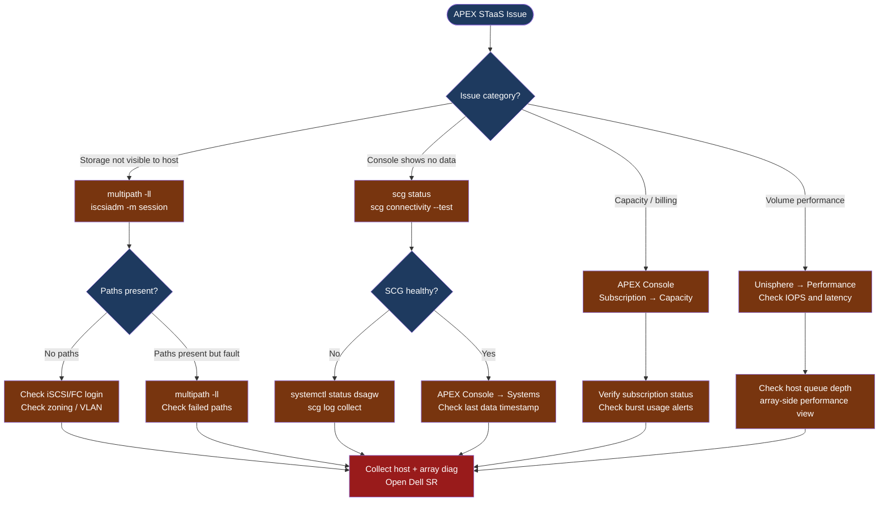

---
tags:
  - dell
  - troubleshooting
search:
  boost: 1.5
---
# APEX Storage as a Service — Diagnostics

<div class="kb-summary">
APEX Storage as a Service diagnostic commands: check host-side iSCSI and multipath connectivity, verify APEX Console subscription state, diagnose SCG telemetry reporting gaps, and collect array and path diagnostics for Dell support cases.

*Applies to: Dell APEX Storage-as-a-Service (block storage)*
</div>

```text
┌──────────────────────────── Dell APEX Storage as a Service — Diagnostics ─────────────────────────────┐
│                                                                                                       │
│   ┌───────────────────────────────────────────────────────────────────────────────────────────────┐   │
│   │   Start here: multipath -ll → iscsiadm session → APEX Console → SCG → array Unisphere       │     │
│   │   Storage not visible to host: check multipath; check iSCSI/FC login; check zoning           │    │
│   │   APEX Console shows no data: check SCG connectivity; check CloudIQ agent on SCG             │    │
│   └───────────────────────────────────────────────────────────────────────────────────────────────┘   │
│                                                                                                       │
│   ┌──────────────────────────────────────────────┐  ┌─────────────────────────────────────────────┐   │
│   │             Host-Side Diagnostics            │  │          APEX Console / SCG                 │   │
│   │   multipath -ll (Linux)                      │  │   scg status (on SCG appliance)             │   │
│   │   iscsiadm -m session (iSCSI hosts)          │  │   scg connectivity --test                   │   │
│   │   mpclaim -s -d (Windows MPIO)               │  │   scg device list                           │   │
│   │   Get-Disk (Windows)                         │  │   APEX Console → Systems                    │   │
│   └──────────────────────────────────────────────┘  └─────────────────────────────────────────────┘   │
│                                                                                                       │
│  Physical Infrastructure:                                                                             │
│  Dell arrays on-premises (PowerStore / PowerFlex) · customer iSCSI VLAN or FC fabric · APEX Console   │
│                                                                                                       │
│  Key terms:                                                                                           │
│  APEX STaaS    = on-prem Dell storage consumed as a subscription; Dell owns hardware, you own data    │
│  APEX Console  = SaaS portal for provisioning, capacity visibility, and support requests              │
│  SCG           = Secure Connect Gateway; relays array telemetry to CloudIQ and APEX Console           │
│  Committed base= minimum contracted capacity billed monthly; burst capacity billed when consumed      │
│  multipath -ll = shows all active I/O paths from Linux host to array LUNs                             │
│  iscsiadm      = Linux iSCSI initiator utility; manages sessions, discovery, and node records         │
│  mpclaim       = Windows MPIO claim tool; shows multipath disk and path status                        │
│  vVols         = Virtual Volumes; per-VM storage objects via VASA provider to vCenter                 │
│                                                                                                       │
└───────────────────────────────────────────────────────────────────────────────────────────────────────┘
```



## Before you begin

- **Access:** Host OS admin credentials; APEX Console login (admin role); SCG appliance SSH; Unisphere access to the underlying array
- **Gather first:** the specific symptom (volume not visible, I/O errors, console shows stale data), affected host names, and the subscription ID from APEX Console
- **Scope:** confirm whether the issue affects a single host, all hosts on one fabric, or all hosts accessing the APEX system
- **Responsibility boundary:** for APEX STaaS, Dell owns the array hardware; customer owns networking, host configuration, and data. For hardware faults, Dell support opens a field dispatch; for host-side issues, the customer team resolves

---

## Step 1 — Check host-side storage connectivity

### Linux hosts (iSCSI)

```bash
# Check active iSCSI sessions
iscsiadm -m session
# Shows: target IQN, target IP, session state, interface
# Expected: sessions to all configured array iSCSI portals; State = Running

# Check iSCSI node database (registered targets)
iscsiadm -m node
# Shows all discovered targets and their login status

# Manually log in if session is missing
iscsiadm -m node -T <target-iqn> -p <array-ip>:<port> --login

# Check multipath status after iSCSI sessions are up
multipath -ll
# Expected output per LUN:
#   <wwid> dm-X DELL,<model>
#   size=<n>G features='...' hwhandler='...'
#   |- <path> <state> <prio> <read_write>
# Healthy: 4 paths (2 per controller port); all paths "active ready"
# Problem: "failed faulty" paths; fewer than expected paths

# Check for path failures in multipath
multipath -ll | grep -E "failed|faulty|checker failed"

# Run path checker on all paths
multipathd show paths
multipathd show maps
```

### Linux hosts (FC)

```bash
# Check FC HBA status
cat /sys/class/fc_host/host*/port_state
# Expected: Online for all HBAs

# Check discovered FC targets
cat /sys/class/fc_transport/*/roles 2>/dev/null | head -20

# Check multipath (same command as iSCSI)
multipath -ll | grep -E "DELL|failed|faulty"
```

### Windows hosts

```powershell
# Check MPIO disk paths (requires MPIO feature installed)
mpclaim -s -d
# Shows: physical disk number, load balance policy, paths
# Expected: all paths show "Active/Optimized" or "Active/Unoptimized"

# PowerShell equivalent
Get-Disk | Where-Object {$_.BusType -eq "iSCSI" -or $_.BusType -eq "Fibre Channel"} |
  Select-Object Number, FriendlyName, Size, OperationalStatus, HealthStatus |
  Format-Table -AutoSize

# Check MPIO paths for a specific disk
Get-MSDSMPathInformation | Where-Object {$_.DiskNumber -eq <disk-number>}
# Shows: path state, weight, active status

# Check iSCSI sessions on Windows
Get-IscsiSession | Select-Object -Property InitiatorNodeAddress, TargetNodeAddress, IsConnected, SessionState
```

---

## Step 2 — Check APEX Console for system and capacity status

```text
Via APEX Console (console.dell.com or dell.com/apex):
  1. Navigate to: Infrastructure → Storage Systems
  2. Find the affected system; check "Last Data Received" timestamp
     - If > 30 minutes ago: SCG is not reporting (proceed to Step 3)
     - If current: the issue is configuration or host-side

  3. Navigate to: Subscriptions → select your subscription
     - Check: Committed capacity vs current usage
     - Check: Burst capacity status (if near or at burst limit, new volume provisioning fails)
     - Check: Subscription expiry date

  4. Navigate to: Storage Systems → <your system> → Volumes
     - Confirm the affected volume exists and is in "Ready" state
     - Check: Volume Attachments — confirm the host is listed

  5. To open a service request directly:
     - Navigate to: Support → Create Service Request
     - Select: the affected system and the system serial number
```

---

## Step 3 — Check SCG telemetry reporting

```bash
# SSH to the SCG appliance
ssh admin@<scg-ip>

# SCG overall health
scg status
# Expected: SCG Service = Running; Connected to CloudIQ = Yes

# Test outbound connectivity to APEX Console and CloudIQ
scg connectivity --test
# Expected: all endpoints Reachable

# List registered devices and their last poll time
scg device list
# Look for the APEX system; check Last Poll Time

# Test connectivity to the specific APEX array
scg device test --id <device-id>
# Expected: Authentication OK; API reachable

# Collect SCG diagnostic bundle for Dell SR
scg log collect --output /tmp/scg-apex-$(date +%F).tar.gz
```

---

## Step 4 — Check the underlying array (Unisphere)

```bash
# For PowerStore (via Unisphere or REST API)
curl -sk -u admin:<password> "https://<powerstore-ip>/api/rest/volume?select=name,state,health" |
  jq '.[] | {name, state, health}'
# Expected: all volumes state = "Ready", health = "OK"

# Check host connections
curl -sk -u admin:<password> "https://<powerstore-ip>/api/rest/host_volume_mapping" |
  jq '.[] | {host_id, volume_id, logical_unit_number}'

# Check array port state
curl -sk -u admin:<password> "https://<powerstore-ip>/api/rest/fc_port?select=name,current_speed,wwn,current_univ_wwn" |
  jq '.[] | {name, current_speed}'

# For PowerFlex — check system via API gateway
curl -sk -H "Authorization: Basic $(echo -n admin:<password> | base64)" \
  "https://<pfx-gateway>:443/api/types/System/instances" | jq '.name,.capacity'
```

---

## Collect diagnostic snapshot for Dell SR

```bash
# On Linux host — collect all path and session info
{
  echo "=== iSCSI sessions ==="
  iscsiadm -m session 2>/dev/null || echo "iSCSI not in use"
  echo "=== multipath ==="
  multipath -ll
  echo "=== multipathd paths ==="
  multipathd show paths
  echo "=== FC HBA state ==="
  cat /sys/class/fc_host/host*/port_state 2>/dev/null || echo "No FC HBAs"
  echo "=== block devices ==="
  lsblk -o NAME,SIZE,TYPE,TRAN,MODEL | grep -v "^loop"
} > /tmp/apex-host-diag-$(date +%F-%H%M).txt
```

---

## See also

- [APEX Storage As A Service — Common Issues](common-issues/)
- [APEX Storage As A Service — Escalation](escalation/)
- [APEX Storage As A Service — Health Checks](../operations/health-checks/)

## Verify resolution

- `multipath -ll` shows all expected paths in `active ready` state with no failed/faulty paths
- `iscsiadm -m session` (or FC HBA state) shows sessions to all configured array portals
- APEX Console → Storage Systems shows the affected system with a current "Last Data Received" timestamp
- SCG: `scg device list` shows the system with `Status = OK` and a recent last poll time
- I/O test from the affected host: `dd if=/dev/mapper/<dm-device> of=/dev/null bs=1M count=1000` completes at expected throughput
