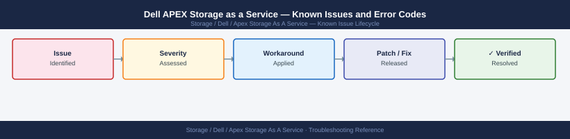

---
tags:
  - troubleshooting
  - apex
  - dell
  - known-issues
---
# Dell APEX Storage as a Service — Known Issues and Error Codes

Dell APEX Storage is a Dell-managed STaaS offering. Hardware operational issues are handled by Dell directly. This page covers tenant-side issues such as portal access, data access, and connectivity requirements.

*Applies to: Dell APEX Block Storage / File Storage / Object Storage*

## Before you begin

- For hardware faults or array failures, contact **Dell APEX support** — Dell manages the hardware lifecycle.
- Tenant responsibilities: maintain TCP 443 outbound to `apex.dell.com` and `cloudiq.dell.com`, and manage data access credentials.

## Portal and Management

| Error / Symptom | Affected Versions | Cause | Workaround / Fix | Fixed In |
|---|---|---|---|---|
| APEX portal shows `Array offline` | APEX | TCP 443 blocked from array management IP to apex.dell.com | Open outbound 443 from array management network; check `status.dell.com` for outage | N/A |
| `Order not visible` in APEX portal after purchase | APEX | Order provisioning takes 24–72 hours after contract execution | Wait 72 hours; contact Dell APEX support if still missing | N/A |

## Data Access

| Error / Symptom | Affected Versions | Cause | Workaround / Fix | Fixed In |
|---|---|---|---|---|
| Storage not accessible after APEX delivery | APEX | Host zoning or masking not configured by customer | Configure FC zoning or iSCSI connectivity per underlying array type | N/A |

## See also

- [Dell APEX — Common Issues](common-issues/)
- [Dell PowerStore — Known Issues](../../powerstore/troubleshooting/known-issues.md)
- [Dell CloudIQ — Known Issues](../../cloudiq/troubleshooting/known-issues.md)
