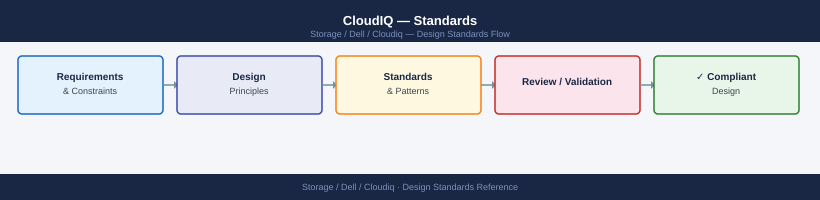

---
tags:
  - architecture
  - dell
---
# CloudIQ — Standards

<div class="kb-summary">
Standards reference covering Sizing and Capacity Model, Naming Conventions, Build and Deployment Baseline, Configuration Checklist.

*Applies to: CloudIQ*
</div>


```vegalite
{
  "$schema": "https://vega.github.io/schema/vega-lite/v5.json",
  "title": {
    "text": "Standards \u2014 Thresholds",
    "fontSize": 13,
    "fontWeight": "normal"
  },
  "width": 480,
  "height": {
    "step": 26
  },
  "data": {
    "values": [
      {
        "metric": "Data reduction ratio decline",
        "zone": "Safe",
        "val": 20
      },
      {
        "metric": "Data reduction ratio decline",
        "zone": "Alert",
        "val": 80
      }
    ]
  },
  "mark": {
    "type": "bar",
    "cornerRadiusEnd": 3
  },
  "encoding": {
    "y": {
      "field": "metric",
      "type": "nominal",
      "axis": {
        "title": null,
        "labelLimit": 200
      },
      "sort": null
    },
    "x": {
      "field": "val",
      "type": "quantitative",
      "stack": "normalize",
      "axis": {
        "title": "Threshold boundary",
        "format": ".0%"
      }
    },
    "color": {
      "field": "zone",
      "type": "nominal",
      "scale": {
        "domain": [
          "Safe",
          "Alert"
        ],
        "range": [
          "#15803d",
          "#dc2626"
        ]
      },
      "legend": {
        "title": "Zone"
      }
    },
    "order": {
      "field": "zone",
      "sort": [
        "Safe",
        "Alert"
      ]
    },
    "tooltip": [
      {
        "field": "metric",
        "type": "nominal",
        "title": "Metric"
      },
      {
        "field": "zone",
        "type": "nominal",
        "title": "Zone"
      },
      {
        "field": "val",
        "type": "quantitative",
        "title": "Segment %",
        "format": ".0f"
      }
    ]
  }
}
```

## Sizing and Capacity Model

CloudIQ is a SaaS product — there is no on-premises compute to size for CloudIQ itself. The sizing consideration is the SCG appliance:

| SCG Parameter | Guideline |
|---|---|
| SCG VM (virtual appliance) | 4 vCPU, 8 GB RAM, 100 GB disk (standard deployment) |
| Max devices per SCG | ~500 registered devices (check current SCG documentation) |
| SCG redundancy | Deploy two SCG appliances; register each device to both for failover |
| Network requirement | Outbound HTTPS (443) to `cloudiq.dell.com` and `esrs.emc.com`; no inbound ports required |

CloudIQ licensing is per-platform/system. Confirm that all monitored systems are included in the CloudIQ licence entitlement.

## Naming Conventions

| Object | Convention | Example |
|---|---|---|
| CloudIQ system display name | Use the same hostname/identifier as in Unisphere/SYMCLI | `lon01-powermax-001` |
| CloudIQ tag (site) | `site:<site-code>` | `site:lon01` |
| CloudIQ tag (environment) | `env:<environment>` | `env:prod` |
| CloudIQ tag (platform) | `platform:<type>` | `platform:powermax` |
| API client name | `svc-cloudiq-<purpose>` | `svc-cloudiq-monitoring` |
| Notification group name | `<team>-<severity>-alerts` | `storage-ops-critical-alerts` |
| Webhook integration name | `<target-system>-<channel>` | `servicenow-incident-creation` |

Apply at minimum three tags per system: site, environment, and platform. This enables efficient filtering in the CloudIQ dashboard across large estates.

## Build and Deployment Baseline

- Deploy the Secure Connect Gateway virtual appliance per the Dell SCG Installation Guide before onboarding systems to CloudIQ
- Register each Dell storage system to SCG from the system's management interface (Unisphere, SYMCLI) before the system will appear in CloudIQ
- Confirm SCG → CloudIQ telemetry is flowing: all systems should appear in the CloudIQ dashboard within 30 minutes of SCG registration
- Create a dedicated API client (`svc-cloudiq-monitoring`) in CloudIQ → Settings → API Access for all automation; do not use personal user accounts in scripts
- Apply tags to all systems at onboarding; do not leave systems untagged
- Configure notification rules for CRITICAL and ERROR severity alerts at minimum — direct to a monitoring email list or webhook
- Set up a webhook to the ITSM system (ServiceNow or equivalent) for CRITICAL alerts to trigger automatic incident creation
- Rotate API client secrets annually; maintain the secret in a secrets vault (not in plaintext scripts)

## Configuration Checklist

- [ ] SCG appliance deployed and reachable from management network
- [ ] All Dell storage systems registered to SCG and visible in CloudIQ dashboard
- [ ] All systems tagged with site, environment, and platform tags
- [ ] Health scores visible for all systems (no system showing "No Data" after 30 minutes)
- [ ] Notification rules configured for CRITICAL alerts → email distribution list
- [ ] Notification rules configured for CRITICAL alerts → ITSM webhook (ServiceNow or equivalent)
- [ ] API client created (`svc-cloudiq-monitoring`) with `client_id` and `client_secret` stored in secrets vault
- [ ] API token generation tested: `curl` to auth endpoint returns a valid `access_token`
- [ ] Capacity forecasting enabled and baseline trends visible (requires at least 7 days of telemetry)
- [ ] SSO configured if corporate identity provider is in use
- [ ] SCG redundancy: two SCG appliances deployed; each device registered to both

## Health Score Thresholds

Health scores run from 0–100. The following thresholds drive operational response.

| Health Score | Status | Action Required |
|---|---|---|
| 90–100 | Healthy | Normal monitoring |
| 80–89 | Needs Attention | Review in next weekly ops meeting |
| 60–79 | At Risk | Investigate within 48 hours; raise in daily stand-up |
| Below 60 | Critical | Raise incident in ServiceNow; investigate same business day |

## Alert Notification Routing

| Severity | Notification Channel | SLA |
|---|---|---|
| CRITICAL | PagerDuty (on-call rotation) | Acknowledge within 15 minutes |
| WARNING | Email — storage-ops distribution list | Review within 4 hours |
| INFO | CloudIQ portal only | Review in daily checklist |

Notification rules are configured in **CloudIQ portal > Settings > Notifications**. Each rule must be documented with the owner team and review date.

## Capacity Warning Levels

| Metric | Warning Threshold | Critical Threshold |
|---|---|---|
| Usable capacity used | 70% | 85% |
| Raw capacity used | 75% | 90% |
| Virtual pool used | 70% | 85% |
| Data reduction ratio decline | > 20% drop from 30-day baseline | > 30% drop |

Capacity alerts at WARNING trigger an email to the storage team. CRITICAL triggers a ServiceNow incident and PagerDuty page.

## Dashboard Standards

| Dashboard | Purpose | Owner | Review Frequency |
|---|---|---|---|
| CloudIQ Fleet Overview | All systems health score summary | Storage team | Daily |
| Capacity Trend | 30/60/90 day capacity trends per system type | Storage team | Weekly |
| AIOps Recommendations | Active AI-driven recommendations | Storage team | Daily |

Dashboards are named using the convention `CloudIQ-[Topic]-[Scope]`.

## API Access Policy

- One API client per consuming system (Splunk, Grafana, automation scripts)
- Client secrets stored in the team secrets manager; never committed to code repositories
- Rotation schedule: every 12 months; rotation date tracked in the credential register
- Read-only scope for all monitoring/reporting clients; write scope requires additional justification

## Change Management Integration

CRITICAL health score alerts and High AIOps recommendations that require infrastructure changes must be actioned via the standard change management process:

1. Raise a ServiceNow change request referencing the CloudIQ alert/recommendation
2. Obtain change approval before making changes to production systems
3. Close the change record with outcome notes after completion

---

## See also

- [Cloudiq — How It Works](how-it-works/)
- [Cloudiq — Integrations](integrations/)
- [Cloudiq — Deploy](../deploy/)
