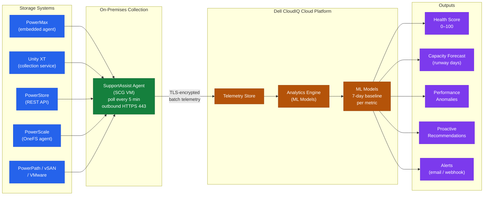

# CloudIQ — How It Works


<div class="kb-summary">
How It Works reference covering Overview, Data Pipeline Topology, How It Works, Supported Platforms, Key Capabilities.
</div>

```text
┌───────────────────────────────────── Dell CloudIQ — How It Works ─────────────────────────────────────┐
│                                                                                                       │
│   ┌───────────────────────────────────────────────────────────────────────────────────────────────┐   │
│   │          SCG polls storage REST APIs every 5 min; forwards telemetry to CloudIQ cloud         │   │
│   │       CloudIQ ML engine baselines each system; scores health; fires alerts on anomalies       │   │
│   │          User views insights in web UI; recommendations trigger remediation workflows         │   │
│   └───────────────────────────────────────────────────────────────────────────────────────────────┘   │
│                                                                                                       │
│    Storage → SCG polls → HTTPS telemetry stream → CloudIQ ingest → AI score → UI alert                │
│                                                                                                       │
│                          ▼                                                 ▼                          │
│                                                                                                       │
│   ┌──────────────────────────────────────────────┐  ┌─────────────────────────────────────────────┐   │
│   │            On-Premises Collection            │  │               Cloud Processing              │   │
│   │      ─────────────────────────────────       │  │      ─────────────────────────────────      │   │
│   │        SCG VM polls storage REST APIs        │  │       CloudIQ ingests telemetry stream      │   │
│   │       Collects perf, capacity, events        │  │      ML baselines each metric per array     │   │
│   │         Compresses and batches data          │  │         Health score computed 0–100         │   │
│   │         TLS-encrypted outbound HTTPS         │  │        Anomaly detection fires alerts       │   │
│   │          No inbound ports required           │  │          Recommendations generated          │   │
│   │        Proxy and CA cert configurable        │  │           Dashboards updated in UI          │   │
│   └──────────────────────────────────────────────┘  └─────────────────────────────────────────────┘   │
│                                                                                                       │
│    SCG data collection interval: 5 min for telemetry; 24 h for full configuration snapshot            │
│                                                                                                       │
│                          ▼                                                 ▼                          │
│                                                                                                       │
│   ┌───────────────────────────────────────────────────────────────────────────────────────────────┐   │
│   │        Step 1 — SCG discovers arrays via management IP + credentials (added in SCG UI)        │   │
│   │         Step 2 — SCG polls array REST API: metrics, alerts, capacity, config inventory        │   │
│   │       Step 3 — Telemetry batched and forwarded outbound HTTPS to CloudIQ ingest endpoint      │   │
│   │        Step 4 — CloudIQ ML scores health; capacity IQ projects runway; anomalies alert        │   │
│   │           Step 5 — Admin views dashboards; exports reports; acts on recommendations           │   │
│   └───────────────────────────────────────────────────────────────────────────────────────────────┘   │
│                                                                                                       │
│    Physical: SCG VM (2 vCPU, 8 GB RAM, 100 GB disk) on ESXi or Hyper-V; outbound 443                  │
│                                                                                                       │
│    Key terms:                                                                                         │
│                                                                                                       │
│    SCG polling   = SCG REST client queries each storage system management API every 5 min             │
│    Telemetry batch= Metrics compressed and batched before forwarding to reduce bandwidth              │
│    ML baseline   = CloudIQ learns normal performance/capacity pattern per system over 7+ days         │
│    Anomaly alert = Deviation beyond ML confidence band triggers email/webhook notification            │
│    Configuration snapshot= Full inventory of volumes, pools, hosts sent every 24 hours                │
│    Runway        = Capacity IQ prediction: days until storage pool reaches defined threshold          │
│    Health score  = Composite AI score; red <70, yellow 70–89, green 90–100                            │
│                                                                                                       │
└───────────────────────────────────────────────────────────────────────────────────────────────────────┘
```
## Overview

Dell CloudIQ is a cloud-native AIOps SaaS platform hosted by Dell. It receives telemetry from on-premises Dell infrastructure via the Secure Connect Gateway (SCG) and processes it through machine-learning models to produce health scores, capacity forecasts, and anomaly alerts. CloudIQ requires no on-premises compute beyond the SCG appliance — all analytics run in Dell's cloud.

## Data Pipeline Topology



## How It Works

1. Each on-premises Dell storage system is registered to an SCG appliance
2. The SCG polls the registered systems for telemetry (capacity metrics, performance counters, hardware health) and forwards it to the Dell CloudIQ back-end over outbound HTTPS (port 443)
3. CloudIQ ingests the telemetry, applies ML-based health scoring, and generates alerts when scores drop or anomalies are detected
4. Users access results via the CloudIQ web dashboard or the REST API
5. Notifications are sent via email or webhook based on configured notification rules

CloudIQ health scores range from 0 to 100. Scores below 80 indicate a condition requiring attention; scores below 60 are typically active hardware or configuration alerts.

## Supported Platforms

| Platform | Telemetry Source |
|---|---|
| PowerMax / VMAX | Embedded telemetry agent |
| Unity XT | CloudIQ data collection service |
| PowerScale (Isilon) | OneFS embedded agent |
| PowerStore | REST API |
| PowerFlex (VxFlex OS) | SDC telemetry |
| XtremIO | REST API |

## Key Capabilities

| Capability | Description |
|---|---|
| Health scoring | 0–100 score per system; ML-based anomaly detection flags degraded conditions |
| Capacity forecasting | Trend-based projection of when systems will reach capacity thresholds |
| Proactive recommendations | AI-generated configuration and performance improvement suggestions |
| Cross-platform visibility | Unified dashboard across all registered Dell systems |
| API access | REST API for integrating CloudIQ data into ITSM and capacity planning tools |
