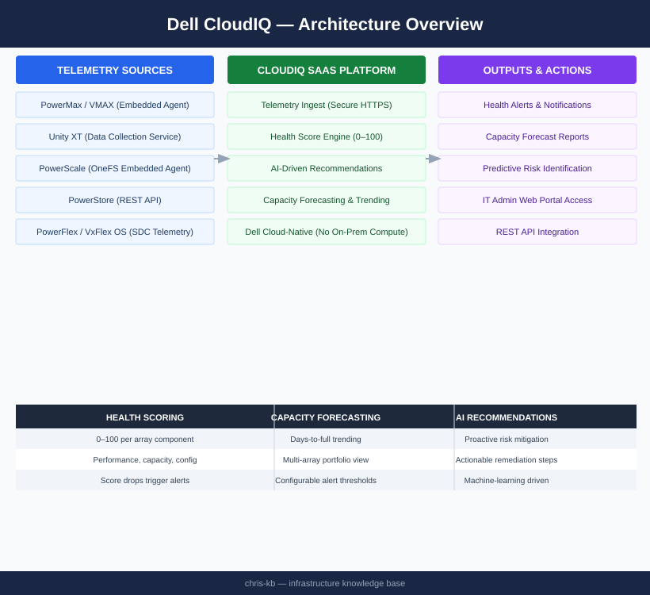

# CloudIQ — Architecture

<div class="kb-summary">
Cloud-native AIOps SaaS platform hosted by Dell. Receives telemetry from on-premises Dell arrays via the Secure Connect Gateway and produces health scores (0–100), capacity forecasts, and AI-driven recommendations. No on-premises compute required beyond the SCG.
</div>

```
┌────────────────────────────────────── Dell CloudIQ Architecture ──────────────────────────────────────┐
│                                                                                                       │
│   ┌───────────────────────────────────────────────────────────────────────────────────────────────┐   │
│   │        CloudIQ: SaaS AIOps platform collecting telemetry from Dell storage and servers        │   │
│   │            Telemetry flows from Secure Connect Gateway (SCG) to Dell cloud backend            │   │
│   │        Provides capacity planning, performance analytics, and predictive health scoring       │   │
│   │                No on-premises compute required; SCG is the only local component               │   │
│   └───────────────────────────────────────────────────────────────────────────────────────────────┘   │
│                                                                                                       │
│    Storage arrays → SCG collects telemetry → CloudIQ cloud → dashboards + AI insights                 │
│                                                                                                       │
│                  ▼                                ▼                                ▼                  │
│                                                                                                       │
│   ┌─────────────────────────────┐  ┌─────────────────────────────┐  ┌─────────────────────────────┐   │
│   │       Data Collection       │  │        Cloud Platform       │  │         Capabilities        │   │
│   │      ─────────────────      │  │      ─────────────────      │  │      ─────────────────      │   │
│   │         SCG on-prem         │  │       Dell SaaS cloud       │  │        Health scoring       │   │
│   │       REST API polling      │  │         ML/AI engine        │  │       Capacity predict      │   │
│   │       Event forwarding      │  │       Telemetry ingest      │  │        Perf analytics       │   │
│   │      Alert aggregation      │  │         Multi-tenant        │  │        Anomaly detect       │   │
│   │       Secure outbound       │  │         API gateway         │  │       Recommendations       │   │
│   └─────────────────────────────┘  └─────────────────────────────┘  └─────────────────────────────┘   │
│                                                                                                       │
│    SCG sends telemetry outbound HTTPS 443 → CloudIQ ingests → AI scoring → UI alerts                  │
│                                                                                                       │
│                  ▼                                ▼                                ▼                  │
│                                                                                                       │
│   │      Layer       │    Component     │      Function     │     Protocol     │      Notes       │   │
│   │ ──────────────── │ ──────────────── │ ───────────────── │ ──────────────── │──────────────────│   │
│   │       Edge       │      SCG VM      │  Telemetry relay  │    HTTPS 443     │  Outbound only   │   │
│   │    Transport     │  Internet/proxy  │   Secure tunnel   │     TLS 1.2+     │ Proxy supported  │   │
│   │      Cloud       │   CloudIQ SaaS   │    AI analytics   │     REST API     │   Dell-hosted    │   │
│   │      Access      │   Web browser    │     Dashboards    │      HTTPS       │     SSO/MFA      │   │
│                                                                                                       │
│    Physical: SCG VM runs on ESXi or Hyper-V on-premises; arrays connect via management IP             │
│                                                                                                       │
│    Key terms:                                                                                         │
│                                                                                                       │
│    CloudIQ      = Dell SaaS AIOps platform; receives telemetry via SCG; provides AI-driven insights   │
│    SCG          = Secure Connect Gateway; on-premises VM relaying telemetry to Dell cloud             │
│    Health score = AI-generated 0-100 score per system; green/yellow/red risk bands                    │
│    Capacity IQ  = CloudIQ module projecting when storage will fill based on growth trends             │
│    Performance  = CloudIQ latency/IOPS/bandwidth dashboards per workload over time                    │
│    Anomaly      = ML baseline comparison; alerts when metric deviates from normal pattern             │
│    Telemetry    = Performance, capacity, configuration, and event data sent every 5 minutes           │
│    Multi-tenant = Single CloudIQ login spans all Dell storage systems across sites                    │
│    AI engine    = Dell ML models trained on fleet-wide data; predict failures before they occur       │
│    Outbound only= No inbound connections; SCG initiates all communication to CloudIQ                  │
│    Proxy support= SCG can route telemetry through HTTP/HTTPS proxy if direct internet blocked         │
│    SaaS         = Software-as-a-Service; Dell manages platform updates; no admin overhead             │
│                                                                                                       │
└───────────────────────────────────────────────────────────────────────────────────────────────────────┘
```


<div class="kb-grid kb-grid-3">
<a class="kb-card" href="how-it-works/"><strong>How It Works</strong><span>How it works, integrations, and design standards.</span></a>
<a class="kb-card" href="integrations/"><strong>Integrations</strong><span>Integration with Dell arrays, Secure Connect Gateway, and REST API.</span></a>
<a class="kb-card" href="design-standards/"><strong>Design Standards</strong><span>SCG redundancy, notification configuration, and API integration practices.</span></a>
</div>

## Supported Platforms

| Platform | Telemetry Source |
|---|---|
| PowerMax / VMAX | Embedded telemetry agent |
| Unity XT | CloudIQ data collection service |
| PowerScale (Isilon) | OneFS embedded agent |
| PowerStore | REST API |
| PowerFlex (VxFlex OS) | SDC telemetry |

## Data Pipeline


