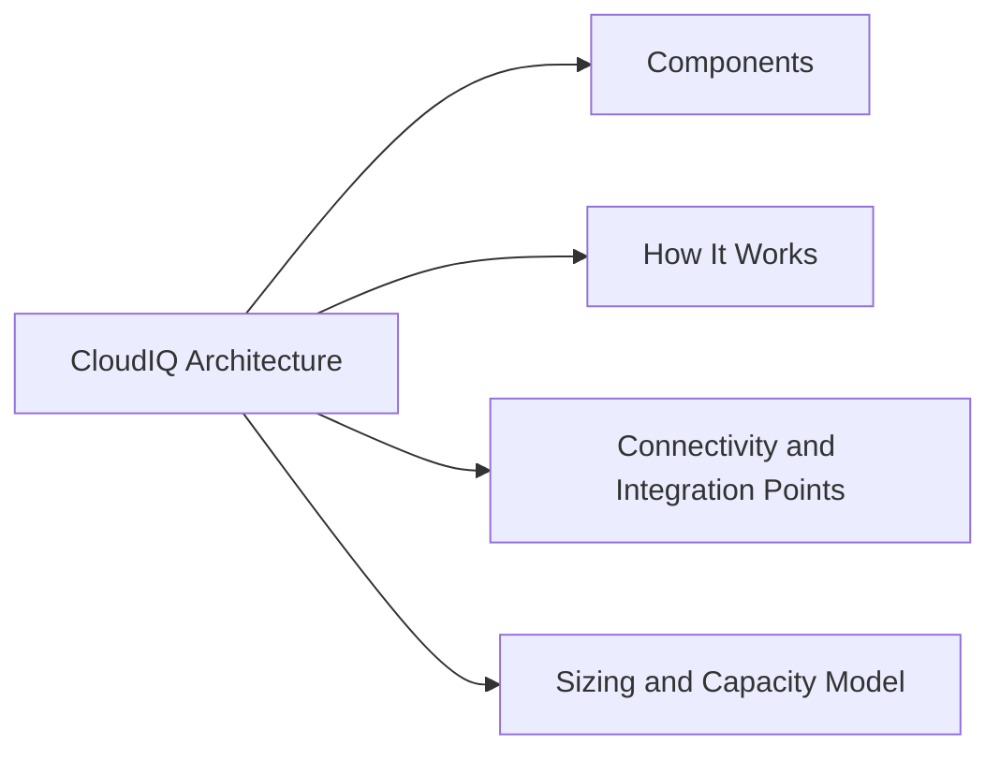

# CloudIQ Architecture

## Overview

Dell CloudIQ is a cloud-native AIOps SaaS platform hosted by Dell. It receives telemetry from on-premises Dell infrastructure via the Secure Connect Gateway (SCG) and processes it through machine-learning models to produce health scores, capacity forecasts, and anomaly alerts. CloudIQ requires no on-premises compute beyond the SCG appliance — all analytics run in Dell's cloud.

## Components

| Component | Location | Role |
|---|---|---|
| CloudIQ SaaS Platform | Dell-hosted cloud | Analytics engine, health scoring, capacity forecasting, alert generation |
| CloudIQ Web Dashboard | Browser (SaaS) | Primary operator interface for health, alerts, capacity, and performance views |
| CloudIQ REST API | Dell-hosted (`cloudiq.dell.com`) | Programmatic access to all CloudIQ data; used for automation and integrations |
| Secure Connect Gateway (SCG) | On-premises (virtual appliance) | Collects telemetry from registered Dell devices and forwards it to CloudIQ over HTTPS |
| Registered storage systems | On-premises | PowerMax, PowerStore, PowerScale, Unity, VPLEX, Data Domain, etc.; each registered to SCG |
| API client credentials | CloudIQ → Settings | OAuth2 `client_id` / `client_secret` for REST API access |

## How It Works

1. Each on-premises Dell storage system is registered to an SCG appliance
2. The SCG polls the registered systems for telemetry (capacity metrics, performance counters, hardware health) and forwards the data to the Dell CloudIQ back-end over outbound HTTPS (port 443)
3. CloudIQ ingests the telemetry, applies ML-based health scoring, and generates alerts when scores drop or anomalies are detected
4. Users access results via the CloudIQ web dashboard or the REST API
5. Notifications are sent via email or webhook based on configured notification rules

CloudIQ health scores range from 0 to 100. Scores below 80 indicate a condition requiring attention; scores below 60 are typically active hardware or configuration alerts.

## Connectivity and Integration Points

| Interface | Protocol / Endpoint | Purpose |
|---|---|---|
| SCG → CloudIQ telemetry | HTTPS 443 outbound | Telemetry upload from SCG to Dell CloudIQ back-end |
| CloudIQ REST API | HTTPS `https://cloudiq.dell.com/cloudiq/rest/v1/` | Programmatic access to health, alerts, capacity, and performance data |
| CloudIQ Auth API | HTTPS `https://cloudiq.dell.com/auth/v1/token` | OAuth2 token endpoint for API clients |
| Email notifications | SMTP (Dell-managed) | Alert email delivery to configured recipients |
| Webhook notifications | HTTPS POST (customer-defined URL) | Alert delivery to external systems (SIEM, ServiceNow, PagerDuty) |
| SSO / IdP | SAML 2.0 | Optional corporate SSO for CloudIQ web login |

## Sizing and Capacity Model

CloudIQ is a SaaS product — there is no on-premises compute to size for CloudIQ itself. The sizing consideration is the SCG appliance:

| SCG Parameter | Guideline |
|---|---|
| SCG VM (virtual appliance) | 4 vCPU, 8 GB RAM, 100 GB disk (standard deployment) |
| Max devices per SCG | ~500 registered devices (check current SCG documentation) |
| SCG redundancy | Deploy two SCG appliances; register each device to both for failover |
| Network requirement | Outbound HTTPS (443) to `cloudiq.dell.com` and `esrs.emc.com`; no inbound ports required |

CloudIQ licensing is per-platform/system. Confirm that all monitored systems are included in the CloudIQ licence entitlement.
