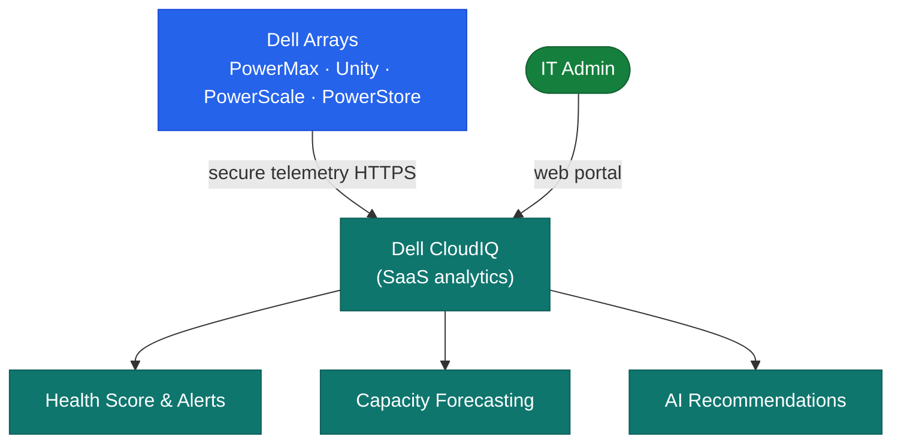

# CloudIQ — Architecture

Cloud-native AIOps SaaS platform hosted by Dell. Receives telemetry from on-premises Dell arrays via the Secure Connect Gateway and produces health scores (0–100), capacity forecasts, and AI-driven recommendations. No on-premises compute required beyond the SCG.

<a class="kb-card" href="how-it-works/"><strong>How It Works</strong>How it works, integrations, and design standards.</a>
<a class="kb-card" href="integrations/"><strong>Integrations</strong>Integration with Dell arrays, Secure Connect Gateway, and REST API.</a>
<a class="kb-card" href="design-standards/"><strong>Design Standards</strong>SCG redundancy, notification configuration, and API integration practices.</a>

## Supported Platforms

| Platform | Telemetry Source |
|---|---|
| PowerMax / VMAX | Embedded telemetry agent |
| Unity XT | CloudIQ data collection service |
| PowerScale (Isilon) | OneFS embedded agent |
| PowerStore | REST API |
| PowerFlex (VxFlex OS) | SDC telemetry |

## Data Pipeline

