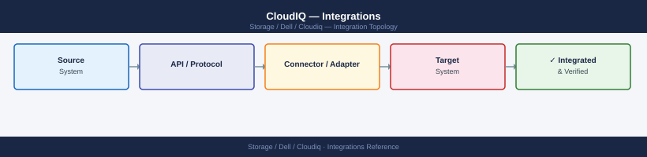

---
tags:
  - architecture
  - dell
---
# CloudIQ — Integrations


<div class="kb-summary">
Integrations reference covering Connectivity and Integration Points, Secure Connect Gateway, Email Notifications, Webhook Notifications, REST API Integration and 1 more sections.

*Applies to: CloudIQ*
</div>



```d2
direction: right

center: "CloudIQ" {shape: hexagon}
email_notifications: "Email Notifications" {shape: rectangle}
webhook_notifications: "Webhook Notifications" {shape: rectangle}
rest_api_integration: "REST API Integration" {shape: rectangle}
servicenow_integration: "ServiceNow Integration" {shape: rectangle}
native_platform_integrations_inbound: "Native Platform Integrations (Inbound via SCG)" {shape: rectangle}
aria_operations_integration: "Aria Operations Integration" {shape: rectangle}

center -> email_notifications
center -> webhook_notifications
center -> rest_api_integration
center -> servicenow_integration
center -> native_platform_integrations_inbound
center -> aria_operations_integration
```

## Email Notifications

CloudIQ sends alert notifications directly from Dell's mail infrastructure — no on-premises SMTP relay is required. Configure notification recipients in the CloudIQ portal under **Settings > Notifications > Email**.

- Add recipient email addresses per notification rule.
- Scope rules by system, severity (CRITICAL, WARNING, INFO), or CloudIQ tag.
- Test the notification configuration using the **Send Test** button in the notification rule.

## Webhook Notifications

CloudIQ supports outbound webhook delivery for CRITICAL alerts, enabling integration with Slack, Microsoft Teams, ServiceNow, or any HTTP endpoint that accepts a JSON POST.

Configure under **Settings > Notifications > Webhook**:

- **Endpoint URL**: the Slack incoming webhook URL, Teams connector URL, or ServiceNow REST API URL.
- **Method**: POST
- **Payload format**: CloudIQ sends a JSON body containing alert severity, system name, description, and timestamp.

## REST API Integration

Common integration patterns:

| Tool | Integration Method |
|---|---|
| Splunk | CloudIQ API poller script (Python) writing JSON events to Splunk HTTP Event Collector |
| Grafana | CloudIQ API data source via Grafana JSON API plugin or custom Python proxy |
| ServiceNow | CloudIQ webhook POST to ServiceNow inbound REST API for incident creation |
| Ansible | CloudIQ API queried in playbooks for health gate checks before storage maintenance tasks |

## ServiceNow Integration

CloudIQ can automatically create ServiceNow incidents for CRITICAL alerts via the webhook notification feature. Configure as follows:

1. In ServiceNow, create or identify an **Inbound REST API** endpoint or a scripted REST API that accepts a JSON POST and creates an incident.
2. In CloudIQ under **Settings > Notifications > Webhook**, add a new webhook with the ServiceNow REST API endpoint URL and any required authentication headers (e.g., Basic auth or OAuth token as a custom header).
3. Set the notification filter to **CRITICAL** severity to avoid flooding the ITSM tool with low-priority alerts.
4. Map the CloudIQ JSON payload fields (system name, alert description, severity) to ServiceNow incident fields in the ServiceNow scripted REST handler.
5. Test by triggering a test notification from CloudIQ and confirming the incident appears in ServiceNow.

For production environments, use a ServiceNow integration user with the minimum required roles (`itil` for incident creation) rather than a shared admin account.

## Overview

CloudIQ collects telemetry natively from all Dell platforms via the Secure Connect Gateway. External integrations extend alert delivery and data access into broader operational toolsets including ITSM, observability platforms, and notification systems.

## Native Platform Integrations (Inbound via SCG)

All Dell storage and server platforms are registered in the SCG and data flows automatically.

| Platform | Connection Method | Key Data |
|---|---|---|
| PowerStore | REST API from SCG | Health score, capacity, performance, alerts |
| PowerMax / VMAX | REST API from SCG | Health score, capacity, SRDF, performance |
| PowerScale / Isilon | REST API from SCG | Health score, capacity, protocol throughput |
| Unity XT | REST API from SCG | Health score, capacity, replication status |
| Data Domain / PowerProtect | REST API from SCG | Dedup ratios, capacity, replication health |
| PowerEdge (via iDRAC) | iDRAC REST API from SCG | Server health, firmware, hardware faults |

## Aria Operations Integration

The Dell CloudIQ management pack for Aria Operations pulls health score and alert data into vROps for correlated VMware + Dell storage dashboards.

Aria Operations > Admin > Solutions > Dell CloudIQ Management Pack
- CloudIQ API URL: https://api.cloudiq.dell.com
- Client ID / Secret: stored in Aria Operations credential store
- Collection interval: 15 minutes

## Integration Summary

| Integration | Method | Purpose |
|---|---|---|
| PowerMax / PowerStore / PowerScale / Unity / DD | SCG telemetry (native) | Health, capacity, and performance data |
| ServiceNow | Webhook from CloudIQ alert rules | Auto-ticket on CRITICAL alerts |
| Slack / Teams | Webhook notification | Real-time alert notifications to ops channel |
| Splunk / Grafana | CloudIQ REST API poller | Fleet health and capacity dashboards |
| Aria Operations | CloudIQ management pack | VMware + Dell storage correlation |
| Email | CloudIQ notification rules | WARNING alert distribution to team |

---

## See also

- [Cloudiq — How It Works](how-it-works/)
- [Cloudiq — Design Standards](design-standards/)
