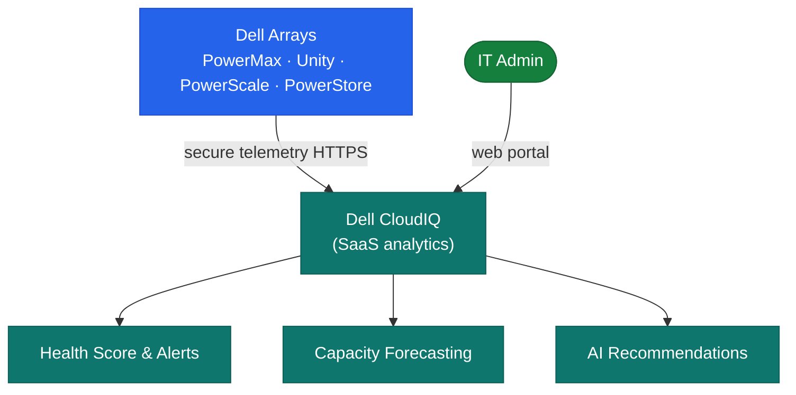

# CloudIQ — Architecture Overview

Dell CloudIQ is a cloud-native AIOps SaaS platform hosted by Dell. It receives telemetry from on-premises Dell infrastructure via the Secure Connect Gateway (SCG) and processes it through machine-learning models to produce health scores, capacity forecasts, and anomaly alerts. CloudIQ requires no on-premises compute beyond the SCG appliance — all analytics run in Dell's cloud.

## Data Pipeline Topology

## How It Works

1. Each on-premises Dell storage system is registered to an SCG appliance
2. The SCG polls the registered systems for telemetry (capacity metrics, performance counters, hardware health) and forwards the data to the Dell CloudIQ back-end over outbound HTTPS (port 443)
3. CloudIQ ingests the telemetry, applies ML-based health scoring, and generates alerts when scores drop or anomalies are detected
4. Users access results via the CloudIQ web dashboard or the REST API
5. Notifications are sent via email or webhook based on configured notification rules

CloudIQ health scores range from 0 to 100. Scores below 80 indicate a condition requiring attention; scores below 60 are typically active hardware or configuration alerts.
