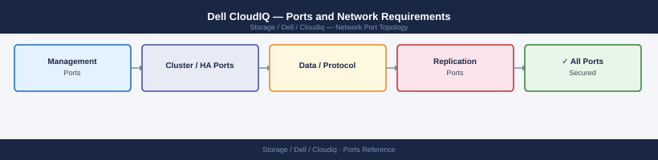

---
tags:
  - cloudiq
  - dell
  - networking
  - firewall
  - ports
  - monitoring
---
# Dell CloudIQ — Ports and Network Requirements

<div class="kb-summary">
Firewall port reference for Dell CloudIQ. CloudIQ is Dell's SaaS analytics and health monitoring platform. All Dell storage arrays that participate in CloudIQ must reach the CloudIQ cloud service via outbound HTTPS.

*Applies to: CloudIQ (SaaS)*
</div>


## How It Works

CloudIQ is a SaaS service — no on-premise CloudIQ server exists. Storage arrays send telemetry outbound to `cloudiq.dell.com`. Admin access is via browser to `cloudiq.dell.com` directly.

## Outbound — Array to CloudIQ (Required for Participation)

| Port | Protocol | Source | Destination | Purpose |
|---|---|---|---|---|
| 443 | TCP | Storage array management IP | cloudiq.dell.com, *.dell.com | Telemetry upload, capacity and health data |

This applies to all CloudIQ-participating arrays:
- Dell PowerStore
- Dell PowerScale
- Dell PowerMax / VMAX
- Dell Unity XT
- Dell Data Domain / PowerProtect DD
- Dell ECS

## Admin Access (SaaS — No On-Prem Rules Needed)

| Port | Protocol | Destination | Purpose |
|---|---|---|---|
| 443 | TCP | cloudiq.dell.com | Admin browser access to CloudIQ dashboards |

## Firewall Summary

| From | To | Ports | Notes |
|---|---|---|---|
| All managed arrays (mgmt IPs) | cloudiq.dell.com | 443 | Required for CloudIQ participation — outbound only |
| Admin browsers | cloudiq.dell.com | 443 | SaaS access — no on-prem rules needed |

## Verify

```bash
# From array management network — test CloudIQ connectivity
curl -sk -o /dev/null -w "%{http_code}" https://cloudiq.dell.com/
# Expected: 200 or 302
```


```text title="Expected output"
200
```

!!! warning "Common errors"
    **`curl: (7) Failed to connect to cloudiq.dell.com port 443: Connection timed out`** — Verify the array management network has outbound HTTPS access to cloudiq.dell.com; check firewall rules and proxy settings.
    **`curl: (60) SSL certificate problem: self signed certificate`** — Add `-k` flag to skip certificate verification (already present in the example), or update the system CA bundle if using an internal proxy.
    **`curl: (35) OpenSSL SSL_connect: Connection reset by peer`** — Confirm the array's NTP is synchronized and the system clock is within acceptable range of CloudIQ servers.
## See also

- [Dell CloudIQ — Architecture](../how-it-works/)
- [Dell PowerStore — Ports](../../powerstore/architecture/ports.md)
- [Dell PowerScale — Ports](../../powerscale/architecture/ports.md)
