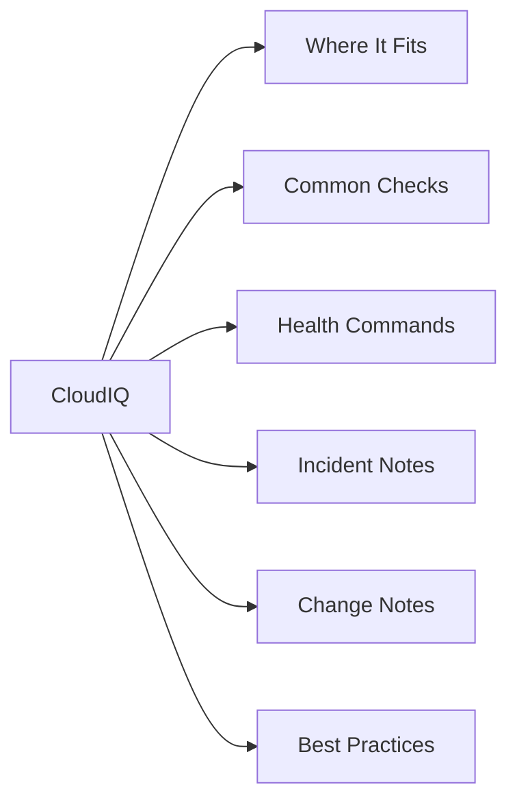

# CloudIQ

<a class="kb-card" href="architecture/"><strong>Architecture</strong>HA topology, components, connectivity, and sizing.</a>
<a class="kb-card" href="standards/"><strong>Standards</strong>Naming conventions, build baseline, and configuration checklist.</a>
<a class="kb-card" href="lifecycle/"><strong>Lifecycle</strong>Version matrix, upgrade paths, EOL tracking, and refresh planning.</a>
<a class="kb-card" href="operations/"><strong>Operations</strong>Daily checks, health monitoring, maintenance tasks, and runbooks.</a>
<a class="kb-card" href="cli-reference/"><strong>CLI Reference</strong>Command reference by category with syntax and examples.</a>
<a class="kb-card" href="scripts/"><strong>Scripts</strong>Automation scripts for daily checks, health, incident triage, and validation.</a>
<a class="kb-card" href="troubleshooting/"><strong>Troubleshooting</strong>Common issues, diagnostic commands, log locations, and error codes.</a>
<a class="kb-card" href="integration/"><strong>Integration</strong>VMware, backup tools, monitoring, authentication, and API integration.</a>
<a class="kb-card" href="security/"><strong>Security</strong>Hardening checklist, RBAC, encryption, audit logging, and compliance.</a>
<a class="kb-card" href="vendor-support/"><strong>Vendor Support</strong>Opening a case, information to collect, support portal, and SLA tiers.</a>

## Overview

Dell CloudIQ is a cloud-native AIOps platform that collects telemetry from Dell storage, server, and networking infrastructure via the Secure Connect Gateway and presents health scores, capacity forecasts, and performance analytics through a web dashboard and REST API. CloudIQ continuously analyses telemetry against Dell's anomaly models and generates proactive alerts before issues become outages. It covers PowerMax, PowerStore, PowerScale, Unity, VPLEX, Data Domain, and other platforms.

## Where It Fits

| Use Case |
|---|
| Centralised health and capacity monitoring across a heterogeneous Dell storage estate |
| Proactive alerting: CloudIQ generates alerts days or weeks before capacity exhaustion or hardware failure |
| Capacity planning: built-in forecasting projects when a system will reach threshold based on growth trends |
| Performance baseline analysis for anomaly detection without manual threshold configuration |
| Single pane of glass for distributed teams managing multiple Dell platforms across multiple sites |

## Common Checks

- Log into the CloudIQ dashboard and review the System Health page for any systems with a health score below 80
- Review active alerts sorted by severity — address CRITICAL and ERROR before end of day
- Check the Capacity page for any system with less than 30 days to full based on the trend line
- Confirm all expected systems are reporting (a missing system indicates an SCG connectivity issue)
- Review the Performance page for any system showing anomalous latency or throughput deviation from baseline
- Check the CloudIQ API token expiry if automation scripts are in use — tokens have a maximum validity period

## Health Commands

~~~bash
# Authenticate to CloudIQ REST API and get a bearer token
curl -s -X POST "https://cloudiq.dell.com/auth/v1/token" \
  -H "Content-Type: application/x-www-form-urlencoded" \
  -d "grant_type=client_credentials&client_id=<client_id>&client_secret=<client_secret>" \
  | jq -r '.access_token'

# List all storage systems visible in CloudIQ
curl -s -H "Authorization: Bearer <token>" \
  "https://cloudiq.dell.com/cloudiq/rest/v1/storage-systems" | jq .

# Get active alerts (all systems)
curl -s -H "Authorization: Bearer <token>" \
  "https://cloudiq.dell.com/cloudiq/rest/v1/alerts?state=ACTIVE" | jq .

# Get capacity summary for a specific system
curl -s -H "Authorization: Bearer <token>" \
  "https://cloudiq.dell.com/cloudiq/rest/v1/storage-systems/<system_id>/capacity" | jq .

# Get performance metrics for a specific system
curl -s -H "Authorization: Bearer <token>" \
  "https://cloudiq.dell.com/cloudiq/rest/v1/storage-systems/<system_id>/performance" | jq .

# List all CloudIQ tags (useful for filtering by site or environment)
curl -s -H "Authorization: Bearer <token>" \
  "https://cloudiq.dell.com/cloudiq/rest/v1/tags" | jq .
~~~

## Incident Notes

When CloudIQ raises a critical alert or a system health score drops, capture the following:

- **Symptom**: What is CloudIQ reporting (alert text, affected component, health score delta)?
- **Impact**: Which workloads or hosts depend on the affected system?
- **Start time**: When did the health score change or the alert first appear?
- **What changed**: Any recent firmware upgrades, capacity changes, or configuration modifications?
- **What was checked**: Commands run, logs reviewed, SCG connectivity verified?
- **Resolution**: Root cause, remediation steps taken, and whether an alert was acknowledged or escalated to a Dell Support case

## Change Notes

Before making changes to CloudIQ configuration (API tokens, alert thresholds, notification rules):

- **Approval**: Confirm change is in the change management system
- **Rollback plan**: Document how to revert notification or threshold changes; note that telemetry changes on the SCG may take up to 24h to reflect
- **Validation steps**: After change, confirm the affected system still appears in CloudIQ and alerts are routing correctly

## Best Practices

| Recommendation | Detail |
|---|---|
| Use CloudIQ tags to organise systems by site, environment, and team | filtering by tag is the fastest way to scope an on-call review |
| Set up email or webhook notifications for CRITICAL severity | Set up email or webhook notifications for CRITICAL severity alerts so they are not missed between dashboard logins |
| Export the CloudIQ capacity forecast monthly and share with | Export the CloudIQ capacity forecast monthly and share with the storage capacity planning meeting |
| Use the CloudIQ API for automation rather than scraping the GUI | the API is stable and versioned |
| Rotate API client secrets on a schedule and update all | Rotate API client secrets on a schedule and update all automation scripts before the old secret expires |
