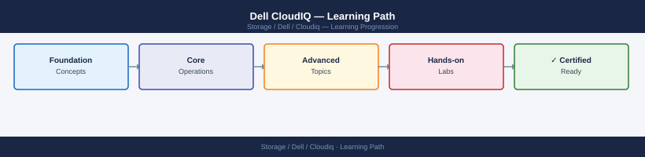

---
tags:
  - dell
  - learning-path
---
# Dell CloudIQ — Learning Path

<div class="kb-summary">
Recommended reading order for Dell CloudIQ. Follow these stages in order to build a complete mental model before working with it in production.

*Applies to: CloudIQ*
</div>



```d2
direction: right

stage_1_architecture: "Stage 1 — Architecture" {shape: rectangle}
stage_2_deployment: "Stage 2 — Deployment" {shape: rectangle}
stage_3_operations: "Stage 3 — Operations" {shape: rectangle}
stage_4_security: "Stage 4 — Security" {shape: rectangle}
stage_5_troubleshooting: "Stage 5 — Troubleshooting" {shape: rectangle}

stage_1_architecture -> stage_2_deployment: next
stage_2_deployment -> stage_3_operations: next
stage_3_operations -> stage_4_security: next
stage_4_security -> stage_5_troubleshooting: next
```

## Stage 1 — Architecture
**Goal**: Understand how CloudIQ collects telemetry from Dell infrastructure, generates health scores, and delivers AIOps insights via its SaaS platform.

**Read in this order**:
- [How It Works](../architecture/how-it-works/) — CloudIQ SaaS architecture: telemetry collection from on-premises Dell systems via Secure Connect Gateway, health score algorithm (weighted component scoring), predictive analytics engine, capacity forecasting model, and performance anomaly detection.
- [Design Standards](../architecture/design-standards/) — Which Dell products are CloudIQ-enabled, telemetry collection frequency, health score thresholds for alert generation, capacity forecast horizon configuration, and multi-system dashboard organisation.
- [Integrations](../architecture/integrations/) — Secure Connect Gateway (SCG) as the on-premises telemetry forwarder, integration with ServiceNow for alert ticket creation, Slack and email notification webhooks, REST API for external reporting, and APEX Console integration.

**Why first**: CloudIQ is a passive observer, not a management plane. Understanding what it can and cannot control prevents confusion about its role in the operations workflow.

---

## Stage 2 — Deployment
**Goal**: Connect your Dell systems to CloudIQ via Secure Connect Gateway and validate telemetry flow.

**Read**:
- [Deploy](../deploy/) — Secure Connect Gateway installation and registration, system onboarding to CloudIQ, telemetry validation in the CloudIQ dashboard, notification channel configuration, and ServiceNow integration setup.
- [Install & Upgrade](../operations/install-upgrade/) — SCG software updates, CloudIQ connector updates for new product support, and re-registration procedures after system replacement.

**Why second**: SCG is the critical path for telemetry. If SCG is misconfigured, CloudIQ shows no data and health scores cannot be generated.

---

## Stage 3 — Operations
**Goal**: Use CloudIQ daily to monitor health scores, act on predictive alerts, review capacity forecasts, and integrate with ticketing systems.

**Read in this order**:
- [Health Checks](../operations/health-checks/) — run the routine first on every shift; covers overall fleet health score, systems with degraded or critical health, active anomaly alerts, and capacity headroom forecast.
- [CLI Reference](../operations/cli-reference/) — CloudIQ REST API endpoints for health score queries, capacity data export, alert retrieval, and system inventory listing.
- [Procedures](../operations/procedures/) — Acknowledging and resolving alerts, customising health score thresholds, configuring capacity forecast notification rules, adding new systems, and exporting monthly health reports.
- [Backup & Restore](../operations/backup-restore/) — CloudIQ configuration backup (notification settings, thresholds), re-onboarding systems after SCG replacement, and alert history export for audit.
- [Scripts](../operations/scripts/) — Automation: daily health score polling via REST API, capacity threshold alerting to Slack, and fleet health report generation for management dashboards.
- [Alerts](../operations/alerts/) — Alert type taxonomy (predictive, threshold, anomaly), alert severity mapping, and alert routing rules.
- [Recommendations](../operations/recommendations/) — How CloudIQ generates remediation recommendations and how to evaluate and act on them.
- [Capacity](../operations/capacity/) — Capacity forecast dashboard interpretation, trend analysis, and how to export capacity data for capacity planning tools.
- [Reports](../operations/reports/) — Pre-built report types (health, capacity, performance), scheduling recurring reports, and sharing reports with stakeholders.

**Why third**: CloudIQ's value is realised through consistent daily use. Operators who check it only on incidents miss the predictive alerts that prevent those incidents.

---

## Stage 4 — Security
**Goal**: Control who can view CloudIQ data, restrict API access, and understand the data privacy model for telemetry sent to Dell's SaaS platform.

**Read**:
- [Access Control](../security/access-control/) — CloudIQ user roles (Administrator, Observer), system-level visibility scoping, and service account permissions for REST API integration.
- [Authentication](../security/authentication/) — CloudIQ SSO configuration, MFA enforcement, REST API OAuth2 token management, and SCG authentication to Dell SaaS.
- [Encryption](../security/encryption/) — Telemetry encryption in transit (TLS from SCG to CloudIQ SaaS), Dell data handling policy for telemetry data, and data residency considerations.
- [Hardening](../security/hardening/) — Restricting CloudIQ user access to relevant systems only, audit log review for user access, MFA mandate, and SCG network egress restriction to CloudIQ endpoints only.

**Why fourth**: Telemetry data leaves the on-premises environment. Understanding what is collected and how it is protected is required for compliance sign-off.

---

## Stage 5 — Troubleshooting
**Goal**: Diagnose missing telemetry, stale health scores, alert notification failures, and SCG connectivity issues.

**Read**:
- [Common Issues](../troubleshooting/common-issues/) — System showing no data in CloudIQ (SCG connectivity lost), health score not updating (telemetry gap), alert notifications not arriving (webhook misconfiguration), and capacity forecast missing (insufficient historical data).
- [Diagnostics](../troubleshooting/diagnostics/) — SCG connectivity test, CloudIQ system status page, telemetry gap analysis in CloudIQ, and SCG log review.
- [Escalation](../troubleshooting/escalation/) — When to open a Dell support case for CloudIQ SaaS issues, SCG troubleshooting escalation, and how to report incorrect health score calculations.

**Why last**: Troubleshooting makes most sense once you know the normal operating state.

---

## See also

- [Cloudiq — Deploy](../deploy/)
- [Cloudiq — Procedures](../operations/procedures/)
- [Cloudiq — Common Issues](../troubleshooting/common-issues/)
