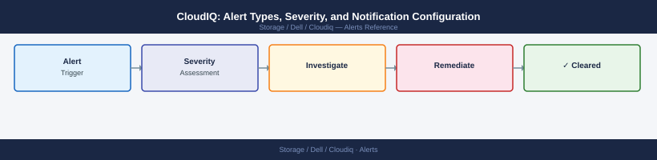

---
tags:
  - dell
  - operations
---
# CloudIQ: Alert Types, Severity, and Notification Configuration

CloudIQ: Alert Types, Severity, and Notification Configuration reference covering Notification Configuration, Dismissing and Acknowledging Alerts, Common Alert Issues.

*Applies to: CloudIQ*

## Before you begin

- **Access:** Storage admin credentials (cluster admin or equivalent)
- **Timing:** safe to run during business hours unless a step is marked ⚠ (causes interruption)
- **Dependencies:** no active upgrades or migrations on the same infrastructure
- **Logging:** capture command output — paste into the change record on completion

---

## Common Alert Issues

| Issue | Likely Cause | Fix |
|---|---|---|
| No alerts appearing | System not registered or phone-home blocked | Check system connectivity and SRS/ESRS config |
| Email notifications not received | Recipient not added or spam filter | Verify recipients in Settings > Notifications |
| Alerts not clearing after fix | System has not reported resolved state | Wait for next telemetry cycle (up to 30 min) |
| Duplicate alerts for same event | Multiple notification rules overlapping | Review and deduplicate notification rules |
| Historical alerts missing | Retention limit reached | CloudIQ retains 90 days of alert history by default |

---

## Verify

- Confirm the operation completed without errors in the log or management UI
- Verify the expected state change is visible (service running, object created, config applied)
- Document the outcome in the change record

## See also

- [Dell CloudIQ Backup and Restore](backup-restore.md)
- [CloudIQ: Capacity Forecasting and Pool Utilisation](capacity.md)
- [Dell CloudIQ CLI Reference](cli-reference.md)
- [CloudIQ — Operations](index.md)
- [CloudIQ — Architecture](../architecture/)
- [CloudIQ — Initial Setup](../deploy/)
- [CloudIQ — Security](../security/)
- [CloudIQ — Troubleshooting](../troubleshooting/)
