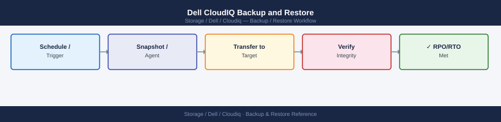

---
tags:
  - dell
  - operations
---
# Dell CloudIQ Backup and Restore


```bash
# Verify your secrets vault has the following stored per API client:
# - Client ID (shown on the API Access page)
# - Client Secret (copy at creation time only)
# - Date created
# - Date of next scheduled rotation
# - Associated integrations (e.g., "Splunk poller", "Ansible pre-check")

# Verify that a stored secret is still valid
CLIENT_ID="<stored-client-id>"
CLIENT_SECRET="<stored-client-secret>"

curl -s -X POST "https://cloudiq.apis.dell.com/auth/oauth/v2/token" \
  -H "Content-Type: application/x-www-form-urlencoded" \
  -d "grant_type=client_credentials&client_id=${CLIENT_ID}&client_secret=${CLIENT_SECRET}" \
  | python3 -c "import sys,json; d=json.load(sys.stdin); print('OK' if 'access_token' in d else 'FAIL')"
```

```bash
# Export audit log via CloudIQ portal
# Admin > Audit Log > Export as CSV
# Set date range: last 30 days (run monthly)

# Store exports with naming convention:
# cloudiq_audit_YYYYMM.csv
# Retain for minimum 90 days; 12 months if under PCI-DSS, HIPAA, or ISO 27001
```
```bash
# VM-level backup (example: ESXi snapshot before SCG update)
# Run from vCenter or via ESXCLI on the ESXi host

# Quiesce the SCG VM before snapshotting
# vCenter → SCG VM → Actions → Snapshots → Take Snapshot
# Name: "pre-update-YYYYMMDD"
# Enable: Snapshot the virtual machine's memory (optional)
# Enable: Quiesce guest file system (requires VMware Tools)

# For Veeam integration:
# Veeam → Jobs → Backup Job → Add SCG VM
# Recommended: daily backup; retain 7 days of restore points
```
```bash
# Create a new notification rule via REST API (example: email rule for CRITICAL alerts)
curl -s -X POST "${BASE}/notification-rules" \
  -H "Authorization: Bearer ${TOKEN}" \
  -H "Content-Type: application/json" \
  -d '{
    "name": "storage-ops-critical-email",
    "severity": ["CRITICAL"],
    "notification_type": "EMAIL",
    "recipients": ["storage-ops@corp.example.com"],
    "enabled": true
  }' | python3 -m json.tool

# Create webhook notification rule for ServiceNow
curl -s -X POST "${BASE}/notification-rules" \
  -H "Authorization: Bearer ${TOKEN}" \
  -H "Content-Type: application/json" \
  -d '{
    "name": "servicenow-incident-critical",
    "severity": ["CRITICAL"],
    "notification_type": "WEBHOOK",
    "webhook_url": "https://your-instance.service-now.com/api/now/table/incident",
    "enabled": true
  }' | python3 -m json.tool

# Send a test notification to validate
curl -s -X POST "${BASE}/notification-rules/<rule-id>/test" \
  -H "Authorization: Bearer ${TOKEN}"
```

## Before you begin

- **Access:** Storage admin credentials (cluster admin or equivalent)
- **Timing:** safe to run during business hours unless a step is marked ⚠ (causes interruption)
- **Dependencies:** no active upgrades or migrations on the same infrastructure
- **Logging:** capture command output — paste into the change record on completion

---

---

## Verify

- Confirm the operation completed without errors in the log or management UI
- Verify the expected state change is visible (service running, object created, config applied)
- Document the outcome in the change record

---

## See also

- [Cloudiq — Procedures](procedures/)
- [Cloudiq — Health Checks](health-checks/)
- [Cloudiq — Common Issues](../troubleshooting/common-issues/)
