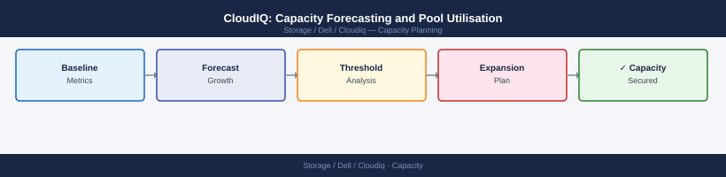

---
tags:
  - dell
  - operations
---
# CloudIQ: Capacity Forecasting and Pool Utilisation

CloudIQ: Capacity Forecasting and Pool Utilisation reference covering Capacity Forecasting, Pool and Volume Utilisation, Threshold Alerts for Capacity, Common Capacity Issues.

*Applies to: CloudIQ*

## Before you begin

- **Access:** Storage admin credentials (cluster admin or equivalent)
- **Timing:** safe to run during business hours unless a step is marked ⚠ (causes interruption)
- **Dependencies:** no active upgrades or migrations on the same infrastructure
- **Logging:** capture command output — paste into the change record on completion

---

## Threshold Alerts for Capacity

Configure capacity threshold alerts so the team is notified before pools reach critical levels.

Navigation: **CloudIQ > Settings > Notifications > Capacity Thresholds**

| Threshold Type | Recommended Value | Alert Severity |
|---|---|---|
| Pool utilisation | 75% | Minor |
| Pool utilisation | 85% | Major |
| Days until full | 30 days | Major |
| Days until full | 7 days | Critical |

## Common Capacity Issues

| Issue | Likely Cause | Fix |
|---|---|---|
| Forecast shows N/A | Less than 7 days of data | Wait for more telemetry to accumulate |
| Days until full wildly inaccurate | Bulk migration skewing trend | Use 90-day view to smooth out spikes |
| Used capacity not matching array UI | Data reduction ratio difference | CloudIQ shows logical used; check raw vs logical |
| New pool not showing | System telemetry not yet pushed | Check SRS connectivity and wait 1 collection cycle |

---

## Verify

- Confirm the operation completed without errors in the log or management UI
- Verify the expected state change is visible (service running, object created, config applied)
- Document the outcome in the change record

## See also

- [CloudIQ: Alert Types, Severity, and Notification Configuration](alerts.md)
- [Dell CloudIQ Backup and Restore](backup-restore.md)
- [Dell CloudIQ CLI Reference](cli-reference.md)
- [CloudIQ — Operations](index.md)
- [CloudIQ — Architecture](../../architecture/)
- [CloudIQ — Initial Setup](../../deploy/)
- [CloudIQ — Security](../../security/)
- [CloudIQ — Troubleshooting](../../troubleshooting/)
