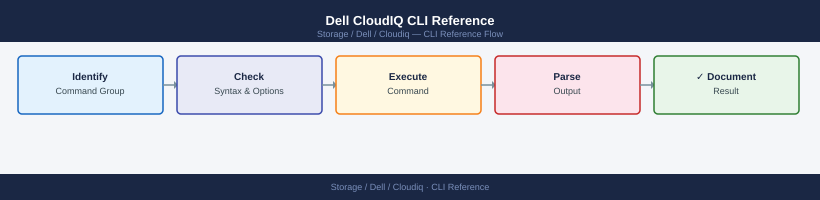

---
tags:
  - dell
  - operations
---
# Dell CloudIQ CLI Reference


```bash
CLIENT_ID="<your_client_id>"
CLIENT_SECRET="<your_client_secret>"
TOKEN_URL="https://cloudiq.apis.dell.com/auth/oauth/v2/token"

# --- Get access token ---
TOKEN=$(curl -s -X POST "${TOKEN_URL}" \
  -H "Content-Type: application/x-www-form-urlencoded" \
  -d "grant_type=client_credentials" \
  -d "client_id=${CLIENT_ID}" \
  -d "client_secret=${CLIENT_SECRET}" \
  | python3 -c "import sys,json; print(json.load(sys.stdin)['access_token'])")

echo "Token: ${TOKEN:0:40}..."   # Print first 40 chars to confirm success

# --- Reusable header for all subsequent calls ---
AUTH="Authorization: Bearer ${TOKEN}"
BASE="https://cloudiq.apis.dell.com/rest/v1"
```

```bash
# --- Current capacity utilisation for a system ---
curl -s -X GET "${BASE}/systems/${SYSTEM_ID}/capacity" \
  -H "${AUTH}" | python3 -m json.tool

# Key capacity fields:
#   total_subscribed_capacity_gb – Logical size allocated to hosts
#   total_used_capacity_gb       – Physical data written
#   total_physical_capacity_gb   – Raw usable capacity
#   percent_used                 – Physical used %
#   days_to_full                 – Forecast days until full (based on trend)
#   forecast_confidence          – LOW / MEDIUM / HIGH

# --- Capacity forecast ---
curl -s -X GET "${BASE}/systems/${SYSTEM_ID}/capacity/forecast" \
  -H "${AUTH}" | python3 -m json.tool

# Forecast with custom horizon (30 / 60 / 90 days)
curl -s -X GET "${BASE}/systems/${SYSTEM_ID}/capacity/forecast?days=90" \
  -H "${AUTH}" | python3 -m json.tool
```
```bash
# --- Get available performance metric types for a system ---
curl -s -X GET "${BASE}/systems/${SYSTEM_ID}/metrics/query" \
  -H "${AUTH}" | python3 -m json.tool

# --- Query performance metrics ---
# Common metric keys: iops, throughput_mb, latency_ms, bandwidth_mb
curl -s -X POST "${BASE}/systems/${SYSTEM_ID}/metrics/query" \
  -H "${AUTH}" \
  -H "Content-Type: application/json" \
  -d "{
    \"metrics\": [\"iops\", \"latency_ms\", \"throughput_mb\"],
    \"start_time\": \"${START}\",
    \"end_time\": \"${END}\",
    \"granularity\": \"HOURLY\"
  }" | python3 -m json.tool

# --- Get real-time (latest) metrics ---
curl -s -X GET "${BASE}/systems/${SYSTEM_ID}/metrics/last" \
  -H "${AUTH}" | python3 -m json.tool
```
```bash
# --- List all existing tags ---
curl -s -X GET "${BASE}/tags" \
  -H "${AUTH}" | python3 -m json.tool

# --- Create a new tag ---
curl -s -X POST "${BASE}/tags" \
  -H "${AUTH}" \
  -H "Content-Type: application/json" \
  -d '{
    "name": "env:production",
    "description": "Production environment systems"
  }' | python3 -m json.tool

TAG_ID="<tag-id>"   # Returned from the create response

# --- Assign a tag to a system ---
curl -s -X POST "${BASE}/systems/${SYSTEM_ID}/tags" \
  -H "${AUTH}" \
  -H "Content-Type: application/json" \
  -d "{\"tag_ids\": [\"${TAG_ID}\"]}" | python3 -m json.tool

# --- List tags assigned to a system ---
curl -s -X GET "${BASE}/systems/${SYSTEM_ID}/tags" \
  -H "${AUTH}" | python3 -m json.tool

# --- Remove a tag from a system ---
curl -s -X DELETE "${BASE}/systems/${SYSTEM_ID}/tags/${TAG_ID}" \
  -H "${AUTH}"

# --- Filter systems by tag ---
curl -s -X GET "${BASE}/systems?tag_id=${TAG_ID}" \
  -H "${AUTH}" | python3 -m json.tool

# --- Delete a tag (removes it globally) ---
curl -s -X DELETE "${BASE}/tags/${TAG_ID}" \
  -H "${AUTH}"
```

## Before you begin

- **Access:** Storage admin credentials (cluster admin or equivalent)
- **Timing:** safe to run during business hours unless a step is marked ⚠ (causes interruption)
- **Dependencies:** no active upgrades or migrations on the same infrastructure
- **Logging:** capture command output — paste into the change record on completion

---

---

## Verify

- Confirm the operation completed without errors in the log or management UI
- Verify the expected state change is visible (service running, object created, config applied)
- Document the outcome in the change record

---

## See also

- [Cloudiq — Procedures](procedures/)
- [Cloudiq — Scripts](scripts/)
- [Cloudiq — Health Checks](health-checks/)
