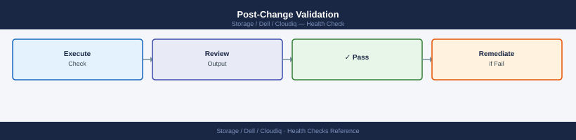

---
tags:
  - dell
  - operations
---
# CloudIQ — Health Checks

Health Checks reference covering Daily Checks, Health Check Commands, Change Readiness, Incident Triage, Post-Change Validation.

*Applies to: CloudIQ*

## Before you begin

- **Access:** Storage admin credentials (cluster admin or equivalent)
- **Timing:** safe to run during business hours unless a step is marked ⚠ (causes interruption)
- **Dependencies:** no active upgrades or migrations on the same infrastructure
- **Logging:** capture command output — paste into the change record on completion

---

## Run This Routine

1. **Overall health score:** CloudIQ dashboard → Health Score — note current score and trend
2. **Active alerts:** CloudIQ → Alerts — review all Critical/High severity items
3. **Storage system connectivity:** CloudIQ → Systems — all systems Connected and reporting
4. **Capacity forecast:** CloudIQ → Capacity → flag any system projected to run out in <90 days
5. **Performance anomalies:** CloudIQ → Performance → check for detected anomalies
6. **Proactive recommendations:** CloudIQ → Recommendations — review and action outstanding items
7. **Sensor data freshness:** verify last data collection timestamp is within 1 hour for all systems

## Change Readiness

- [ ] No active CRITICAL alerts on the affected system in CloudIQ
- [ ] SCG connectivity status for the affected system shows CONNECTED
- [ ] Record the current health score as a pre-change baseline
- [ ] Confirm CloudIQ alert notifications are routing to the correct email or webhook destination
- [ ] If using the REST API for automation during the window, confirm token is valid

| Item | Status | Notes |
|---|---|---|
| No active CRITICAL alerts on target system | | |
| SCG connectivity: CONNECTED | | |
| Pre-change health score recorded | | |
| Alert notification routing confirmed | | |
| API token valid (if applicable) | | |

## Incident Triage

**On alert or issue:**
1. Log in to CloudIQ and identify the affected system and alert severity
2. Check the anomaly timeline on the system's detail page (Timeline tab) to identify when the issue began
3. Pull performance metrics from the Analytics tab to correlate with the alert timestamp
4. Check SCG connectivity — if the system shows "Not Reporting", the issue may be SCG rather than the storage array itself
5. Cross-reference with any change activity at the time the anomaly was detected
6. Open a Dell support case directly from the CloudIQ alert if the issue cannot be resolved internally

| Symptom | Likely Cause | Action |
|---|---|---|
| Health score dropped suddenly | Performance anomaly or hardware fault | Check Timeline tab, pull performance metrics, review active alerts |
| System shows "Not Reporting" | SCG connectivity failure | SSH to SCG, run `dsagw status` and `dsagw list-devices`, check proxy/firewall |
| CRITICAL alert: drive fault | Disk hardware failure | Confirm in array management UI, open Dell support case from CloudIQ alert |
| CRITICAL alert: capacity threshold | Array nearing full | Review capacity forecast, initiate capacity expansion or data reduction review |
| Alert notifications not received | Notification routing misconfigured | Verify notification settings under Settings > Alerts in CloudIQ |
| API returning 401 Unauthorized | Expired or revoked API token | Regenerate token in CloudIQ Settings > API Tokens |

## Post-Change Validation

- [ ] System health score has returned to the pre-change baseline (or improved)
- [ ] No new CRITICAL or WARNING alerts have been generated on the affected system
- [ ] SCG connectivity for the system shows CONNECTED in CloudIQ
- [ ] Capacity forecast is unchanged or improved (no unexpected capacity consumption)
- [ ] Alert notification routing is confirmed active — no suppression window left open

## Common Health Issues

| Issue | Likely Cause | Fix |
|---|---|---|
| System shows grey in CloudIQ | Phone-home disconnected | Verify SRS/ESRS gateway, check firewall |
| Health score drops unexpectedly | New hardware alert generated | Check Alerts tab, drill into component detail |
| Component status stale | Delayed telemetry | Last contact > 1 hour indicates connectivity issue |
| Drive predictive failure alert | Vendor analysis from telemetry | Open support case — proactive replacement |
| Replication link health degraded | WAN latency or packet loss | Check network path between replication endpoints |

---

## Verify

- Confirm the operation completed without errors in the log or management UI
- Verify the expected state change is visible (service running, object created, config applied)
- Document the outcome in the change record

---

## See also

- [Cloudiq — Procedures](procedures/)
- [Cloudiq — CLI Reference](cli-reference/)
- [Cloudiq — Common Issues](../troubleshooting/common-issues/)
