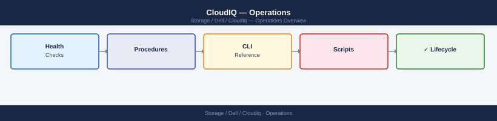

---
tags:
  - dell
  - operations
---
# CloudIQ — Operations

CloudIQ — Operations reference: CLI Reference, Health Checks, Procedures, Install & Upgrade, and 2 more.

*Applies to: CloudIQ*

<a class="kb-card" href="cli-reference/"><strong>CLI Reference</strong>Commands, syntax, and quick reference.</a>
<a class="kb-card" href="health-checks/"><strong>Health Checks</strong>Routine checks, service validation, and status verification.</a>
<a class="kb-card" href="procedures/"><strong>Procedures</strong>Day-to-day operational tasks and how-to guides.</a>
<a class="kb-card" href="install-upgrade/"><strong>Install & Upgrade</strong>Installation, upgrade, patching, and decommission.</a>
<a class="kb-card" href="backup-restore/"><strong>Backup & Restore</strong>Backup configuration, restore procedures, and validation.</a>
<a class="kb-card" href="scripts/"><strong>Scripts</strong>Automation scripts and reusable code.</a>
<a class="kb-card" href="capacity/"><strong>Capacity</strong>Capacity forecasting, utilization trends, and growth analysis.</a>
<a class="kb-card" href="alerts/"><strong>Alerts</strong>Alert configuration, notification rules, and alert suppression.</a>
<a class="kb-card" href="recommendations/"><strong>Recommendations</strong>CloudIQ AI-driven recommendations and action items.</a>
<a class="kb-card" href="reports/"><strong>Reports</strong>Scheduled and on-demand reports for storage health and utilization.</a>

