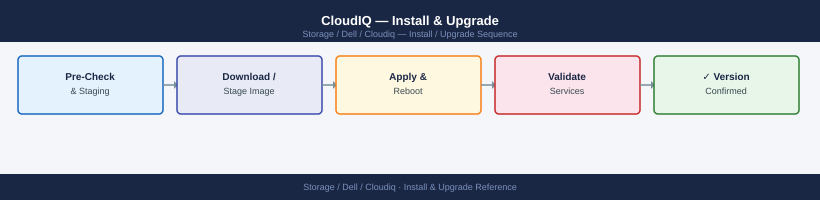

---
tags:
  - dell
  - operations
---
# CloudIQ — Install & Upgrade


<div class="kb-summary">
Install & Upgrade reference covering Platform Updates, API Token Management, Secure Connect Gateway Compatibility, Supported Systems, Renewal and Subscription.

*Applies to: CloudIQ*
</div>



> Part of the [CloudIQ](../index.md) reference.

---

## Before you begin

- **Access:** Storage admin credentials (cluster admin or equivalent)
- **Timing:** safe to run during business hours unless a step is marked ⚠ (causes interruption)
- **Dependencies:** no active upgrades or migrations on the same infrastructure
- **Logging:** capture command output — paste into the change record on completion

---

## Platform Updates

CloudIQ is a SaaS platform hosted and operated by Dell — there is no on-premises upgrade process. All connected systems automatically use the current CloudIQ version. Dell releases major feature updates quarterly, with minor feature additions and bug fixes deployed continuously. Release notes are published at [https://www.dell.com/support](https://www.dell.com/support) under the CloudIQ product page.

Because CloudIQ is always current, lifecycle management focuses on the components you control: API credentials, the Secure Connect Gateway appliance, and your active ProSupport entitlements.

## API Token Management

CloudIQ REST API access uses OAuth2 client credentials (client ID and client secret). Client secrets have a configurable maximum validity and must be rotated before expiry to avoid automation outages.

| Token Type | Max Validity | Recommended Rotation Schedule |
|---|---|---|
| Client Secret (API credential) | Up to 2 years (configurable at creation) | Every 90 days |
| Access Token (bearer) | 1 hour | Fetched per session by automation; not stored |

Rotation process:

1. Create a new client credential pair in CloudIQ under **Settings > API Access**.
2. Update all automation scripts and vaults with the new client ID and secret.
3. Validate that scripts authenticate successfully using the new credential.
4. Delete the old client credential from CloudIQ.

Store client secrets in a secrets manager (CyberArk, HashiCorp Vault, or AWS Secrets Manager) — never in plaintext configuration files.

## Secure Connect Gateway Compatibility

The Secure Connect Gateway (SCG) is the on-premises component that forwards encrypted telemetry to CloudIQ. SCG must be kept on a current supported version; older SCG versions may lose compatibility with CloudIQ telemetry ingestion endpoints as the SaaS platform evolves.

| SCG Version | CloudIQ Compatibility | Notes |
|---|---|---|
| 5.x (current) | Full compatibility | Recommended for all new deployments |
| 4.x | Supported with limited features | Upgrade to 5.x before next feature release cycle |
| 3.x and below | End of support | Must upgrade; telemetry forwarding may fail |

Check SCG version and update status in the SCG web UI under **Settings > About**. Download SCG updates from the Dell support portal.

## Supported Systems

CloudIQ telemetry coverage spans the following Dell platforms. Systems added to CloudIQ must have an active ProSupport contract and must be connected via SCG.

| Dell Platform | CloudIQ Support Added | Notes |
|---|---|---|
| PowerMax | CloudIQ v1.0 (2019) | Full capacity, performance, and health visibility |
| PowerStore | CloudIQ v1.0 (2019) | Full support including CloudIQ-native alerts |
| PowerScale (Isilon) | CloudIQ v1.1 (2020) | Requires OneFS 8.1.2 or later |
| Unity XT | CloudIQ v1.1 (2020) | Requires Unity OE 5.0 or later |
| VPLEX | CloudIQ v1.2 (2021) | Health and alert visibility; limited performance metrics |
| Data Domain (PowerProtect DD) | CloudIQ v1.2 (2021) | Capacity and protection visibility |
| PowerEdge Servers | CloudIQ v1.3 (2022) | Server health and firmware tracking |

## Renewal and Subscription

CloudIQ entitlement is included with an active **ProSupport** or **ProSupport Plus** contract on each managed system. There is no separate CloudIQ subscription fee. When a system's ProSupport contract expires or lapses, that system will stop reporting telemetry to CloudIQ within 30 days of contract expiry.

To maintain CloudIQ coverage:

- Audit contract renewal dates annually in the Dell support portal under **My Products and Services**.
- Renew ProSupport contracts before expiry — lapsed coverage may result in gaps in capacity trend data.
- When decommissioning a system, remove it from CloudIQ (**Settings > Systems**) to avoid stale alerts.

## Platform Update Model

CloudIQ is a SaaS platform managed entirely by Dell. There is no customer-managed version to upgrade. Feature releases, AI model updates, and API changes are deployed by Dell and communicated via the CloudIQ release notes published in the CloudIQ portal under **Settings > Release Notes**.

Customer lifecycle responsibilities are limited to:
1. Keeping the Secure Connect Gateway (SCG) current
2. Onboarding newly deployed Dell systems
3. Managing CloudIQ API token lifecycle
4. Monitoring CloudIQ release notes for breaking API changes

## Secure Connect Gateway (SCG) Lifecycle

The SCG has its own version lifecycle and must be kept current for compatibility with new Dell platforms and CloudIQ features.

### SCG Version Check

```text
┌─────────────────────────────────── CloudIQ — Lifecycle Management ────────────────────────────────────┐
│                                                                                                       │
│   ┌──────────────────────────────────────────────┐  ┌─────────────────────────────────────────────┐   │
│   │                  Onboarding                  │  │             Ongoing Maintenance             │   │
│   │             Create Dell account              │  │            Monitor telemetry age            │   │
│   │               Register arrays                │  │             Re-register if stale            │   │
│   │               Configure alerts               │  │            Update array firmware            │   │
│   │              Add users + roles               │  │            Rotate service account           │   │
│   │            Test webhook delivery             │  │             Annual access review            │   │
│   └──────────────────────────────────────────────┘  └─────────────────────────────────────────────┘   │
│                                                                                                       │
│  Physical Infrastructure:                                                                             │
│  CloudIQ is SaaS — no on-prem component to patch · array firmware controls telemetry client           │
│                                                                                                       │
│  Key terms:                                                                                           │
│                                                                                                       │
│  Telemetry age = Time since last successful push from array; stale > 15 min triggers alert            │
│  Re-registration = Removing and re-adding array to CloudIQ; resets telemetry stream                   │
│  Service account rotation = Changing Dell account password used for CloudIQ API access                │
│  Access review = Auditing CloudIQ user list; removing departed staff and role changes                 │
│  Array firmware = On-array software; update process depends on array model (PSTCLI, ESRS)             │
│  ESRS = EMC Secure Remote Services; gateway used by some older Dell arrays for telemetry              │
│  CloudIQ SaaS = Hosted by Dell; no customer upgrade responsibility for the platform itself            │
│                                                                                                       │
└───────────────────────────────────────────────────────────────────────────────────────────────────────┘

```
## API Token Lifecycle

CloudIQ REST API tokens use OAuth2 client credentials. Tokens should be rotated annually.

Rotation procedure:
1. CloudIQ portal > Settings > API Clients > [Client] > Rotate Secret
2. Update the new client_secret in the team secrets manager
3. Redeploy or restart any automation scripts that use the old secret
4. Verify API scripts return HTTP 200 after rotation

## Release Notes Review

Review CloudIQ release notes when notified by Dell (typically monthly). Check for:
- New platform support (confirm newly deployed systems are supported)
- API endpoint changes or deprecations
- Feature changes that affect existing alert rules or notification configurations

**Location**: CloudIQ portal > Settings > Release Notes

---

## Verify

- Confirm the operation completed without errors in the log or management UI
- Verify the expected state change is visible (service running, object created, config applied)
- Document the outcome in the change record

---

## See also

- [Cloudiq — Procedures](procedures/)
- [Cloudiq — Health Checks](health-checks/)
- [Cloudiq — Deploy](../deploy/)
