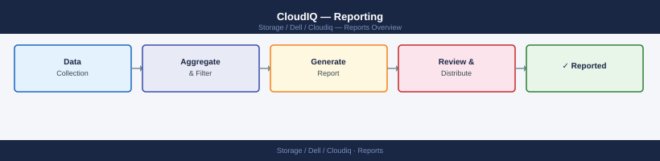

---
tags:
  - dell
  - operations
---
# CloudIQ — Reporting



```bash
# Trigger an on-demand health report via CloudIQ API
curl -sk -X POST \
  "https://cloudiq.apis.dell.com/cloudiq/rest/v1/reports" \
  -H "Authorization: Bearer <access_token>" \
  -H "Content-Type: application/json" \
  -d '{
    "type": "HEALTH_SUMMARY",
    "system_ids": ["<systemId1>", "<systemId2>"],
    "date_range": {
      "start": "2026-04-01T00:00:00Z",
      "end": "2026-04-30T23:59:59Z"
    },
    "format": "PDF"
  }'

# Check report generation status
curl -sk -X GET \
  "https://cloudiq.apis.dell.com/cloudiq/rest/v1/reports/<reportId>" \
  -H "Authorization: Bearer <access_token>" \
  -H "Accept: application/json" | jq '{status, download_url}'

# Download completed report
curl -sk -X GET \
  "https://cloudiq.apis.dell.com/cloudiq/rest/v1/reports/<reportId>/download" \
  -H "Authorization: Bearer <access_token>" \
  -o cloudiq-health-report.pdf
```


## Before you begin

- **Access:** Storage admin credentials (cluster admin or equivalent)
- **Timing:** safe to run during business hours unless a step is marked ⚠ (causes interruption)
- **Dependencies:** no active upgrades or migrations on the same infrastructure
- **Logging:** capture command output — paste into the change record on completion

---

---

## Verify

- Confirm the operation completed without errors in the log or management UI
- Verify the expected state change is visible (service running, object created, config applied)
- Document the outcome in the change record

## See also

- [CloudIQ: Alert Types, Severity, and Notification Configuration](alerts.md)
- [Dell CloudIQ Backup and Restore](backup-restore.md)
- [CloudIQ: Capacity Forecasting and Pool Utilisation](capacity.md)
- [CloudIQ — Operations](index.md)
- [CloudIQ — Architecture](../architecture/)
- [CloudIQ — Initial Setup](../deploy/)
- [CloudIQ — Security](../security/)
- [CloudIQ — Troubleshooting](../troubleshooting/)
