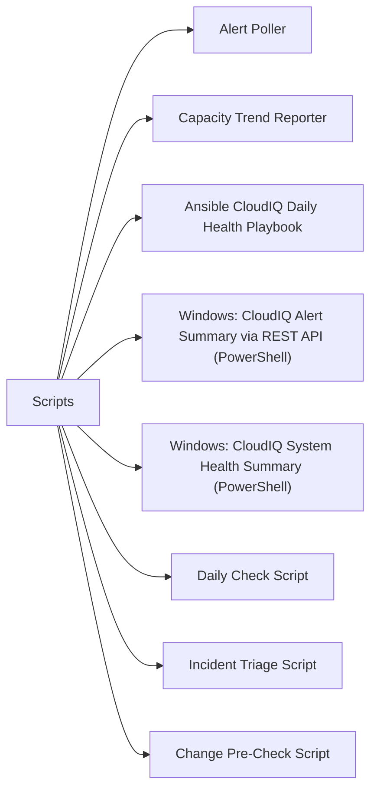

# Scripts

> Part of the [CloudIQ](../) reference.

---



## Alert Poller

Polls the CloudIQ REST API for all active alerts across the storage estate and prints a formatted report grouped by severity. Exits non-zero if any CRITICAL alerts are found. Designed for cron or monitoring integration.

~~~python
#!/usr/bin/env python3
# cloudiq_alert_poller.py — Poll CloudIQ for active alerts across all systems
# Requirements: requests
# Usage: CLOUDIQ_CLIENT_ID=xxx CLOUDIQ_CLIENT_SECRET=yyy ./cloudiq_alert_poller.py

import os
import sys
import requests
import urllib3
from datetime import datetime
from collections import defaultdict

urllib3.disable_warnings(urllib3.exceptions.InsecureRequestWarning)

CLIENT_ID     = os.environ.get("CLOUDIQ_CLIENT_ID", "")
CLIENT_SECRET = os.environ.get("CLOUDIQ_CLIENT_SECRET", "")
CLOUDIQ_BASE  = "https://cloudiq.dell.com"
AUTH_URL      = f"{CLOUDIQ_BASE}/auth/v1/token"
API_BASE      = f"{CLOUDIQ_BASE}/cloudiq/rest/v1"

if not CLIENT_ID or not CLIENT_SECRET:
    print("ERROR: CLOUDIQ_CLIENT_ID and CLOUDIQ_CLIENT_SECRET must be set.", file=sys.stderr)
    sys.exit(1)

session = requests.Session()


def get_token():
    resp = session.post(
        AUTH_URL,
        data={
            "grant_type": "client_credentials",
            "client_id": CLIENT_ID,
            "client_secret": CLIENT_SECRET,
        },
        headers={"Content-Type": "application/x-www-form-urlencoded"},
    )
    resp.raise_for_status()
    return resp.json()["access_token"]


def api_get(token, path, params=None):
    resp = session.get(
        f"{API_BASE}{path}",
        headers={"Authorization": f"Bearer {token}", "Accept": "application/json"},
        params=params,
    )
    resp.raise_for_status()
    return resp.json()


def main():
    exit_code = 0

    print("=" * 70)
    print("  CloudIQ Active Alert Report")
    print(f"  Generated: {datetime.now().strftime('%Y-%m-%d %H:%M:%S')}")
    print("=" * 70)

    token = get_token()

    data   = api_get(token, "/alerts", params={"state": "ACTIVE"})
    alerts = data.get("results", data if isinstance(data, list) else [])

    if not alerts:
        print("\nNo active alerts.")
        sys.exit(0)

    # Group by severity
    by_severity = defaultdict(list)
    for alert in alerts:
        sev = alert.get("severity", "UNKNOWN").upper()
        by_severity[sev].append(alert)

    for sev in ("CRITICAL", "ERROR", "WARNING", "INFO", "UNKNOWN"):
        group = by_severity.get(sev, [])
        if not group:
            continue
        print(f"\n--- {sev} ({len(group)}) ---")
        print(f"  {'SYSTEM':<30}  {'COMPONENT':<25}  DESCRIPTION")
        print("  " + "-" * 80)
        for a in group:
            system    = a.get("system_name", a.get("systemName", "unknown"))
            component = a.get("component_name", a.get("componentName", a.get("object_name", "unknown")))
            desc      = a.get("description", a.get("message", "no description"))
            print(f"  {system:<30}  {component:<25}  {desc}")
        if sev in ("CRITICAL", "ERROR"):
            exit_code = max(exit_code, 2)
        elif sev == "WARNING":
            exit_code = max(exit_code, 1)

    print(f"\n{'=' * 70}")
    print(f"  Total active alerts: {len(alerts)}")
    labels = {0: "OK", 1: "WARNING", 2: "CRITICAL"}
    print(f"  Overall: {labels.get(exit_code, 'UNKNOWN')}")
    sys.exit(exit_code)


if __name__ == "__main__":
    main()
~~~

#### How to run this script — step by step

**Before you start — what you need**
- Python 3.7 or newer installed (python.org)
- The `requests` library: open Command Prompt and run `pip install requests`
- A CloudIQ API client ID and client secret (see Step 2 for where to find these)
- Internet access to https://cloudiq.dell.com

**Step 1 — Save the file**

1. Open **Notepad**
2. Copy the entire code block above
3. Click **File → Save As**, change "Save as type" to **All Files**
4. Name it `cloudiq_alert_poller.py` and save it to your Desktop

**Step 2 — Fill in your details**

| Variable | What to put | How to find it |
|---|---|---|
| `CLOUDIQ_CLIENT_ID` | Your CloudIQ API client ID | Log into cloudiq.dell.com → Settings → API Access → Create credentials |
| `CLOUDIQ_CLIENT_SECRET` | Your CloudIQ API client secret | Shown once when you create the API credentials |

**Step 3 — Open a terminal**

- **For .py (Python):** Open Command Prompt. Install Python first from python.org if needed.

**Step 4 — Run the script**

```
cd C:\Users\YourName\Desktop
set CLOUDIQ_CLIENT_ID=your-client-id
set CLOUDIQ_CLIENT_SECRET=your-client-secret
python cloudiq_alert_poller.py
```

**What you should see**

A report grouped by severity (CRITICAL, ERROR, WARNING, INFO). Each alert shows the system name, component, and description. The final lines show total alert count and an overall OK/WARNING/CRITICAL status. The script exits non-zero if critical alerts are present.

---

## Capacity Trend Reporter

Queries CloudIQ for all storage systems, fetches their capacity metrics, and prints a trend report showing current utilisation and projected days-to-full. Flags systems under 30 days to full.

~~~python
#!/usr/bin/env python3
# cloudiq_capacity_reporter.py — CloudIQ capacity trend and days-to-full reporter
# Requirements: requests
# Usage: CLOUDIQ_CLIENT_ID=xxx CLOUDIQ_CLIENT_SECRET=yyy WARN_DAYS=30 ./cloudiq_capacity_reporter.py

import os
import sys
import requests
from datetime import datetime

CLIENT_ID     = os.environ.get("CLOUDIQ_CLIENT_ID", "")
CLIENT_SECRET = os.environ.get("CLOUDIQ_CLIENT_SECRET", "")
WARN_DAYS     = int(os.environ.get("WARN_DAYS", "30"))
CLOUDIQ_BASE  = "https://cloudiq.dell.com"
API_BASE      = f"{CLOUDIQ_BASE}/cloudiq/rest/v1"

if not CLIENT_ID or not CLIENT_SECRET:
    print("ERROR: CLOUDIQ_CLIENT_ID and CLOUDIQ_CLIENT_SECRET must be set.", file=sys.stderr)
    sys.exit(1)

session = requests.Session()


def get_token():
    resp = session.post(
        f"{CLOUDIQ_BASE}/auth/v1/token",
        data={"grant_type": "client_credentials",
              "client_id": CLIENT_ID, "client_secret": CLIENT_SECRET},
        headers={"Content-Type": "application/x-www-form-urlencoded"},
    )
    resp.raise_for_status()
    return resp.json()["access_token"]


def api_get(token, path, params=None):
    resp = session.get(
        f"{API_BASE}{path}",
        headers={"Authorization": f"Bearer {token}"},
        params=params,
    )
    resp.raise_for_status()
    return resp.json()


def main():
    exit_code = 0
    token = get_token()

    systems_data = api_get(token, "/storage-systems")
    systems = systems_data.get("results", [])

    print("=" * 80)
    print("  CloudIQ Capacity Trend Report")
    print(f"  Generated: {datetime.now().strftime('%Y-%m-%d %H:%M:%S')}")
    print("=" * 80)
    print(f"\n{'SYSTEM':<30}  {'TYPE':<15}  {'USED %':>7}  {'DAYS TO FULL':>13}  STATUS")
    print("-" * 80)

    for sys_obj in systems:
        sys_id   = sys_obj.get("id", "unknown")
        sys_name = sys_obj.get("system_name", sys_obj.get("name", sys_id))
        sys_type = sys_obj.get("system_type", sys_obj.get("type", "unknown"))

        try:
            cap = api_get(token, f"/storage-systems/{sys_id}/capacity")
        except Exception:
            cap = {}

        total  = float(cap.get("total_subscribed_tib", cap.get("total_tib", 0)))
        used   = float(cap.get("used_tib", 0))
        dtf    = cap.get("days_until_full", cap.get("daysUntilFull", None))
        pct    = (used / total * 100) if total > 0 else 0.0

        if dtf is not None:
            dtf_val = int(dtf)
            dtf_str = str(dtf_val)
        else:
            dtf_val = 9999
            dtf_str = "N/A"

        if dtf_val <= WARN_DAYS:
            status = f"WARNING — {dtf_str} days"
            exit_code = max(exit_code, 1)
        elif pct >= 85:
            status = "WARNING — over 85%"
            exit_code = max(exit_code, 1)
        else:
            status = "OK"

        print(f"{sys_name:<30}  {sys_type:<15}  {pct:>6.1f}%  {dtf_str:>13}  {status}")

    print("-" * 80)
    labels = {0: "OK", 1: "WARNING", 2: "CRITICAL"}
    print(f"\nOverall: {labels.get(exit_code, 'UNKNOWN')}")
    sys.exit(exit_code)


if __name__ == "__main__":
    main()
~~~

#### How to run this script — step by step

**Before you start — what you need**
- Python 3.7 or newer installed (python.org)
- The `requests` library: run `pip install requests` in Command Prompt
- A CloudIQ API client ID and secret from cloudiq.dell.com → Settings → API Access

**Step 1 — Save the file**

1. Open **Notepad**
2. Copy the entire code block above
3. Click **File → Save As**, change "Save as type" to **All Files**
4. Name it `cloudiq_capacity_reporter.py` and save it to your Desktop

**Step 2 — Fill in your details**

| Variable | What to put | How to find it |
|---|---|---|
| `CLOUDIQ_CLIENT_ID` | Your CloudIQ API client ID | cloudiq.dell.com → Settings → API Access |
| `CLOUDIQ_CLIENT_SECRET` | Your CloudIQ API client secret | Shown when credentials are created |
| `WARN_DAYS` | Days-to-full threshold to flag | Default is `30` |

**Step 3 — Open a terminal**

- **For .py (Python):** Open Command Prompt. Install Python first from python.org if needed.

**Step 4 — Run the script**

```
cd C:\Users\YourName\Desktop
set CLOUDIQ_CLIENT_ID=your-client-id
set CLOUDIQ_CLIENT_SECRET=your-client-secret
python cloudiq_capacity_reporter.py
```

**What you should see**

A table listing every storage system managed in CloudIQ with columns for name, type, used percentage, days until full, and status. Any system projected to fill within 30 days (or already over 85%) is marked WARNING. The final line shows the overall status.

---

## Ansible CloudIQ Daily Health Playbook

Playbook targeting localhost. Authenticates to CloudIQ, retrieves active alerts and capacity summaries, prints the output, and fails if critical alerts are present.

~~~yaml
---
# cloudiq_daily_health.yml — Ansible daily CloudIQ health check playbook
# Usage: ansible-playbook cloudiq_daily_health.yml

- name: Dell CloudIQ Daily Health Check
  hosts: localhost
  gather_facts: false
  vars:
    cloudiq_base: "https://cloudiq.dell.com"
    client_id: "{{ lookup('env', 'CLOUDIQ_CLIENT_ID') }}"
    client_secret: "{{ lookup('env', 'CLOUDIQ_CLIENT_SECRET') }}"
    warn_days_to_full: 30

  tasks:
    - name: Authenticate to CloudIQ API
      ansible.builtin.uri:
        url: "{{ cloudiq_base }}/auth/v1/token"
        method: POST
        body_format: form-urlencoded
        body:
          grant_type: client_credentials
          client_id: "{{ client_id }}"
          client_secret: "{{ client_secret }}"
        return_content: true
      register: auth_resp
      no_log: true

    - name: Set access token
      ansible.builtin.set_fact:
        cloudiq_token: "{{ auth_resp.json.access_token }}"
      no_log: true

    - name: Get active alerts
      ansible.builtin.uri:
        url: "{{ cloudiq_base }}/cloudiq/rest/v1/alerts?state=ACTIVE"
        method: GET
        headers:
          Authorization: "Bearer {{ cloudiq_token }}"
        return_content: true
      register: alerts_resp

    - name: Show active alerts
      ansible.builtin.debug:
        msg: "{{ alerts_resp.json.results | default([]) }}"

    - name: Get storage system capacity
      ansible.builtin.uri:
        url: "{{ cloudiq_base }}/cloudiq/rest/v1/storage-systems"
        method: GET
        headers:
          Authorization: "Bearer {{ cloudiq_token }}"
        return_content: true
      register: systems_resp

    - name: Show storage systems
      ansible.builtin.debug:
        msg: "{{ systems_resp.json.results | default([]) | map(attribute='system_name') | list }}"

    - name: Fail if CRITICAL alerts present
      ansible.builtin.fail:
        msg: "CRITICAL alerts active in CloudIQ. Review alerts_resp output above."
      when: >
        (alerts_resp.json.results | default([]) |
         selectattr('severity', 'equalto', 'CRITICAL') | list | length) > 0
~~~

#### How to run this script — step by step

**Before you start — what you need**
- Ansible installed on a Linux/macOS control node (or WSL on Windows)
- A CloudIQ API client ID and secret set as environment variables

**Step 1 — Save the file**

1. Open a text editor
2. Copy the entire code block above
3. Save it as `cloudiq_daily_health.yml` in your Ansible working directory

**Step 2 — Fill in your details**

| Variable | What to put | How to find it |
|---|---|---|
| `CLOUDIQ_CLIENT_ID` | Your CloudIQ API client ID | cloudiq.dell.com → Settings → API Access |
| `CLOUDIQ_CLIENT_SECRET` | Your CloudIQ API client secret | Shown when credentials are created |
| `warn_days_to_full` | Days threshold to warn | Default is `30` |

**Step 3 — Open a terminal**

Open a terminal on your Ansible control node.

**Step 4 — Run the script**

```
cd /path/to/your/playbooks
export CLOUDIQ_CLIENT_ID=your-client-id
export CLOUDIQ_CLIENT_SECRET=your-client-secret
ansible-playbook cloudiq_daily_health.yml
```

**What you should see**

Ansible connects to CloudIQ, prints the list of active alerts and storage system names, then fails the play if any CRITICAL alerts are found.

---

## Windows: CloudIQ Alert Summary via REST API (PowerShell)

Authenticates to CloudIQ using OAuth2 and prints a count of CRITICAL, WARNING, and INFO alerts — all from a PowerShell window on your Windows PC.

~~~powershell
# cloudiq_alert_summary.ps1 — CloudIQ active alert summary (Windows PowerShell)
# Requires: PowerShell 5.1+ (built into Windows 10/11)
# Run: .\cloudiq_alert_summary.ps1

$ClientId     = "your-client-id"      # From CloudIQ portal: Settings → API Access
$ClientSecret = "your-client-secret"  # From CloudIQ portal: Settings → API Access

$AuthUrl  = "https://cloudiq.dell.com/auth/v1/token"
$ApiBase  = "https://cloudiq.dell.com/cloudiq/rest/v1"

# Step 1: Get OAuth2 access token
Write-Host "Authenticating to CloudIQ ..."
try {
    $TokenResp = Invoke-RestMethod -Uri $AuthUrl `
        -Method POST `
        -Body "grant_type=client_credentials&client_id=$ClientId&client_secret=$ClientSecret" `
        -ContentType "application/x-www-form-urlencoded"
    $Token = $TokenResp.access_token
} catch {
    Write-Host "ERROR: Authentication failed - $($_.Exception.Message)"
    exit 1
}

if (-not $Token) {
    Write-Host "ERROR: No access token received. Check your client ID and secret."
    exit 1
}
Write-Host "Authentication successful."

$Headers = @{ Authorization = "Bearer $Token"; Accept = "application/json" }

# Step 2: Get active alerts
Write-Host ""
Write-Host "Fetching active alerts ..."
try {
    $AlertsResp = Invoke-RestMethod -Uri "$ApiBase/alerts?state=ACTIVE" -Headers $Headers
    $Alerts = $AlertsResp.results
} catch {
    Write-Host "ERROR: Could not fetch alerts - $($_.Exception.Message)"
    exit 1
}

# Step 3: Count by severity
$Critical = ($Alerts | Where-Object { $_.severity -eq "CRITICAL" }).Count
$Warning  = ($Alerts | Where-Object { $_.severity -eq "WARNING" }).Count
$Info     = ($Alerts | Where-Object { $_.severity -eq "INFO" }).Count
$Total    = $Alerts.Count

Write-Host ""
Write-Host "========================================"
Write-Host "  CloudIQ Alert Summary"
Write-Host "========================================"
Write-Host "  CRITICAL : $Critical"
Write-Host "  WARNING  : $Warning"
Write-Host "  INFO     : $Info"
Write-Host "  TOTAL    : $Total"
Write-Host "========================================"

if ($Critical -gt 0) {
    Write-Host "  STATUS: CRITICAL — $Critical critical alert(s) require attention."
    exit 2
} elseif ($Warning -gt 0) {
    Write-Host "  STATUS: WARNING — $Warning warning alert(s) found."
    exit 1
} else {
    Write-Host "  STATUS: OK — No critical or warning alerts."
    exit 0
}
~~~

#### How to run this script — step by step

**Before you start — what you need**
- Windows 10 or 11 (PowerShell 5.1 is already installed)
- Internet access to cloudiq.dell.com
- A CloudIQ API client ID and secret (see Step 2 for where to find them)

**Step 1 — Save the file**

1. Open **Notepad**
2. Copy the entire code block above
3. Click **File → Save As**, change "Save as type" to **All Files**
4. Name it `cloudiq_alert_summary.ps1` and save it to your Desktop

**Step 2 — Fill in your details**

| Variable | What to put | How to find it |
|---|---|---|
| `$ClientId` | Your CloudIQ API client ID | Log into cloudiq.dell.com → Settings → API Access → Create API credentials |
| `$ClientSecret` | Your CloudIQ API client secret | Shown once when you create the credentials — copy it then |

**Step 3 — Open a terminal**

- **For .ps1 (PowerShell):** Press Windows key → type `PowerShell` → right-click → **Run as Administrator**

**Step 4 — Allow scripts to run (one-time)**

```
Set-ExecutionPolicy -Scope Process -ExecutionPolicy Bypass
```

**Step 5 — Run the script**

```
cd C:\Users\YourName\Desktop
.\cloudiq_alert_summary.ps1
```

**What you should see**

A summary box showing counts for CRITICAL, WARNING, and INFO alerts, plus a total. The final STATUS line tells you the overall health. If there are critical alerts it exits with a non-zero code, which can be used for automated monitoring.

---

## Windows: CloudIQ System Health Summary (PowerShell)

Uses the same CloudIQ OAuth2 token to list all managed storage systems and highlight any with a health score below 80.

~~~powershell
# cloudiq_system_health.ps1 — CloudIQ system health summary (Windows PowerShell)
# Requires: PowerShell 5.1+ (built into Windows 10/11)
# Run: .\cloudiq_system_health.ps1

$ClientId     = "your-client-id"      # From CloudIQ portal: Settings → API Access
$ClientSecret = "your-client-secret"  # From CloudIQ portal: Settings → API Access

$AuthUrl = "https://cloudiq.dell.com/auth/v1/token"
$ApiBase = "https://cloudiq.dell.com/cloudiq/rest/v1"

# Step 1: Get OAuth2 access token
Write-Host "Authenticating to CloudIQ ..."
try {
    $TokenResp = Invoke-RestMethod -Uri $AuthUrl `
        -Method POST `
        -Body "grant_type=client_credentials&client_id=$ClientId&client_secret=$ClientSecret" `
        -ContentType "application/x-www-form-urlencoded"
    $Token = $TokenResp.access_token
} catch {
    Write-Host "ERROR: Authentication failed - $($_.Exception.Message)"
    exit 1
}
Write-Host "Authentication successful."
$Headers = @{ Authorization = "Bearer $Token"; Accept = "application/json" }

# Step 2: Get all managed systems
Write-Host ""
Write-Host "Fetching storage systems ..."
try {
    $SysResp = Invoke-RestMethod -Uri "$ApiBase/systems" -Headers $Headers
    $Systems = $SysResp.results
} catch {
    Write-Host "ERROR: Could not fetch systems - $($_.Exception.Message)"
    exit 1
}

Write-Host ""
Write-Host "========================================"
Write-Host "  CloudIQ System Health Summary"
Write-Host "========================================"
Write-Host ""

$Degraded = 0
foreach ($Sys in $Systems) {
    $Name         = $Sys.system_name
    $Type         = $Sys.system_type
    $HealthScore  = $Sys.health_score
    $HealthIssues = $Sys.health_issues

    $Flag = ""
    if ($HealthScore -ne $null -and $HealthScore -lt 80) {
        $Flag = "  <<< HEALTH SCORE LOW"
        $Degraded++
    }

    Write-Host "  System  : $Name"
    Write-Host "  Type    : $Type"
    Write-Host "  Score   : $HealthScore$Flag"
    if ($HealthIssues) {
        Write-Host "  Issues  : $HealthIssues"
    }
    Write-Host ""
}

Write-Host "========================================"
Write-Host "  Total systems : $($Systems.Count)"
Write-Host "  Below score 80: $Degraded"
if ($Degraded -gt 0) {
    Write-Host "  STATUS: WARNING — $Degraded system(s) have low health scores."
    exit 1
} else {
    Write-Host "  STATUS: OK — All systems have health score 80 or above."
    exit 0
}
~~~

#### How to run this script — step by step

**Before you start — what you need**
- Windows 10 or 11 with PowerShell 5.1 (built in — no download needed)
- Internet access to cloudiq.dell.com
- A CloudIQ API client ID and secret

**Step 1 — Save the file**

1. Open **Notepad**
2. Copy the entire code block above
3. Click **File → Save As**, change "Save as type" to **All Files**
4. Name it `cloudiq_system_health.ps1` and save it to your Desktop

**Step 2 — Fill in your details**

| Variable | What to put | How to find it |
|---|---|---|
| `$ClientId` | Your CloudIQ API client ID | cloudiq.dell.com → Settings → API Access |
| `$ClientSecret` | Your CloudIQ API client secret | Shown once when credentials are created |

**Step 3 — Open a terminal**

- **For .ps1 (PowerShell):** Press Windows key → type `PowerShell` → right-click → **Run as Administrator**

**Step 4 — Allow scripts to run (one-time)**

```
Set-ExecutionPolicy -Scope Process -ExecutionPolicy Bypass
```

**Step 5 — Run the script**

```
cd C:\Users\YourName\Desktop
.\cloudiq_system_health.ps1
```

**What you should see**

For each storage system: its name, type, health score (0-100), and any health issues reported by CloudIQ. Any system with a score below 80 is flagged with `<<< HEALTH SCORE LOW`. The summary at the bottom shows how many systems are degraded.

---

## Daily Check Script

Gets an OAuth2 token, counts systems reporting, counts CRITICAL/ERROR/WARNING alerts, flags any system with health_score below 80, and flags any system with fewer than 30 days to capacity threshold — printing PASS/FAIL per check.

```bash
#!/bin/bash
# cloudiq_daily_check.sh — Daily operations check for Dell CloudIQ
# Usage: CLOUDIQ_CLIENT_ID=xxx CLOUDIQ_CLIENT_SECRET=yyy ./cloudiq_daily_check.sh
# Requirements: curl, jq

set -uo pipefail

CLOUDIQ_CLIENT_ID="${CLOUDIQ_CLIENT_ID:-}"
CLOUDIQ_CLIENT_SECRET="${CLOUDIQ_CLIENT_SECRET:-}"
AUTH_URL="https://cloudiq.dell.com/auth/v1/token"
API_BASE="https://cloudiq.dell.com/cloudiq/rest/v1"
HEALTH_SCORE_MIN=80
DAYS_TO_FULL_WARN=30

if [[ -z "$CLOUDIQ_CLIENT_ID" || -z "$CLOUDIQ_CLIENT_SECRET" ]]; then
  echo "ERROR: CLOUDIQ_CLIENT_ID and CLOUDIQ_CLIENT_SECRET must be set." >&2
  exit 1
fi

PASS=0
FAIL=0

check() {
  local label="$1"
  local rc="$2"
  if [[ "$rc" -eq 0 ]]; then
    printf "  %-55s  PASS\n" "$label"
    PASS=$((PASS + 1))
  else
    printf "  %-55s  FAIL\n" "$label"
    FAIL=$((FAIL + 1))
  fi
}

# Get token
TOKEN=$(curl -sf -X POST "$AUTH_URL" \
  -H "Content-Type: application/x-www-form-urlencoded" \
  -d "grant_type=client_credentials&client_id=$CLOUDIQ_CLIENT_ID&client_secret=$CLOUDIQ_CLIENT_SECRET" \
  | jq -r '.access_token')

[[ -z "$TOKEN" || "$TOKEN" == "null" ]] && echo "ERROR: Authentication failed." >&2 && exit 2

AUTH_HDR="Authorization: Bearer $TOKEN"

echo "========================================"
echo "  CloudIQ Daily Check"
echo "  $(date '+%Y-%m-%d %H:%M:%S')"
echo "========================================"

# 1. Systems reporting
SYSTEMS=$(curl -sf -H "$AUTH_HDR" "$API_BASE/storage-systems")
SYSTEM_COUNT=$(echo "$SYSTEMS" | jq '.results | length')
echo "  [INFO] systems reporting: $SYSTEM_COUNT"
[[ "$SYSTEM_COUNT" -gt 0 ]] && check "systems reporting (>0)" 0 || check "systems reporting (>0)" 1

# 2. Alert counts
ALERTS=$(curl -sf -H "$AUTH_HDR" "$API_BASE/alerts?state=ACTIVE")
CRIT=$(echo "$ALERTS" | jq '[.results[] | select(.severity=="CRITICAL")] | length')
ERR=$(echo "$ALERTS"  | jq '[.results[] | select(.severity=="ERROR")]    | length')
WARN=$(echo "$ALERTS" | jq '[.results[] | select(.severity=="WARNING")]  | length')
echo "  [INFO] alerts — CRITICAL:$CRIT  ERROR:$ERR  WARNING:$WARN"
[[ "$CRIT" -gt 0 || "$ERR" -gt 0 ]] && check "CRITICAL/ERROR alerts (none)" 1 || check "CRITICAL/ERROR alerts (none)" 0
[[ "$WARN" -gt 0 ]] && check "WARNING alerts (none)" 1 || check "WARNING alerts (none)" 0

# 3. Systems with health_score < 80
LOW_HEALTH=$(echo "$SYSTEMS" | jq --argjson min "$HEALTH_SCORE_MIN" \
  '[.results[] | select(.health_score != null and .health_score < $min) | .system_name]')
LOW_COUNT=$(echo "$LOW_HEALTH" | jq 'length')
echo "  [INFO] systems with health_score < $HEALTH_SCORE_MIN: $LOW_COUNT ($LOW_HEALTH)"
[[ "$LOW_COUNT" -gt 0 ]] && check "health_score >= $HEALTH_SCORE_MIN (all systems)" 1 || check "health_score >= $HEALTH_SCORE_MIN (all systems)" 0

# 4. Systems with < 30 days to capacity threshold
NEAR_FULL=0
while IFS= read -r sys_id; do
  CAP=$(curl -sf -H "$AUTH_HDR" "$API_BASE/storage-systems/$sys_id/capacity" 2>/dev/null || echo "{}")
  DTF=$(echo "$CAP" | jq '.days_until_full // .daysUntilFull // 9999')
  [[ "$DTF" != "null" && "$DTF" -lt "$DAYS_TO_FULL_WARN" ]] && NEAR_FULL=$((NEAR_FULL + 1))
done < <(echo "$SYSTEMS" | jq -r '.results[].id')
echo "  [INFO] systems with < ${DAYS_TO_FULL_WARN} days to capacity: $NEAR_FULL"
[[ "$NEAR_FULL" -gt 0 ]] && check "capacity forecast >= ${DAYS_TO_FULL_WARN} days (all)" 1 || check "capacity forecast >= ${DAYS_TO_FULL_WARN} days (all)" 0

echo "========================================"
echo "  PASS: $PASS   FAIL: $FAIL"
[[ "$FAIL" -eq 0 ]] && echo "  STATUS: OK" && exit 0 || echo "  STATUS: DEGRADED" && exit 1
```

---

## Incident Triage Script

Fetches all active alerts, all system health scores, and capacity forecasts from CloudIQ to a timestamped JSON/text file for sharing with support.

```bash
#!/bin/bash
# cloudiq_triage.sh — Incident triage data capture for Dell CloudIQ
# Usage: CLOUDIQ_CLIENT_ID=xxx CLOUDIQ_CLIENT_SECRET=yyy ./cloudiq_triage.sh
# Requirements: curl, jq

CLOUDIQ_CLIENT_ID="${CLOUDIQ_CLIENT_ID:-}"
CLOUDIQ_CLIENT_SECRET="${CLOUDIQ_CLIENT_SECRET:-}"
AUTH_URL="https://cloudiq.dell.com/auth/v1/token"
API_BASE="https://cloudiq.dell.com/cloudiq/rest/v1"

if [[ -z "$CLOUDIQ_CLIENT_ID" || -z "$CLOUDIQ_CLIENT_SECRET" ]]; then
  echo "ERROR: CLOUDIQ_CLIENT_ID and CLOUDIQ_CLIENT_SECRET must be set." >&2
  exit 1
fi

OUTFILE="cloudiq_triage_$(date '+%Y%m%d_%H%M%S').txt"

TOKEN=$(curl -sf -X POST "$AUTH_URL" \
  -H "Content-Type: application/x-www-form-urlencoded" \
  -d "grant_type=client_credentials&client_id=$CLOUDIQ_CLIENT_ID&client_secret=$CLOUDIQ_CLIENT_SECRET" \
  | jq -r '.access_token')

[[ -z "$TOKEN" || "$TOKEN" == "null" ]] && echo "ERROR: Authentication failed." >&2 && exit 2

AUTH_HDR="Authorization: Bearer $TOKEN"

section() {
  echo "" >> "$OUTFILE"
  echo "========================================" >> "$OUTFILE"
  echo "  $1" >> "$OUTFILE"
  echo "========================================" >> "$OUTFILE"
}

{
  echo "CloudIQ Triage Capture"
  echo "Date : $(date '+%Y-%m-%d %H:%M:%S')"
} > "$OUTFILE"

section "ACTIVE ALERTS"
curl -sf -H "$AUTH_HDR" "$API_BASE/alerts?state=ACTIVE" | jq . >> "$OUTFILE" 2>&1

section "STORAGE SYSTEMS (health scores)"
curl -sf -H "$AUTH_HDR" "$API_BASE/storage-systems" \
  | jq '[.results[] | {id, system_name, system_type, health_score}]' >> "$OUTFILE" 2>&1

section "CAPACITY FORECASTS"
SYSTEMS=$(curl -sf -H "$AUTH_HDR" "$API_BASE/storage-systems")
while IFS= read -r row; do
  SYS_ID=$(echo "$row" | jq -r '.id')
  SYS_NAME=$(echo "$row" | jq -r '.system_name')
  CAP=$(curl -sf -H "$AUTH_HDR" "$API_BASE/storage-systems/$SYS_ID/capacity" 2>/dev/null || echo "{}")
  echo "  $SYS_NAME: $(echo "$CAP" | jq -c '{used_tib,total_subscribed_tib,days_until_full}')" >> "$OUTFILE"
done < <(echo "$SYSTEMS" | jq -c '.results[]')

echo "Triage data written to: $OUTFILE"
```

---

## Change Pre-Check Script

Confirms zero CRITICAL alerts for the target system, health_score above 75, system is actively reporting, and no capacity forecasts below 14 days — exits 2 on any failure.

```bash
#!/bin/bash
# cloudiq_precheck.sh — Pre-change validation for Dell CloudIQ
# Usage: CLOUDIQ_CLIENT_ID=xxx CLOUDIQ_CLIENT_SECRET=yyy \
#        TARGET_SYSTEM_NAME="my-powerstore-01" ./cloudiq_precheck.sh
# Requirements: curl, jq

set -uo pipefail

CLOUDIQ_CLIENT_ID="${CLOUDIQ_CLIENT_ID:-}"
CLOUDIQ_CLIENT_SECRET="${CLOUDIQ_CLIENT_SECRET:-}"
TARGET_SYSTEM_NAME="${TARGET_SYSTEM_NAME:-}"
AUTH_URL="https://cloudiq.dell.com/auth/v1/token"
API_BASE="https://cloudiq.dell.com/cloudiq/rest/v1"

if [[ -z "$CLOUDIQ_CLIENT_ID" || -z "$CLOUDIQ_CLIENT_SECRET" ]]; then
  echo "ERROR: CLOUDIQ_CLIENT_ID and CLOUDIQ_CLIENT_SECRET must be set." >&2
  exit 1
fi

ISSUES=0

fail() { echo "  FAIL: $1"; ISSUES=$((ISSUES + 1)); }
pass() { echo "  PASS: $1"; }

TOKEN=$(curl -sf -X POST "$AUTH_URL" \
  -H "Content-Type: application/x-www-form-urlencoded" \
  -d "grant_type=client_credentials&client_id=$CLOUDIQ_CLIENT_ID&client_secret=$CLOUDIQ_CLIENT_SECRET" \
  | jq -r '.access_token')

[[ -z "$TOKEN" || "$TOKEN" == "null" ]] && echo "ERROR: Authentication failed." >&2 && exit 2

AUTH_HDR="Authorization: Bearer $TOKEN"

echo "========================================"
echo "  CloudIQ Pre-Change Check"
echo "  Target: ${TARGET_SYSTEM_NAME:-all}"
echo "  $(date '+%Y-%m-%d %H:%M:%S')"
echo "========================================"

SYSTEMS=$(curl -sf -H "$AUTH_HDR" "$API_BASE/storage-systems")

# Find target system (or use all if not specified)
if [[ -n "$TARGET_SYSTEM_NAME" ]]; then
  SYS_OBJ=$(echo "$SYSTEMS" | jq --arg n "$TARGET_SYSTEM_NAME" '.results[] | select(.system_name == $n)')
  [[ -z "$SYS_OBJ" || "$SYS_OBJ" == "null" ]] && fail "system '$TARGET_SYSTEM_NAME' not found in CloudIQ" && echo; exit 2
  SYS_ID=$(echo "$SYS_OBJ" | jq -r '.id')
  HEALTH=$(echo "$SYS_OBJ" | jq '.health_score // 0')
else
  SYS_ID=""
  HEALTH=100
fi

# 1. System is reporting
[[ -n "$SYS_ID" ]] && pass "system found and reporting" || fail "system not found"

# 2. Health score > 75
if [[ -n "$TARGET_SYSTEM_NAME" ]]; then
  [[ "$(echo "$HEALTH > 75" | bc)" -eq 1 ]] \
    && pass "health_score $HEALTH > 75" \
    || fail "health_score $HEALTH <= 75"
fi

# 3. No CRITICAL alerts for target system
ALERTS=$(curl -sf -H "$AUTH_HDR" "$API_BASE/alerts?state=ACTIVE")
if [[ -n "$TARGET_SYSTEM_NAME" ]]; then
  CRIT=$(echo "$ALERTS" | jq --arg n "$TARGET_SYSTEM_NAME" \
    '[.results[] | select(.severity=="CRITICAL" and .system_name==$n)] | length')
else
  CRIT=$(echo "$ALERTS" | jq '[.results[] | select(.severity=="CRITICAL")] | length')
fi
[[ "$CRIT" -eq 0 ]] && pass "no CRITICAL alerts" || fail "$CRIT CRITICAL alert(s) active"

# 4. Capacity forecast not below 14 days
if [[ -n "$SYS_ID" ]]; then
  CAP=$(curl -sf -H "$AUTH_HDR" "$API_BASE/storage-systems/$SYS_ID/capacity" 2>/dev/null || echo "{}")
  DTF=$(echo "$CAP" | jq '.days_until_full // .daysUntilFull // 9999')
  [[ "$DTF" == "null" ]] && DTF=9999
  [[ "$DTF" -ge 14 ]] && pass "capacity forecast $DTF days (>= 14)" || fail "capacity forecast $DTF days (< 14)"
fi

echo "========================================"
if [[ "$ISSUES" -gt 0 ]]; then
  echo "  PRE-CHECK FAILED — $ISSUES issue(s). Do not proceed."
  exit 2
fi
echo "  PRE-CHECK PASSED — Safe to proceed."
exit 0
```

---

## Post-Change Validation Script

Runs the same checks as the pre-check and additionally verifies that the system's health_score has not dropped compared to the baseline recorded before the change.

```bash
#!/bin/bash
# cloudiq_postcheck.sh — Post-change validation for Dell CloudIQ
# Usage: CLOUDIQ_CLIENT_ID=xxx CLOUDIQ_CLIENT_SECRET=yyy \
#        TARGET_SYSTEM_NAME="my-powerstore-01" \
#        BASELINE_HEALTH_SCORE=92 ./cloudiq_postcheck.sh
# Requirements: curl, jq

set -uo pipefail

CLOUDIQ_CLIENT_ID="${CLOUDIQ_CLIENT_ID:-}"
CLOUDIQ_CLIENT_SECRET="${CLOUDIQ_CLIENT_SECRET:-}"
TARGET_SYSTEM_NAME="${TARGET_SYSTEM_NAME:-}"
BASELINE_HEALTH_SCORE="${BASELINE_HEALTH_SCORE:-}"
AUTH_URL="https://cloudiq.dell.com/auth/v1/token"
API_BASE="https://cloudiq.dell.com/cloudiq/rest/v1"

if [[ -z "$CLOUDIQ_CLIENT_ID" || -z "$CLOUDIQ_CLIENT_SECRET" ]]; then
  echo "ERROR: CLOUDIQ_CLIENT_ID and CLOUDIQ_CLIENT_SECRET must be set." >&2
  exit 1
fi

ISSUES=0

fail() { echo "  FAIL: $1"; ISSUES=$((ISSUES + 1)); }
pass() { echo "  PASS: $1"; }

TOKEN=$(curl -sf -X POST "$AUTH_URL" \
  -H "Content-Type: application/x-www-form-urlencoded" \
  -d "grant_type=client_credentials&client_id=$CLOUDIQ_CLIENT_ID&client_secret=$CLOUDIQ_CLIENT_SECRET" \
  | jq -r '.access_token')

[[ -z "$TOKEN" || "$TOKEN" == "null" ]] && echo "ERROR: Authentication failed." >&2 && exit 2

AUTH_HDR="Authorization: Bearer $TOKEN"

echo "========================================"
echo "  CloudIQ Post-Change Validation"
echo "  Target: ${TARGET_SYSTEM_NAME:-all}"
echo "  $(date '+%Y-%m-%d %H:%M:%S')"
echo "========================================"

SYSTEMS=$(curl -sf -H "$AUTH_HDR" "$API_BASE/storage-systems")

SYS_OBJ=""; SYS_ID=""; CURRENT_HEALTH=0
if [[ -n "$TARGET_SYSTEM_NAME" ]]; then
  SYS_OBJ=$(echo "$SYSTEMS" | jq --arg n "$TARGET_SYSTEM_NAME" '.results[] | select(.system_name == $n)')
  [[ -z "$SYS_OBJ" || "$SYS_OBJ" == "null" ]] && fail "system '$TARGET_SYSTEM_NAME' not found" || pass "system found"
  SYS_ID=$(echo "$SYS_OBJ" | jq -r '.id')
  CURRENT_HEALTH=$(echo "$SYS_OBJ" | jq '.health_score // 0')
fi

# 1. System reporting
[[ -n "$SYS_ID" ]] && pass "system reporting" || fail "system not found"

# 2. Health score > 75
[[ -n "$TARGET_SYSTEM_NAME" ]] && {
  [[ "$(echo "$CURRENT_HEALTH > 75" | bc)" -eq 1 ]] \
    && pass "health_score $CURRENT_HEALTH > 75" || fail "health_score $CURRENT_HEALTH <= 75"
}

# 3. No CRITICAL alerts
ALERTS=$(curl -sf -H "$AUTH_HDR" "$API_BASE/alerts?state=ACTIVE")
if [[ -n "$TARGET_SYSTEM_NAME" ]]; then
  CRIT=$(echo "$ALERTS" | jq --arg n "$TARGET_SYSTEM_NAME" \
    '[.results[] | select(.severity=="CRITICAL" and .system_name==$n)] | length')
else
  CRIT=$(echo "$ALERTS" | jq '[.results[] | select(.severity=="CRITICAL")] | length')
fi
[[ "$CRIT" -eq 0 ]] && pass "no CRITICAL alerts" || fail "$CRIT CRITICAL alert(s) active"

# 4. Capacity forecast >= 14 days
if [[ -n "$SYS_ID" ]]; then
  CAP=$(curl -sf -H "$AUTH_HDR" "$API_BASE/storage-systems/$SYS_ID/capacity" 2>/dev/null || echo "{}")
  DTF=$(echo "$CAP" | jq '.days_until_full // .daysUntilFull // 9999')
  [[ "$DTF" == "null" ]] && DTF=9999
  [[ "$DTF" -ge 14 ]] && pass "capacity forecast $DTF days (>= 14)" || fail "capacity forecast $DTF days (< 14)"
fi

# 5. Health score not dropped vs baseline
if [[ -n "$BASELINE_HEALTH_SCORE" && -n "$TARGET_SYSTEM_NAME" ]]; then
  echo "  health_score: baseline=$BASELINE_HEALTH_SCORE  current=$CURRENT_HEALTH"
  [[ "$(echo "$CURRENT_HEALTH >= $BASELINE_HEALTH_SCORE" | bc)" -eq 1 ]] \
    && pass "health_score not dropped vs baseline" \
    || fail "health_score dropped (was $BASELINE_HEALTH_SCORE, now $CURRENT_HEALTH)"
else
  echo "  INFO: BASELINE_HEALTH_SCORE not set — skipping comparison"
fi

echo "========================================"
if [[ "$ISSUES" -gt 0 ]]; then
  echo "  POST-CHECK FAILED — $ISSUES issue(s). Investigate before closing change."
  exit 2
fi
echo "  POST-CHECK PASSED — All checks healthy."
exit 0
```

---

## Health Check Script

Cron-safe summary reporting total systems, critical alert count, warning count, and systems below health_score 80 — exits 0 if clean, 1 if warnings, 2 if critical.

```bash
#!/bin/bash
# cloudiq_health.sh — Cron-safe health check for Dell CloudIQ
# Usage: CLOUDIQ_CLIENT_ID=xxx CLOUDIQ_CLIENT_SECRET=yyy ./cloudiq_health.sh
# Requirements: curl, jq
# Exit codes: 0=OK  1=WARN  2=CRIT

CLOUDIQ_CLIENT_ID="${CLOUDIQ_CLIENT_ID:-}"
CLOUDIQ_CLIENT_SECRET="${CLOUDIQ_CLIENT_SECRET:-}"
AUTH_URL="https://cloudiq.dell.com/auth/v1/token"
API_BASE="https://cloudiq.dell.com/cloudiq/rest/v1"

if [[ -z "$CLOUDIQ_CLIENT_ID" || -z "$CLOUDIQ_CLIENT_SECRET" ]]; then
  echo "CRIT: CLOUDIQ_CLIENT_ID and CLOUDIQ_CLIENT_SECRET must be set" >&2
  exit 2
fi

STATE=0

flag() {
  local level="$1"; shift
  echo "  [$level] $*"
  case "$level" in
    CRIT) [[ "$STATE" -lt 2 ]] && STATE=2 ;;
    WARN) [[ "$STATE" -lt 1 ]] && STATE=1 ;;
  esac
}

TOKEN=$(curl -sf -X POST "$AUTH_URL" \
  -H "Content-Type: application/x-www-form-urlencoded" \
  -d "grant_type=client_credentials&client_id=$CLOUDIQ_CLIENT_ID&client_secret=$CLOUDIQ_CLIENT_SECRET" \
  | jq -r '.access_token')

if [[ -z "$TOKEN" || "$TOKEN" == "null" ]]; then
  echo "CRIT: CloudIQ authentication failed"
  exit 2
fi

AUTH_HDR="Authorization: Bearer $TOKEN"

echo "CloudIQ Health — $(date '+%Y-%m-%d %H:%M:%S')"

# Total systems
SYSTEMS=$(curl -sf -H "$AUTH_HDR" "$API_BASE/storage-systems")
SYSTEM_COUNT=$(echo "$SYSTEMS" | jq '.results | length')
echo "  [INFO] total systems: $SYSTEM_COUNT"

# Alert counts
ALERTS=$(curl -sf -H "$AUTH_HDR" "$API_BASE/alerts?state=ACTIVE")
CRIT=$(echo "$ALERTS" | jq '[.results[] | select(.severity=="CRITICAL")] | length')
ERR=$(echo "$ALERTS"  | jq '[.results[] | select(.severity=="ERROR")]    | length')
WARN_CNT=$(echo "$ALERTS" | jq '[.results[] | select(.severity=="WARNING")] | length')
echo "  [INFO] alerts — CRITICAL:$CRIT  ERROR:$ERR  WARNING:$WARN_CNT"

[[ "$CRIT" -gt 0 || "$ERR" -gt 0 ]] \
  && flag CRIT "$((CRIT + ERR)) CRITICAL/ERROR alert(s)" \
  || echo "  [OK] no CRITICAL/ERROR alerts"

[[ "$WARN_CNT" -gt 0 ]] \
  && flag WARN "$WARN_CNT WARNING alert(s)" \
  || echo "  [OK] no WARNING alerts"

# Systems below health_score 80
LOW=$(echo "$SYSTEMS" | jq '[.results[] | select(.health_score != null and .health_score < 80)] | length')
echo "  [INFO] systems with health_score < 80: $LOW"
[[ "$LOW" -gt 0 ]] \
  && flag WARN "$LOW system(s) with health_score < 80" \
  || echo "  [OK] all systems health_score >= 80"

LABELS=( OK WARN CRIT )
echo "OVERALL: ${LABELS[$STATE]}"
exit "$STATE"
```
