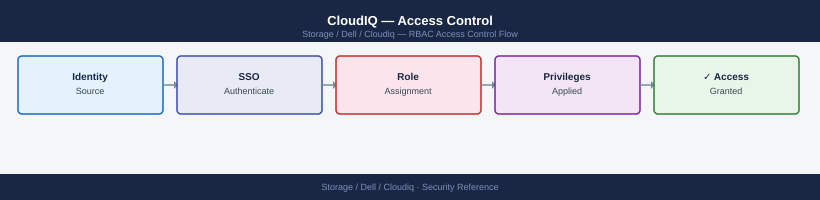

---
tags:
  - dell
  - security
---
# CloudIQ — Access Control

CloudIQ role-based access control — user management, RBAC configuration, and access policy enforcement.

*Applies to: CloudIQ*

> Part of the [CloudIQ](../index.md) reference.

---

CloudIQ provides role-based access control to limit what each user can view and modify.

| Role | Permissions |
|---|---|
| CloudIQ Admin | Full access: manage users, roles, notification rules, API credentials, and all system data |
| System Admin | Manage and view assigned systems; cannot manage users or global settings |
| Viewer | Read-only access to dashboards, health scores, capacity, and alerts; cannot modify settings or acknowledge alerts |

Assign roles under **Settings > Users**. Apply the principle of least privilege — most operational users should be Viewer or System Admin; CloudIQ Admin should be restricted to a small number of named individuals.

## Before you begin

- **Access:** Storage admin credentials (cluster admin or equivalent)
- **Change management:** security changes require CAB approval in most environments
- **Rollback plan:** document current state before any security control change
- **Testing:** validate in a non-production environment first where possible

---

---

## See also

- [Cloudiq — Authentication](authentication/)
- [Cloudiq — Hardening](hardening/)
- [Cloudiq — Encryption](encryption/)
