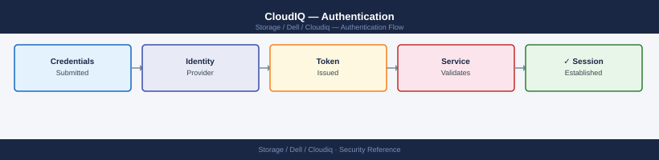

---
tags:
  - dell
  - security
---
# CloudIQ — Authentication

Authentication reference covering API Authentication, Related Reference.

*Applies to: CloudIQ*

> Part of the [CloudIQ](../index.md) reference.

---

CloudIQ uses Dell account-based authentication for portal access. Accounts are managed at [https://www.dell.com/account](https://www.dell.com/account).

- **SSO/Federation**: CloudIQ supports identity federation via Azure AD and Okta. Configure federation under **Settings > Identity Provider** in the CloudIQ admin console. With federation enabled, users authenticate via your corporate IdP and CloudIQ accepts the SAML assertion.
- **MFA**: Enforce multi-factor authentication on all Dell accounts that have access to CloudIQ. For federated accounts, MFA enforcement is managed by your IdP. For non-federated Dell accounts, enable MFA in **My Dell Account** settings.
- **Session management**: CloudIQ sessions have a fixed idle timeout; users are required to re-authenticate after inactivity.

## Before you begin

- **Access:** Storage admin credentials (cluster admin or equivalent)
- **Change management:** security changes require CAB approval in most environments
- **Rollback plan:** document current state before any security control change
- **Testing:** validate in a non-production environment first where possible

---

## API Authentication

API client credentials (client ID and client secret) provide programmatic access with the same permissions as the user account that created them.

Best practices:

- **Rotate client secrets every 90 days**. Create the new credential before deleting the old one to avoid automation downtime.
- **Store secrets in a vault**: use CyberArk, HashiCorp Vault, AWS Secrets Manager, or equivalent. Never store client secrets in plaintext configuration files, scripts, or version control.
- **Use separate credentials per integration**: create one client credential per integration (Splunk, Grafana, ServiceNow, etc.) so that a compromised credential can be revoked without affecting other integrations.
- **Scope by use case**: access tokens derived from client credentials inherit the role of the creating account. Create API accounts with the minimum required role (typically Viewer for monitoring integrations).
- **Monitor credential usage**: review the CloudIQ audit log for API calls made with each credential to detect unusual access patterns.
---

## Related Reference

- [Standard SAML Configuration](../../../../security/saml-configuration/index.md) — SP/IdP setup, Azure AD and Okta steps, attribute mapping, and security requirements

---

## See also

- [Cloudiq — Access Control](access-control/)
- [Cloudiq — Hardening](hardening/)
- [Cloudiq — Encryption](encryption/)
